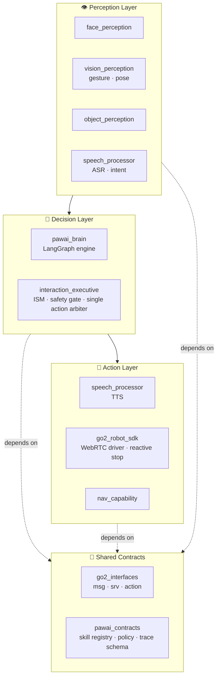

<div align="center">

# 🐾 PawAI — Home Companion Robot Dog

**English** | [中文](./README.zh.md)

*A multimodal, embodied-interaction robot dog built on the Unitree Go2 Pro.*

[](https://docs.ros.org/en/humble/)
[](https://www.python.org/)
[](https://www.nvidia.com/en-us/autonomous-machines/embedded-systems/jetson-orin/)
[](https://www.unitree.com/go2)
[](#-architecture)
[](./LICENSE)

</div>

> **PawAI sees, understands, decides and acts.** It recognises familiar faces,
> reads hand gestures and body posture, understands spoken language, detects
> everyday objects, and responds safely with voice, motion and navigation —
> all orchestrated on the edge by a three-layer decision engine
> (**Safety → Policy → Expression**).

PawAI is not a chatbot, and not a pile of disconnected demos. It is an
**embodied interaction loop** — *See → Understand → Decide → Act* — running on a
Unitree Go2 Pro with an NVIDIA Jetson Orin Nano. The codebase follows
**Clean Architecture**: perception, decision and driver layers are cleanly
separated with a single, unidirectional dependency direction.

---

## ✨ Highlights

| Capability | What it does | Stack |
|------------|--------------|-------|
| 👤 **Face** | Greets known people, flags strangers | YuNet + SFace + IOU tracking (local, < 30 ms) |
| ✋ **Gesture** | 7 gestures → actions, OK as confirm | MediaPipe Gesture Recognizer / RTMPose |
| 🧍 **Pose** | Sit / crouch / fall cues | MediaPipe Pose |
| 🥤 **Object** | 80-class detection + 3D position | YOLO26n ONNX + D435 depth |
| 🗣️ **Speech** | ASR → LLM intent → TTS reply | SenseVoice / Whisper · LangGraph · Gemini / edge-tts / Piper |
| 🧠 **Brain** | Persona + skill policy + safety gate | LangGraph decision engine |
| 🧭 **Navigation** *(experimental)* | Relative goals, routes, reactive stop | RPLIDAR + Nav2 + AMCL + D435 safety stop |

---

## 🏗️ Architecture

PawAI is a single ROS2 workspace of **10 focused packages**, layered so that
dependencies only ever point *inward* toward the shared contracts.



> **One rule, strictly enforced:** `interaction_executive` is the *only* exit
> to the robot's body. `pawai_brain` proposes; the executive disposes (safety
> gate first). The two never import each other — both depend only on
> `pawai_contracts`.

### Packages

| Package | Layer | Responsibility |
|---------|-------|----------------|
| [`go2_interfaces`](go2_interfaces/) | Contracts | ROS2 message / service / action definitions for the Go2 |
| [`pawai_contracts`](pawai_contracts/) | Contracts | ROS-free domain contracts: skill registry, LLM policy, trace schema |
| [`go2_robot_sdk`](go2_robot_sdk/) | Driver | Go2 WebRTC driver (Clean Arch: domain / application / infrastructure / presentation), reactive safety stop |
| [`face_perception`](face_perception/) | Perception | Face detection + identity recognition + tracking |
| [`vision_perception`](vision_perception/) | Perception | Hand-gesture and body-pose recognition |
| [`object_perception`](object_perception/) | Perception | YOLO26n object detection with 3D positioning |
| [`speech_processor`](speech_processor/) | Speech I/O | ASR, intent, LLM bridge, TTS |
| [`pawai_brain`](pawai_brain/) | Decision | LangGraph conversation / decision engine + persona |
| [`interaction_executive`](interaction_executive/) | Decision | State machine, safety gate, single action arbiter |
| [`nav_capability`](nav_capability/) | Capability | Relative-goal / route navigation actions *(experimental, HITL)* |

---

## 🤖 Hardware

| Part | Spec |
|------|------|
| Body | Unitree **Go2 Pro** |
| Edge compute | NVIDIA **Jetson Orin Nano Super 8 GB** |
| Vision | Intel RealSense **D435** (RGB-D) |
| LiDAR | **RPLIDAR A2M12** (12 m, 16 000 samples/s) |
| Audio | USB microphone + USB speaker |

---

## 📋 System Requirements

| System | ROS2 distro |
|--------|-------------|
| Ubuntu 22.04 (Jetson / x86) | Humble |

---

## ⚙️ Installation

```bash
# Clone into a colcon workspace (this repo root *is* the workspace src)
git clone --recurse-submodules https://github.com/roy4222/PawAI.git src
cd src

# Python deps (project uses uv)
uv pip install -r requirements.txt          # add requirements-jetson.txt on the Jetson

# Build
source /opt/ros/humble/setup.bash           # use setup.zsh on the Jetson
colcon build
source install/setup.bash
```

---

## 🚀 Quick Start

```bash
# Minimal Go2 driver
export ROBOT_IP="192.168.123.161"
export CONN_TYPE="webrtc"
ros2 launch go2_robot_sdk robot.launch.py \
  enable_tts:=false nav2:=false slam:=false rviz2:=false foxglove:=false

# Speech + LLM end-to-end (one-shot tmux)
bash scripts/start_llm_e2e_tmux.sh

# Full multimodal demo (perception + brain + Studio)
bash scripts/start_full_demo_tmux.sh

# Face-recognition pipeline
bash scripts/start_face_identity_tmux.sh
```

See [`CLAUDE.md`](CLAUDE.md) for the full build / run matrix and known pitfalls,
and [`docs/runbook/`](docs/runbook/README.md) for demo operation SOPs.

---

## 🛟 Reliability — Graceful Degradation

Every cloud-first capability falls back to a local path, so a demo never goes
dark:

| Stage | Primary | Fallback 1 | Fallback 2 |
|-------|---------|-----------|-----------|
| **LLM** | OpenRouter (Gemini / GPT-mini) | local Qwen | RuleBrain |
| **TTS** | Gemini Flash TTS | edge-tts | Piper (offline) |
| **ASR** | SenseVoice cloud | SenseVoice local | faster-whisper local |

---

## 🖥️ PawAI Studio

An operator web UI (a "ChatGPT-style console meets AI Foxglove") for driving and
observing the robot.

```bash
bash pawai-studio/start.sh      # → http://localhost:3000/studio
```

---

## 📚 Documentation

| Area | Entry point |
|------|-------------|
| Project mission & demo scope | [`docs/mission/`](docs/mission/README.md) |
| ROS2 interface contracts | [`docs/contracts/`](docs/contracts/interaction_contract.md) |
| Brain / perception / speech / studio | [`docs/architecture/`](docs/architecture/README.md) |
| Navigation & obstacle avoidance | [`docs/architecture/navigation/`](docs/architecture/navigation/README.md) |
| Operation runbooks (demo SOPs) | [`docs/runbook/`](docs/runbook/README.md) |
| Architecture decisions (ADRs) | [`docs/adr/`](docs/adr/README.md) |

Historical / superseded material lives under [`docs/archive/`](docs/archive/);
deprecated packages and scripts live under [`archive/`](archive/README.md).

---

## 🙏 Built on go2_ros2_sdk

PawAI began as a fork of [**abizovnuralem/go2_ros2_sdk**](https://github.com/abizovnuralem/go2_ros2_sdk)
— the excellent ROS2 / WebRTC integration for the Unitree Go2 by
[@abizovnuralem](https://github.com/abizovnuralem) and [@tfoldi](https://github.com/tfoldi).
The `go2_robot_sdk`, `go2_interfaces` and driver layers descend from that work;
PawAI adds the perception, brain, speech, navigation and Studio layers on top.

> 🧭 *Future work:* containerised deployment (`docker/`) and a documentation
> website are planned but not yet shipped.

---

## License

[BSD 2-Clause](./LICENSE) — inherited from the upstream `go2_ros2_sdk` project.
