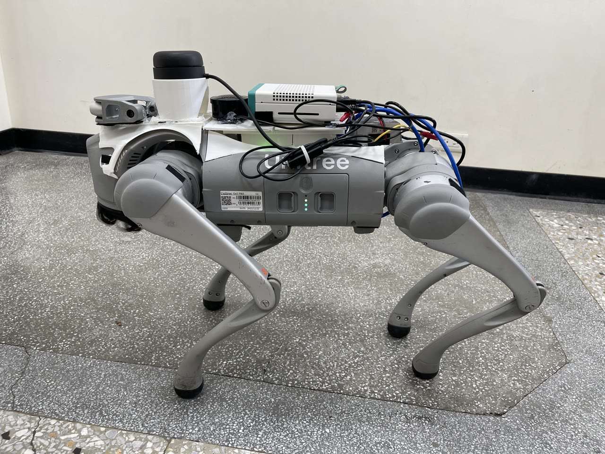
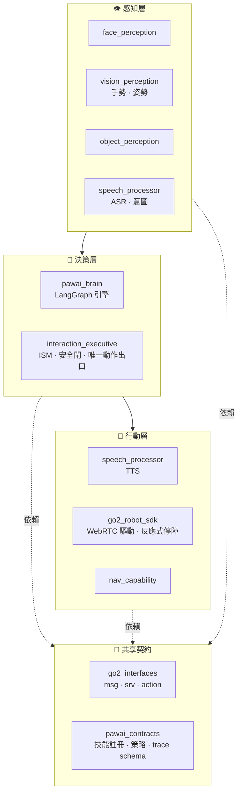

<div align="center">

# 🐾 PawAI — 居家互動機器狗

[English](./README.md) | **中文**

*以 Unitree Go2 Pro 為載體的多模態具身互動機器狗。*

[](https://docs.ros.org/en/humble/)
[](https://www.python.org/)
[](https://www.nvidia.com/en-us/autonomous-machines/embedded-systems/jetson-orin/)
[](https://www.unitree.com/go2)
[](#-架構)
[](./LICENSE)

</div>

> **PawAI 看得懂、聽得懂、會決策、能行動。** 它認得熟人、讀手勢與姿勢、聽懂語音、
> 辨識日常物體，並透過三層決策引擎（**Safety → Policy → Expression**）在邊緣端
> 安全地以語音、動作與導航回應。

PawAI 不是聊天機器人，也不是各功能分開展示的辨識系統，而是一條
**具身互動迴路**——*看懂 → 理解 → 決策 → 行動*——跑在 Unitree Go2 Pro ＋
NVIDIA Jetson Orin Nano 上。整個程式庫遵循 **Clean Architecture**：感知、決策、
驅動三層清楚分離、依賴單向。

<div align="center">

### 🎬 Demo 影片

<a href="https://youtu.be/rTVchCmYQuw">
  
</a>

▶️ **[YouTube 觀看 — IM4308：PawAI · 基於多模態感知融合之自主尋物與具身互動](https://youtu.be/rTVchCmYQuw)**

</div>

---

## ✨ 核心能力

| 能力 | 做什麼 | 技術 |
|------|--------|------|
| 👤 **人臉** | 認熟人打招呼、陌生人警示 | YuNet + SFace + IOU 追蹤（本地 < 30 ms） |
| ✋ **手勢** | 7 種手勢 → 動作，OK 二次確認 | MediaPipe Gesture Recognizer / RTMPose |
| 🧍 **姿勢** | 坐下 / 彎腰 / 跌倒提示 | MediaPipe Pose |
| 🥤 **物體** | 80 類偵測 + 3D 座標 | YOLO26n ONNX + D435 深度 |
| 🗣️ **語音** | ASR → LLM 意圖 → TTS 回覆 | SenseVoice / Whisper · LangGraph · Gemini / edge-tts / Piper |
| 🧠 **大腦** | 人格 + 技能策略 + 安全閘 | LangGraph 決策引擎 |
| 🧭 **導航**（實驗性） | 相對目標、路線、反應式停障 | RPLIDAR + Nav2 + AMCL + D435 安全停 |

---

## 🏗️ 架構

PawAI 是單一 ROS2 workspace，由 **10 個職責單一的套件**組成，依賴方向永遠
*向內*指向共享契約。



> **唯一硬規則：** `interaction_executive` 是機器狗身體的*唯一*出口。
> `pawai_brain` 只提案，executive 才執行（安全閘優先）。兩者互不 import，
> 皆只依賴 `pawai_contracts`。

### 套件一覽

| 套件 | 層 | 職責 |
|------|----|------|
| [`go2_interfaces`](go2_interfaces/) | 契約 | Go2 的 ROS2 訊息 / 服務 / 動作定義 |
| [`pawai_contracts`](pawai_contracts/) | 契約 | 不含 ROS 的領域契約：技能註冊、LLM 策略、trace schema |
| [`go2_robot_sdk`](go2_robot_sdk/) | 驅動 | Go2 WebRTC 驅動（Clean Arch：domain / application / infrastructure / presentation）、反應式安全停障 |
| [`face_perception`](face_perception/) | 感知 | 人臉偵測 + 身份識別 + 追蹤 |
| [`vision_perception`](vision_perception/) | 感知 | 手勢與姿勢辨識 |
| [`object_perception`](object_perception/) | 感知 | YOLO26n 物體偵測 + 3D 定位 |
| [`speech_processor`](speech_processor/) | 語音 I/O | ASR、意圖、LLM 橋接、TTS |
| [`pawai_brain`](pawai_brain/) | 決策 | LangGraph 對話 / 決策引擎 + 人格 |
| [`interaction_executive`](interaction_executive/) | 決策 | 狀態機、安全閘、唯一動作出口 |
| [`nav_capability`](nav_capability/) | 能力 | 相對目標 / 路線導航動作（實驗性、HITL） |

---

## 🤖 硬體

PawAI 可以分層上手。只跑 Go2 driver 不需要所有外設；完整多模態 Demo 才需要全套硬體。

| 上手目標 | 需要的硬體 |
|----------|------------|
| **最小 Go2 driver** | Unitree **Go2 Pro** + 一台在 Go2 網路內的 Ubuntu 22.04 / ROS2 Humble 機器 |
| **完整 PawAI 互動 Demo** | Go2 Pro + NVIDIA **Jetson Orin Nano Super 8 GB** + Intel RealSense **D435** + USB 麥克風 + USB 喇叭 |
| **物體 / 深度感知** | 固定在機器狗或測試架上的 Intel RealSense **D435** |
| **實驗性導航** | **RPLIDAR A2M12** + 穩固支架 + 外接供電餘裕 + 人在旁邊看守安全 |
| **操作端 UI** | 可連到 PawAI Studio 的筆電或桌機瀏覽器 |

實際 Go2 Pro 配置建議準備：

- D435 的 USB 3 線材與固定支架。
- USB 麥克風與喇叭，或等效的 Go2 音訊播放路徑。
- 若要做導航實驗，RPLIDAR 需要穩固固定、5 V 供電與急停流程。
- 一台開發機負責改 code；Jetson 負責 ROS2 runtime、GPU 推理與機器狗 I/O。

---

## 📋 系統需求

| 系統 | ROS2 版本 |
|------|-----------|
| Ubuntu 22.04（Jetson / x86） | Humble |

---

## 🧭 新使用者上手路徑

1. 先跑 **最小 Go2 driver**，確認 WebRTC 控制能通。
2. 加上 **D435**，分別驗證人臉、物體、姿勢感知。
3. 等攝影機與感知穩定後，再接語音與 TTS。
4. 單一路徑都通過後，再啟 PawAI Studio 與完整多模態 Demo。
5. 導航仍屬實驗性能力：只在有人看守、有明確停機流程的環境中測。

---

## ⚙️ 安裝

```bash
# Clone 進 colcon workspace（此 repo 根目錄本身就是 workspace 的 src）
git clone --recurse-submodules https://github.com/roy4222/PawAI.git src
cd src

# Python 依賴（專案使用 uv）
uv pip install -r requirements.txt          # Jetson 上再加 requirements-jetson.txt

# 建構
source /opt/ros/humble/setup.bash           # Jetson 用 setup.zsh
colcon build
source install/setup.bash
```

---

## 🚀 快速開始

```bash
# 最小 Go2 驅動
export ROBOT_IP="192.168.123.161"
export CONN_TYPE="webrtc"
ros2 launch go2_robot_sdk robot.launch.py \
  enable_tts:=false nav2:=false slam:=false rviz2:=false foxglove:=false

# 語音 + LLM 端到端（一鍵 tmux）
bash scripts/start_llm_e2e_tmux.sh

# 完整多模態 Demo（感知 + 大腦 + Studio）
bash scripts/start_full_demo_tmux.sh

# 人臉辨識 pipeline
bash scripts/start_face_identity_tmux.sh
```

完整建構 / 執行矩陣與已知陷阱見 [`CLAUDE.md`](CLAUDE.md)，
Demo 操作 SOP 見 [`docs/runbook/`](docs/runbook/README.md)。

---

## 🛟 可靠性 — 三層降級鏈

每個雲端優先的能力都有本地 fallback，Demo 不會斷：

| 層 | 主線 | Fallback 1 | Fallback 2 |
|----|------|-----------|-----------|
| **LLM** | OpenRouter（Gemini / GPT-mini） | 本地 Qwen | RuleBrain |
| **TTS** | Gemini Flash TTS | edge-tts | Piper（離線） |
| **ASR** | SenseVoice 雲端 | SenseVoice 本地 | faster-whisper 本地 |

---

## 🖥️ PawAI Studio

操作端網頁 UI（「ChatGPT 風格主控台 ＋ AI 版 Foxglove」），用來驅動與觀測機器狗。

```bash
bash pawai-studio/start.sh      # → http://localhost:3000/studio
```

---

## 📚 文件

| 領域 | 入口 |
|------|------|
| 專案定位與 Demo 範圍 | [`docs/mission/`](docs/mission/README.md) |
| ROS2 介面契約 | [`docs/contracts/`](docs/contracts/interaction_contract.md) |
| 大腦 / 感知 / 語音 / Studio | [`docs/architecture/`](docs/architecture/README.md) |
| 導航與避障 | [`docs/architecture/navigation/`](docs/architecture/navigation/README.md) |
| 操作 runbook（Demo SOP） | [`docs/runbook/`](docs/runbook/README.md) |
| 架構決策（ADR） | [`docs/adr/`](docs/adr/README.md) |

內部歷史文件不包含在公開版；
已退役的套件與腳本在 [`archive/`](archive/README.md)。

---

## 🙏 基於 go2_ros2_sdk

PawAI 起初是 [**abizovnuralem/go2_ros2_sdk**](https://github.com/abizovnuralem/go2_ros2_sdk)
的 fork——由 [@abizovnuralem](https://github.com/abizovnuralem) 與
[@tfoldi](https://github.com/tfoldi) 打造、出色的 Unitree Go2 ROS2 / WebRTC 整合。
`go2_robot_sdk`、`go2_interfaces` 與驅動層皆承襲自該專案；PawAI 在其上加入感知、
大腦、語音、導航與 Studio 各層。

> 🧭 *未來工作：* 容器化部署（`docker/`）與文件網站已規劃但尚未產出。

---

## 授權

[BSD 2-Clause](./LICENSE) — 承襲自上游 `go2_ros2_sdk` 專案。
