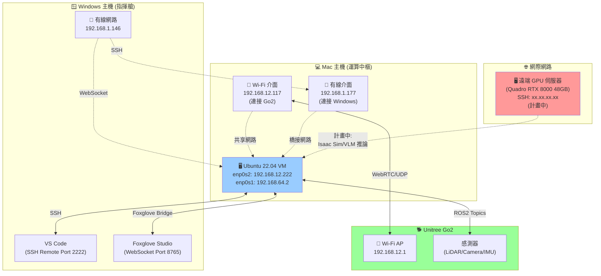
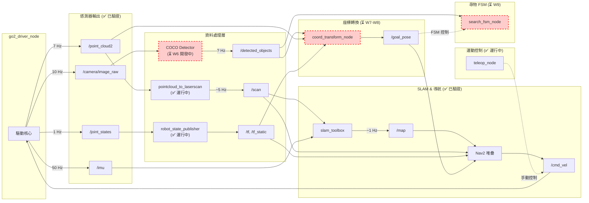
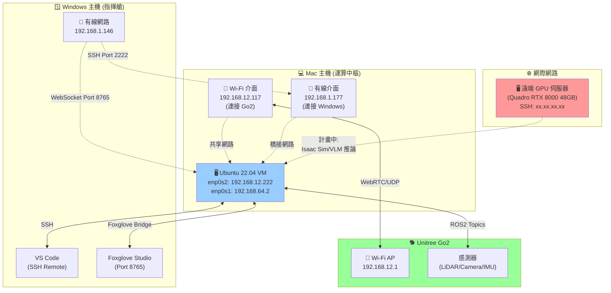
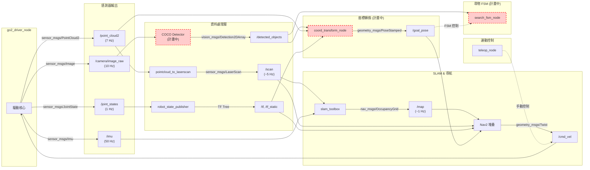
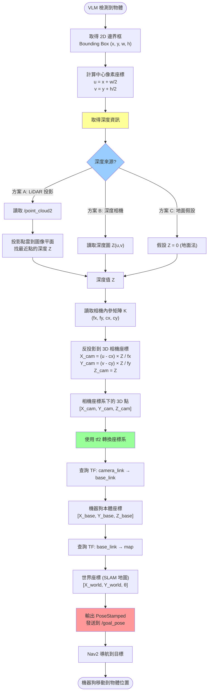
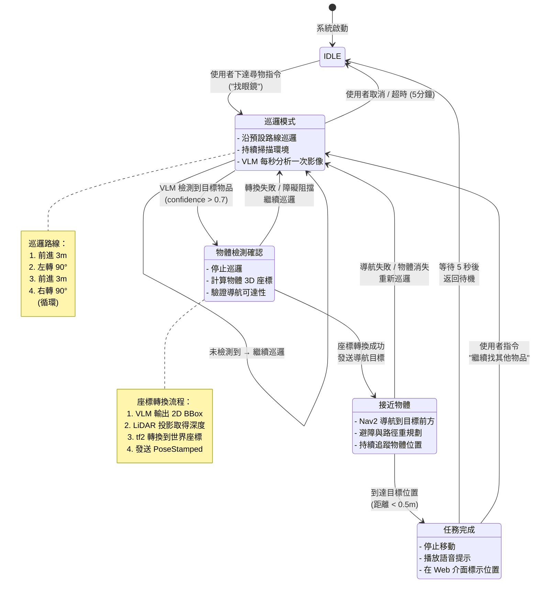
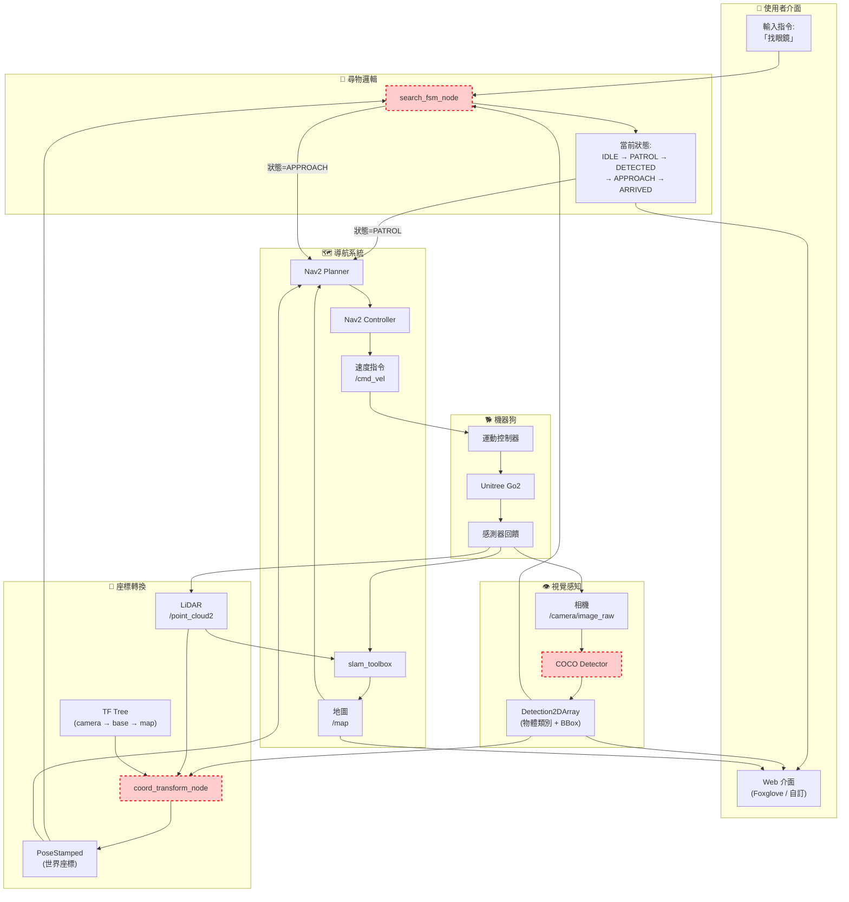

# Go2 機器狗智慧尋物系統 - 專題目標

## 專題名稱：老人與狗
**修訂日期：** 2025年11月23日（更新當前進度與架構圖）
**專題目標：** 結合機器狗移動平台、ROS2 導航系統及 COCO 本地 VLM（Gemini 為備案），開發一個具備自主導航、環境感知和指定物品尋獲能力的智慧尋物系統。

**變更歷史：**
- 2025/11/23：新增當前狀態摘要、更新進度表、補充 5 個技術架構圖、更新風險管理表（Roy）
- 2025/11/20：依 2025/11/19 會議決議同步更新（原版本）

---

## 0. 當前狀態摘要（2025/11/23 更新）

### 📍 當前週次：W6（第二個月）

**專案整體進度：約 55%**

### ✅ 已完成項目

1. **基礎建設與導航（W1-W5）**
   - ROS2 Humble + go2_robot_sdk 環境配置完成
   - SLAM（slam_toolbox）+ Nav2 導航堆疊穩定運行
   - 感測器整合：LiDAR/Camera/IMU 資料串流正常（topic 頻率達標）
   - 雙機協同開發環境：Mac ↔ Windows/VM 網路架構建立
   - Foxglove 視覺化工具連線成功（WebSocket Port 8765）

2. **Phase 1 自動化腳本（2025/11/23 完成）**
   - 開發 `phase1_test.sh` 一鍵測試腳本
   - 支援環境檢查、4 終端自動啟動、互動式控制（`auto` 指令自動巡房建圖）
   - 大幅降低操作錯誤風險，簡化測試流程

### 🔄 進行中項目

1. **COCO VLM 整合（W6，進度 30%）**
   - 研究 TorchVision COCO 模型架構
   - 尚未實作 `/detected_objects` 節點
   - **目標：12/03 前完成本地 GPU 推論雛形**

2. **Phase 1 實機測試（進度 0%）**
   - 自動化腳本已開發完成
   - 尚未執行實際建圖測試（SLAM + Nav2 驗證）
   - **目標：11/24 完成測試並產出報告**

### ⏳ 待開發項目（關鍵路徑）

1. **座標轉換（W7-W8，進度 0%）**
   - 🔴 **核心技術，連結視覺與導航的唯一橋樑**
   - 計畫採用 LiDAR 投影 + 地面假設法（Z=0）
   - **目標：12/05 前完成基礎轉換邏輯**

2. **尋物 FSM（W9，進度 0%）**
   - 實作巡邏→掃描→鎖定→導航狀態機
   - **目標：12/09 前完成端到端閉環測試**

3. **Isaac Sim 模擬器（進度 20%）**
   - go2_omniverse 方案確認
   - 尚未部署到遠端 GPU（Quadro RTX 8000）
   - **目標：11/26 前完成部署與 ROS2 橋接**（負責人：柏翊）

### 🎯 本週重點行動（11/23-11/26）

#### 優先級 🔴 最高
1. **立即執行 Phase 1 測試**
   ```bash
   # 使用 phase1_test.sh 執行建圖測試
   zsh phase1_test.sh env       # 環境檢查
   zsh phase1_test.sh t1        # Terminal 1: 啟動驅動
   zsh phase1_test.sh t2        # Terminal 2: 監控頻率
   zsh phase1_test.sh t3        # Terminal 3: 啟動 SLAM+Nav2
   zsh phase1_test.sh t4        # Terminal 4: 輸入 auto 自動建圖
   zsh phase1_test.sh save_map  # 儲存地圖
   zsh phase1_test.sh nav_test  # 測試導航
   ```
   - 驗證 /scan 頻率 > 5 Hz
   - 儲存地圖檔案（phase1.yaml + phase1.pgm）
   - 測試 Nav2 單點導航
   - 撰寫測試報告（2025-11-23-phase1-test-result.md）

#### 優先級 🔴 高
2. **啟動 COCO VLM 開發**
   - 安裝 TorchVision 與相依套件（使用 `uv pip install`）
   - 實作 coco_detector_node 雛形
   - 輸出 Detection2DArray 訊息格式

#### 優先級 🟡 中
3. **遠端 GPU + Isaac Sim 部署**（負責人：柏翊）
   - 完成 Windows VM → GPU 串接
   - 部署 Isaac Sim 2023.1.1 + Orbit 0.3.0
   - 驗證 go2_omniverse 與 ROS2 通訊

### ⚠️ 當前風險

- **Phase 1 測試未執行**：影響後續開發信心與時程，需立即完成
- **VLM 節點開發滯後**：W6 進度落後，需加速至少達到 50%
- **座標轉換技術難度高**：W7-W8 為關鍵，需預留除錯時間與備案（地面法）

### 📅 關鍵時程里程碑

| 日期 | 內容 | 負責人 |
|------|------|--------|
| **11/24 (日)** | Phase 1 測試完成 + 測試報告 | Roy |
| **11/26 (二)** | 週會：確認 VLM 介面規範、GPU 部署狀態 | 全組 |
| **12/03 (二)** | COCO VLM 雛形完成 | 如薇、旭 |
| **12/05 (四)** | 座標轉換基礎完成 | Roy、柏翊 |
| **12/09 (一)** | 尋物 FSM 端到端測試 | 全組 |
| **12/10 (二)** | **文件內容完成** | 全組 |
| **12/12 (四)** | **正式繳交** | 全組 |
| **12/17 (二)** | **第一階段發表** | 全組 |

### 📊 進度儀表板

```
基礎建設 ████████████████████ 100%
SLAM/Nav2 ████████████████████ 100%
VLM視覺   ██████░░░░░░░░░░░░░░  30%
座標轉換  ░░░░░░░░░░░░░░░░░░░░   0%
尋物FSM    ░░░░░░░░░░░░░░░░░░░░   0%
模擬器    ████░░░░░░░░░░░░░░░░  20%
Web介面   ██████░░░░░░░░░░░░░░  30% (Foxglove)
整體進度  ███████████░░░░░░░░░  55%
```

### 🔗 相關文件

- [開發計畫（符合度評估）](./開發計畫.md)
- [Phase 1 執行指南（快速版）](../01-guides/slam_nav/phase1_execution_guide_v2.md)
- [開發日誌（2025/11/23）](../04-notes/dev_notes/2025-11-23-phase1-automation.md)

---

## I. 專案願景與核心價值

### 1. 願景
讓 Go2 機器狗成為家庭環境中**實用**、**自主**的物品尋回助手，尤其能幫助高齡者或行動不便者解決日常找尋物品的困擾。

### 2. 核心技術棧 (修正後)

| 功能領域 | 核心技術 | 備註 (為何選擇) |
| :--- | :--- | :--- |
| **機器狗平台** | Unitree Go2 (實機) | 穩定、具備基本感測器與 SDK 支援。 |
| **作業系統** | Ubuntu 22.04 + **ROS2 Humble** | 業界標準，提供模組化開發框架。 |
| **模擬環境** | **Isaac Sim (Orbit)** | 提供高擬真數位孿生，**取代原規劃的非官方 SDK 串接**。 |
| **自主導航** | **ROS2 Nav2** + **slam\_toolbox** | 成熟的 SLAM 與導航套件。 |
| **智慧視覺** | **COCO 目標檢測 + 本地 GPU 推論** | 以 TorchVision FasterRCNN/MobileNet 為主力，延遲可控；Gemini Robotics API 調整為 Plan B 備援。 |

---

## II. 修正後的技術架構 (VLM 導向)

### 1. 軟硬體分層架構圖

```mermaid
flowchart TD
    subgraph FRONT["系統前端 (Web 介面)"]
        ui_cmd[使用者指令 (找眼鏡)] --> bridge(ROS2 Web Bridge / WebSocket)
        stream[即時影像串流] --> bridge
        map_ui[地圖與結果標示] --> bridge
    end
    
    subgraph ROS["ROS2 核心節點 (伺服器 / 虛擬機)"]
        bridge --> logic[尋物邏輯節點]
        cam[攝影機 2D 圖像] --> vlm[VLM 處理節點]
        lidar[LiDAR 點雲數據] --> tfconv[座標轉換節點]
        logic --> nav(Nav2 導航堆棧)
        nav --> cmd[運動控制指令]
        vlm --> px(2D 圖像座標)
        px --> tfconv
        tfconv --> logic
        tfconv --> world(3D 世界座標)
    end
    
    subgraph DOG["Go2 機器狗 (實機 / Isaac Sim)"]
        cmd --> ctrl[Go2 運動控制器]
        ctrl --> robot(實機 Go2)
        robot --> lidar
        robot --> cam
        ctrl --> sim(Isaac Sim 數位孿生)
        sim --> lidar
        sim --> cam
    end
```

### 2. 關鍵流程：圖像座標到世界座標的轉換 (步驟 D)

這是系統成功的關鍵。

1.  **輸入：** VLM 輸出 $\rightarrow$ 圖像上的 2D 像素座標 $[u, v]$。
2.  **深度計算：** 讀取同時間 LiDAR 數據或深度攝影機獲取的深度圖 $Z(u, v)$。
3.  **座標轉換：** 利用攝影機的**內參矩陣** $K$ (Intrinsic Matrix) 和深度 $Z$，將 $[u, v]$ 轉換為 Go2 本體座標系下的 3D 座標 $[x, y, z]$。
    $$
    \begin{bmatrix} x \\ y \\ z \end{bmatrix} = Z \cdot K^{-1} \cdot \begin{bmatrix} u \\ v \\ 1 \end{bmatrix}
    $$
4.  **世界轉換：** 使用 ROS2 `tf2`，將本體座標 $[x, y, z]$ 轉換為 SLAM 地圖上的**世界座標** $[X_w, Y_w, Z_w]$。
5.  **輸出：** 3D 世界座標 $\rightarrow$ 作為 Nav2 的導航目標點。

> 💡 **詳細圖解**：完整的座標轉換流程圖請參考 [第 VIII 章第 3 節：座標轉換詳細流程圖](#3-座標轉換詳細流程圖)

### 3. 網路拓樸架構圖（2025/11/23 新增）

展示當前開發環境的實際網路配置。



**配置說明：**
- **Mac 主機**：核心運算節點，運行 Ubuntu VM
- **Windows 主機**：開發操作介面，使用 VS Code SSH 和 Foxglove 視覺化
- **Go2 機器狗**：實機測試平台，透過 WebRTC 與 VM 通訊
- **遠端 GPU**（計畫中）：Isaac Sim 模擬與 VLM 本地推論

### 4. ROS2 節點通訊架構圖（2025/11/23 新增）

展示當前系統的 ROS2 節點與 topic 關係。



**節點狀態說明：**
- ✅ **已驗證運行**：驅動、感測器、SLAM、Nav2、控制層
- ⏳ **開發中**：COCO VLM（W6）、座標轉換（W7-W8）、尋物 FSM（W9）
- 紅色虛線框：計畫中尚未實作的節點

> 💡 **更詳細的架構圖**：完整的 5 個技術架構圖請參考 [第 VIII 章：技術架構圖集](#viii-技術架構圖集)

---

## III. 4 個月分階段時程規劃 (以週為單位)

**圖例說明：**
- [✅] 已完成並驗證
- [🔄] 開發中（當前週次正在進行）
- [⏳] 尚未開始（計畫中）
- [❌] 已取消或調整
- **📍 當前週次：W6 (2025/11/23)**

### 第 1 個月：基礎建設與環境學習

| 週次 | 任務重點 | 成果里程碑 |
| :--- | :--- | :--- |
| **W1** | **環境配置 (ROS2 + SDK)** | [✅] 所有成員完成環境配置，確認 GPU 伺服器規格。 |
| **W2** | **實機基本功能測試** | [✅] Go2 運動控制、所有感測器數據 (LiDAR/Camera/IMU) 串流驗證。 |
| **W3** | **SLAM 基礎測試** | [✅] 使用 `slam_toolbox` 在簡單環境完成 SLAM 建圖、地圖保存與載入。 |
| **W4** | **Isaac Sim 入門與整合** | [✅] 完成 Isaac Sim 安裝，執行 `go2_omniverse` 範例，確認 ROS2 橋接正常。 |

### 第 2 個月：核心功能開發 (Nav2 + VLM)

| 週次 | 任務重點 | 成果里程碑 |
| :--- | :--- | :--- |
| **W5** | **Nav2 導航與避障** | [✅] 完成複雜地圖的自主導航與動態避障測試，記錄成功率。 |
| **📍W6** | **COCO VLM 整合（Plan A）** | [🔄] **開發中（30%）**：研究 TorchVision COCO 模型；尚未實作 `/detected_objects` 節點；目標 12/03 完成雛形。 |
| **W7** | **座標系統轉換開發 I** | [🔄] **計畫中（0%）**：LiDAR 投影 + 地面假設法；實作圖像座標 $\rightarrow$ Go2 本體座標；目標 12/05 完成基礎邏輯。 |
| **W8** | **座標系統轉換開發 II** | [⏳] **尚未開始**：整合 `tf2` 完成本體座標 $\rightarrow$ 世界座標轉換；與 Nav2 串接測試。 |

### 第 3 個月：系統整合與 Web 介面

| 週次 | 任務重點 | 成果里程碑 |
| :--- | :--- | :--- |
| **W9** | **尋物邏輯與流程控制** | [⏳] **尚未開始（0%）**：實作完整的尋物狀態機 (巡邏 $\rightarrow$ 掃描 $\rightarrow$ 鎖定 $\rightarrow$ 導航)；目標 12/09 完成端到端測試。 |
| **W10** | **Web 介面雛形開發** | [🔄] **部分完成（30%）**：已有 Foxglove 視覺化；尚未建立自訂 Web 介面；目標 12/10 前完成基礎頁面。 |
| **W11** | **使用者測試與回饋** | [⏳] **尚未開始**：依賴 W9-W10 完成後進行內部使用者測試。 |
| **W12** | **系統穩定性與優化** | [⏳] **尚未開始**：依賴完整系統運行後進行長時間測試與效能優化。 |

### 第 4 個月：最終準備與文件撰寫

| 週次 | 任務重點 | 成果里程碑 |
| :--- | :--- | :--- |
| **W13** | **Demo 情境準備與演練** | [⏳] **待前階段完成**：準備 4 個 Demo 情境，演練 Plan A/B/C 應變方案，錄製展示影片。 |
| **W14-15** | **文件撰寫與簡報準備** | [⏳] **待前階段完成**：完成所有專題文件撰寫、簡報製作與口頭報告演練。 |
| **W16** | **最終檢查** | [⏳] **待前階段完成**：所有功能最終測試，文件與程式碼最終整理。 |

---

## IV. 風險管理與應對方案 (Plan A/B/C)

| 風險等級 | 風險項目 | 緩解措施 (開發期) | 應對方案 (Demo 期) |
| :--- | :--- | :--- | :--- |
| **🔴 高** | **座標轉換誤差過大** | 增加校正點位與次數；若實機困難，則在 W7/W8 主攻模擬器校正。 | **Plan B：** Demo 時機器狗導航到**大致區域**，並在 Web 介面標示** VLM 圖像座標**，口頭說明轉換流程。 |
| **🔴 高** | **Isaac Sim 學習曲線** | 預留 W4 完整一週時間專門學習；團隊內指定一名核心成員負責 Sim 相關任務。 | **Plan C：** 若模擬器開發受阻，則直接使用實機 ROS2 + SLAM + Nav2 作為最低可行方案。 |
| **🟡 中** | **VLM API 額度/延遲** | 開發本地快取機制；調整 VLM 呼叫頻率；優化影像壓縮。 | **Plan B：** 若網路延遲，改用預錄的 VLM 辨識結果與實機導航結合。 |
| **🟡 中** | **實機過熱/故障** | 模擬器作為主要開發環境；設定 Go2 連續運行時間限制。 | **Plan B/C：** 實機僅展示基本移動與 SLAM；核心尋物功能在模擬器或影片中展示。 |
| **🟡 中** | **Phase 1 測試未通過**（2025/11/23 新增） | 使用 phase1_test.sh 腳本降低操作錯誤；提前在小空間驗證 SLAM 建圖精度；11/24 前完成測試。 | **Plan B：** 使用模擬器展示 SLAM 建圖；實機僅展示基本移動與感測器數據。 |
| **🟡 中** | **多終端操作複雜度**（2025/11/23 新增） | 開發一鍵自動化腳本 (phase1_test.sh)；撰寫清楚的 SOP 文件；提供互動式控制介面（`auto` 指令）。 | **Plan B：** Demo 時使用預錄影片搭配口頭說明；降低現場操作失誤風險；準備快速重啟腳本 (`restart_all.sh`)。 |
| **🟡 中** | **雙機環境配置困難**（2025/11/23 新增） | 建立網路拓樸圖；記錄 Mac/Windows/VM 的 IP 與 Port 配置；使用 SSH Port Forwarding 簡化連線；提供一鍵環境檢查 (`phase1_test.sh env`)。 | **Plan C：** 改用單機開發（僅 Mac + VM），放棄 Windows Foxglove（改用 VM 內 RViz2 或 headless 模式）。 |

---

## V. 資源與規格確認清單

| 項目 | 狀態 | 修正建議 | 負責人 | 期限 |
| :--- | :--- | :--- | :--- | :--- |
| **GPU 伺服器** | ✅ **Quadro RTX 8000 48GB** | **遠超需求！** 支援 RTX 光線追蹤、多機器人、VLM 本地推論。遠端 SSH 連線（參考 `../01-guides/remote_gpu_setup.md`） | ROY | ✅ 已確認 |
| **VLM 方案** | ✅ Plan A：COCO | 本地推論（Torch + RTX 8000）為主；**Plan B：** Gemini API 核准後作為補充；**Plan C：** OpenAI/Claude Vision | (VLM 小組) | W6-W7 |
| **第三人稱視角** | **已廢棄/降級** | 專注於 Go2 內建感測器 (LiDAR/Camera) 的第一人稱方案。 | (所有成員) | W1 |
| **必讀文檔** | ✅ **已提供** | **8 份完整開發文件**（`docs/` 目錄），涵蓋 VLM/座標轉換/FSM/Isaac Sim/測試。 | (所有成員) | W6 開始前 |

---

## VI. 總結與提醒

此修正計畫將專注於整合 **ROS2/Nav2/Isaac Sim/COCO VLM** 這四個獨立且強大的組件，避免了「開發模擬器與 SDK 串接」這個不存在的需求，大大提高了專案成功的機率。

**成功關鍵：**

1.  **快速修正技術認知**，特別是 Isaac Sim 的使用方式。
2.  **成功實作座標轉換 (W7-W8)**，這是連結視覺與導航的唯一橋樑。
3.  **嚴格遵守 4 個月時程**，並準備好 Plan B/C 以應對高風險技術挑戰。

---

## VII. 2025/11/19 會議新增目標與時程

### 1. 關鍵時程里程碑
| 日期 | 內容 | 說明 |
|------|------|------|
| 12/10 (二) | 文件內容完成 | 各模組文件定稿，納入 `docs/` 對應章節 |
| 12/11 (三) | 文件修正日 | 依指導老師建議修訂 |
| 12/12 (四) | 正式繳交 | 提交第一階段文件與成果 |
| 12/17 (三) | 第一階段發表 | 展示 COCO VLM + Nav2 + Isaac Sim Demo（含備案影片） |
| 每週二第六節 | 固定會議 | 14:40 週會，追蹤 W6-W9 任務 |

### 2. 架構與環境決議
- **開發拓樸**：Mac ↔ Windows VM (Ubuntu) ↔ 遠端 GPU（Quadro RTX 8000），全組共享、支援 Isaac Sim/ROS2/VLM。詳見 `docs/01-guides/remote_gpu_setup.md`。
- **VLM 策略**：COCO 模型為主線、本地可控；Gemini/Claude 僅作為零樣本備案。
- **模擬器必要性**：因實機噪音、過熱與空間限制，Isaac Sim 為主要測試平台，實機僅做確認與展示。

### 3. 第二階段擴充目標
| 模組 | 會議結論 | 目標時程 |
|------|----------|----------|
| Web/APP 介面 | 建置桌面端 UI：登入、狀態監看、影像串流、下達尋物指令。行動版視情況採本地 IP。 | W10-W11 |
| 資料記錄/資料庫 | 蒐集搜尋時間、物品類型、頻率，預留記憶衰退分析與家屬遠端關懷。 | W10-W12 |
| Demo 與簡報 | 繪製含 Mermaid/動畫的架構圖，錄製 Isaac Sim/實機備援影片，準備 Plan A/B/C。 | W12-W13 |
| 文件流程 | 導入 Docs-as-Code，於 `docs/` 索引對齊所有手冊/設計/測試；新增 presentation checklist。 | 持續 |

### 4. 後續優先工作
1. **W6**：完成 Windows VM + GPU 串接、部署 ROS2、安裝 Isaac Sim、實作 COCO VLM 雛形。
2. **W7-W8**：完成座標轉換（LiDAR 投影 + 地面假設）與 Nav2 串接；在 Isaac Sim 驗證閉環。
3. **W9**：組合尋物 FSM，並依 `testing_plan.md` 進行端到端驗收，產出 Demo 版本。
4. **文檔管理**：每次會議後更新 `docs/00-overview/claude_plan.md` 與 `docs/04-notes/CHANGELOG.md`，保持需求/現況同步。

---

## VIII. 技術架構圖集

本章節提供系統各層級的詳細架構圖，以 Mermaid 語法繪製，便於文件維護與版本控制。

### 1. 網路拓樸架構圖

展示 Mac、Windows、VM、Go2 與遠端 GPU 的網路連線關係。



**說明：**
- Mac 透過 Wi-Fi (192.168.12.117) 連接 Go2 機器狗
- Windows 透過有線網路 (192.168.1.146) 使用 SSH (Port 2222) 與 Foxglove (Port 8765) 連接 Mac 內的 VM
- VM 透過 enp0s2 (192.168.12.222) 與 Go2 通訊，透過 enp0s1 (192.168.64.2) 與 Mac 共享網路
- 遠端 GPU 伺服器（計畫中）將用於 Isaac Sim 模擬與 VLM 本地推論

---

### 2. ROS2 節點通訊架構圖

展示所有 ROS2 節點的 topic 訂閱/發布關係與資料流向。



**說明：**
- 紅色虛線框：計畫中尚未實作的節點（COCO Detector、座標轉換、尋物 FSM）
- 關鍵 topic 頻率標註於圖中
- 顯示完整的感測器 → 處理 → 導航 → 控制鏈路

---

### 3. 座標轉換詳細流程圖

展示 2D 像素座標到 3D 世界座標的完整數學轉換流程。



**說明：**
- **方案 A（主要）**：使用 LiDAR 投影取得深度
- **方案 B（備援）**：使用深度相機（若 Go2 有配備）
- **方案 C（最簡）**：地面假設法（假設物體在地面，Z=0）
- 關鍵步驟：反投影（Deprojection）+ tf2 座標系轉換

---

### 4. 尋物 FSM 狀態機圖

展示尋物系統的完整狀態轉移邏輯。



**狀態說明：**
- **IDLE（待機）**：等待使用者指令
- **PATROL（巡邏）**：沿預設路線巡邏，持續掃描環境
- **DETECTED（檢測確認）**：VLM 檢測到目標物品，計算 3D 座標
- **APPROACH（接近）**：Nav2 導航到目標位置
- **ARRIVED（任務完成）**：停止移動，播放提示

**轉移條件：**
- 巡邏 → 檢測：VLM confidence > 0.7
- 檢測 → 接近：座標轉換成功且可導航
- 接近 → 完成：距離 < 0.5m

---

### 5. 端到端資料流向圖

展示從使用者指令到機器狗動作的完整資料流。



**關鍵資料流：**
1. **輸入流**：Web 介面 → FSM 節點 → 導航指令
2. **感知流**：相機/LiDAR → VLM/SLAM → 環境理解
3. **決策流**：FSM 狀態 → 座標轉換 → 導航目標
4. **執行流**：Nav2 規劃 → 速度指令 → 機器狗運動
5. **回饋流**：感測器 → 地圖更新 → Web 介面顯示

---

祝專題順利！
