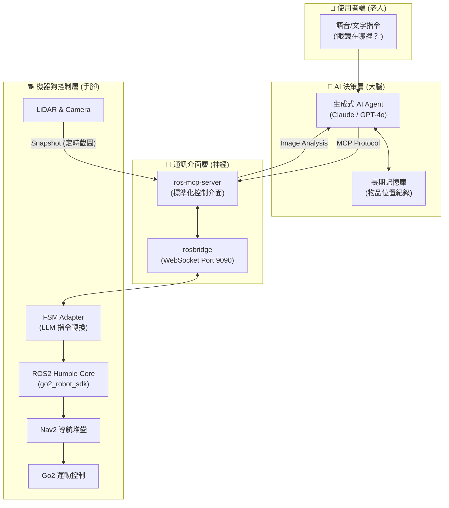
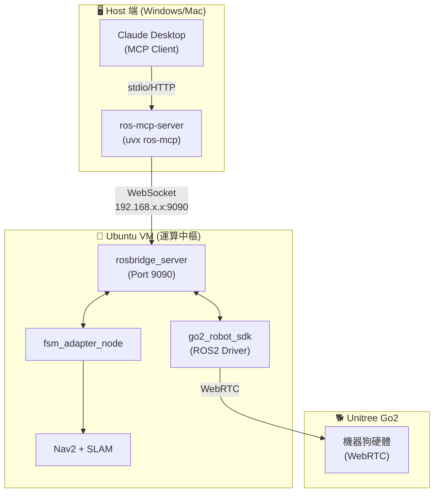

# 專題計畫書：「老人與狗」

## 基於 MCP 架構與生成式 AI 的 Go2 機器狗居家陪伴與尋物系統

**專題名稱：** 老人與狗 (Elder and Dog)  
**文件版本：** v3.3 (YOLO-World + DA3 融合版)  
**修訂日期：** 2025年12月17日  
**關鍵里程碑：** 2026/1/7 第一階段發表（剩餘 21 天）

---

## 0. 當前狀態摘要（2025/12/17 更新）

### 📍 當前週次：W8 Day 3（第二個月）

**專案整體進度：約 80%**

### ✅ 已完成項目

| 模組 | 進度 | 說明 |
|------|------|------|
| **ROS2 環境** | 100% | Ubuntu 22.04 + ROS2 Humble + go2_robot_sdk |
| **SLAM + Nav2** | 100% | slam_toolbox + Nav2 導航堆疊驗證完成 |
| **感測器整合** | 100% | LiDAR/Camera/IMU 資料串流正常 |
| **雙橋接網路** | 100% | Mac VM ↔ Windows ↔ Go2 架構完成 |
| **ros-mcp-server 整合** | 100% | rosbridge + MCP 控制鏈驗證成功 |
| **snapshot_service** | 100% | 相機截圖服務運作正常 |
| **move_for_duration** | 100% | 定時移動服務（安全限速）|
| **Depth Anything V2** | 100% | DA3 Metric 深度估計，326ms 推論 |
| **Go2 距離校正** | 100% | SCALE_FACTOR=0.60，誤差 <10% |
| **感知融合設計** | 100% | YOLO + DA3 → JSON 架構設計完成 |

### 🔄 進行中項目（W8 重點）

| 模組 | 進度 | 下一步 |
|------|------|--------|
| **YOLO-World 整合** | 10% | `/find_object` API 實作 |
| **備案影片錄製** | 0% | 本週必須完成 |
| **Go2 動作庫研究** | 100% | 35+ 動作可用（Hello, Dance 等）✅ |

### 🎯 架構定位（12/17 更新）

**核心定位：** YOLO-World + DA3 融合架構

```
使用者：「幫我找水瓶」
      ↓
LLM 語意理解（Claude/GPT）
      ↓ 呼叫 /find_object API
GPU Server 執行：
  ├── YOLO-World：偵測物體 → bbox, center
  └── DA3 Metric：深度估計 → distance
      ↓ 融合輸出 JSON
{ label: "water bottle", distance: 1.2m, direction: "左側", cmd_vel: {...} }
      ↓
Go2 機器狗執行移動
```

**設計理念：**
- ❌ 不給 LLM 吃「生肉」（原始圖片 → 3-7 秒延遲）
- ✅ 給 LLM 吃「熟食」（DA3 + YOLO JSON → **< 2.5 秒延遲**）
- ✅ 雙模型並行：物體偵測 + 深度估計同時運行
- ✅ API 回傳 cmd_vel：Safety Layer 已內建

> 💡 **為什麼不用純 VLM？** 純 VLM 成功率僅 5-6 成，延遲高且不可控。YOLO + DA3 融合方案快 3 倍、可調試。

### 🐕 專案目標擴展（12/17 教授會議）

> 「尋物功能似不太能發揮亮點，我們再一起想想如何讓 Go2 用 MCP 發揮更多用途」

**原目標**：尋物機器狗  
**新目標**：**智能、互動式 AI 機器狗**

- 尋物只是功能之一，不是全部
- Go2 具備 35+ 內建動作（Hello、Dance、FingerHeart 等）
- 可透過 MCP 調用，實現「聽得懂人話」的多元互動

---

## I. 專案願景與核心價值

### 1. 願景

讓 Go2 機器狗成為「懂爺爺奶奶」的 AI 居家夥伴，具備**語意理解**、**視覺感知**與**主動關懷**能力，解決長者「物品遺失的困擾」與「缺乏情感陪伴」兩大痛點。

### 2. 核心理念：「老人與狗」

這不只是一個會移動的工具，而是一隻能：
- **聽得懂人話：** 理解模糊指令（如「幫我找眼鏡」）
- **看得懂環境：** 透過 VLM 辨識居家物品與障礙物
- **找得到東西：** 在家中自主巡視，引導長者尋回物品

### 3. 技術定位

| 項目 | 傳統方案 | 本專題方案 |
|------|---------|-----------|
| 指令理解 | 程式化指令 | **自然語言 (LLM)** |
| 視覺處理 | 即時串流 / LLM Vision | **Perception API (DA3+YOLO) → JSON** |
| 控制介面 | 自訂協定 | **MCP 標準協定** |
| 導航策略 | 純座標導航 | **雙系統：LLM 規劃 + 確定性執行** |
| 記憶系統 | 無 | **短期記憶 (任務狀態機)** |

---

## II. 系統架構

### 1. 高階架構圖



### 2. 資料流詳解

```
使用者指令 "幫我找水"
     ↓
LLM (Claude/GPT) 理解意圖
     ↓ MCP Protocol
ros-mcp-server 轉譯
     ↓ WebSocket
rosbridge_server
     ↓ ROS2 Topics
FSM Adapter 節點
     ├── /cmd_vel（簡單移動）
     └── Nav2 Action（複雜導航）
           ↓
     Go2 機器狗執行
           ↓
Camera 截圖 → ros-mcp-server → LLM 視覺分析
           ↓
LLM："前方有障礙物，轉向中..."
```

### 3. 關鍵技術選型

| 模組 | 技術方案 | 選擇理由 |
|------|---------|---------|
| **機器人大腦** | Claude 3.5 / GPT-4o | 強大的語意理解與推論能力 |
| **通訊協定** | MCP (Model Context Protocol) | LLM 直接呼叫 ROS2 功能的標準介面 |
| **MCP Server** | ros-mcp-server | 開源、支援 ROS1/ROS2、**支援 Action**、有 Go2 範例 |
| **機器人平台** | Unitree Go2 + ROS2 Humble | 業界標準，穩定性高 |
| **視覺方案** | Snapshot + VLM | 解決即時串流的高延遲問題 |
| **導航框架** | Nav2 + slam_toolbox | 成熟的 SLAM 與導航套件 |
| **網路拓樸** | 雙橋接網路 | Windows ↔ VM ↔ Go2 低延遲通訊 |

### 4. 座標系統約定

| 座標框架 | 說明 | 注意事項 |
|---------|------|----------|
| `map` | SLAM 世界座標系 | Nav2 目標點使用此框架 |
| `base_link` | 機器狗本體中心 | 運動控制參考點 |
| `front_camera` | 前置相機 | ⚠️ **不是** `camera_link`（go2.urdf 定義） |
| `camera_link` | RealSense 相機 | 僅 `go2_with_realsense.urdf` 使用 |

> ⚠️ **TF 查詢注意：** 使用預設 URDF 時，相機框架為 `front_camera`，不是 `camera_link`！

### 4. 網路拓樸架構圖



---

## III. 執行階段與時程規劃

### 第一階段：核心驗證 (Proof of Concept)

**時間：** 2025/12/06 ～ 2026/1/7（發表日）  
**目標：** 展示「AI 聽懂指令並控制機器狗」的 MVP

#### W6 (12/2-12/8)：環境重構與 MCP 串接

- [x] ros-mcp-server Clone 與研究完成
- [x] 安裝 rosbridge_server
- [x] 測試 uvx ros-mcp 連線
- [x] **里程碑：** Claude Desktop 輸入「往前走」，機器狗成功移動 ✅

#### W7 (12/9-12/15)：視覺閉環 (Visual Loop)

- [x] 實作 `/capture_snapshot` 服務
- [x] 讓 LLM 讀取圖片並描述環境
- [x] 實作 `/move_for_duration` 定時移動服務
- [x] Phase A 移動控制測試（前進/後退/左轉/右轉/緊急停止）
- [ ] Phase B Odometry 精確移動測試
- [ ] Phase C 手動避障流程測試
- [ ] Phase D Kilo Code 整合測試
- [ ] **里程碑：** AI 看到障礙物，自主決定「轉向」

#### W8 (12/16-12/22)：YOLO-World + DA3 融合實作 🔴

- [x] 感知融合架構設計（12/17）
- [x] Go2 動作庫研究（35+ 動作可用）
- [ ] **GPU Server：YOLO-World 部署**
  - [ ] 安裝 ultralytics + supervision
  - [ ] 下載 yolov8s-world.pt 模型
  - [ ] 建立 `yolo_world_model.py`
  - [ ] 建立 `fusion_service.py`
- [ ] **修改 perception_server.py**
  - [ ] 新增 `/find_object` API
  - [ ] 模型預熱 + 錯誤處理
- [ ] **Mac VM 整合測試**
- [ ] **里程碑：** `/find_object` API 回傳正確 JSON，延遲 < 2.5s

#### W9 (12/23-12/28)：實機測試與備案

- [ ] 實機驗證（3 場景 × 10 次）
- [ ] 成功率達標（目標 > 80%）
- [ ] **錄製備案影片**（教授要求，必做！）
- [ ] 更新 MCP System Prompt
- [ ] **里程碑：** 備案影片完成

#### W10 (12/29-1/6)：Demo 準備

- [ ] 壓力測試（連續運行 10 分鐘）
- [ ] 準備簡報 PPT（三版架構演進）
- [ ] 實機演練 Demo 腳本
- [ ] 最終彩排 3 次
- [ ] **里程碑：** Demo 成功率 > 80%

### 第二階段：智能互動擴展 (寒假 1月中-2月)

**核心目標：** 從「尋物工具」全面升級為「智能互動 AI 夥伴」

#### 2.1 多模態互動系統

- [ ] **語音整合**
  - Whisper STT（語音轉文字）
  - ElevenLabs / Azure TTS（文字轉語音）
  - 實現「完全語音」互動體驗

- [ ] **Web 控制介面**
  - FastAPI 後端（取代 Claude Desktop）
  - Web 前端（說話按鈕 + 即時影像回傳）
  - 手機友善介面（長者易用性設計）

#### 2.2 動作庫完整整合

- [ ] **基礎互動動作**（優先）
  - Hello (打招呼)、Stretch (伸懶腰)
  - Dance1/Dance2 (跳舞)、FingerHeart (比愛心)
  - WiggleHips (扭屁股)、Wallow (打滾)

- [ ] **進階展示動作**（選用）
  - FrontFlip (前空翻)、MoonWalk (月球漫步)
  - Handstand (倒立)、Bound (彈跳)

- [ ] **情境化動作序列**
  - 「早安問候」：StandUp → Stretch → Hello
  - 「歡迎回家」：Hello → Dance1 → FingerHeart
  - 「任務完成慶祝」：Dance2 → WiggleHips

#### 2.3 記憶與學習系統

- [ ] **短期記憶**（任務級別）
  - 當前目標追蹤
  - 動作歷史記錄
  - 任務狀態機（FSM）

- [ ] **中期記憶**（對話級別）
  - 當日互動歷史
  - 使用者偏好學習
  - 物品發現記錄

- [ ] **長期記憶**（永久儲存）
  - 物品位置地圖（SQLite）
  - 使用者習慣資料庫
  - 互動行為優化

#### 2.4 Context Builder 節點

- [ ] **環境感知增強**
  - 雷達摘要：「前方 0.5m 有障礙物」
  - 方位提示：「目標在 1 點鐘方向，約 2 公尺」
  - 場景理解：「你在客廳，沙發在左側」

- [ ] **時空推理能力**
  - 「藥盒通常在哪？」→ 查詢歷史記錄
  - 「剛剛看到的水瓶在哪？」→ 短期記憶查詢
  - 「帶我去上次找到眼鏡的地方」→ 位置記憶

### 第三階段：多代理人協同 (下學期 3-6月)

**核心目標：** 實現「多角色 AI 夥伴」，從單一功能升級為全方位陪伴

#### 3.1 LangGraph 多代理人架構

```
                    Supervisor Agent
                    (總指揮 & 意圖判斷)
                           |
          +----------------+----------------+
          |                |                |
   Companion Agent   Navigation Agent   Memory Agent
   (聊天陪伴)         (專業導航)        (記憶管理)
          |                |                |
          +----------------+----------------+
                           |
                     MCP Control Layer
                           |
                      Go2 Hardware
```

- [ ] **Supervisor Agent**（總指揮）
  - 意圖分類：問候、尋物、閒聊、動作展示
  - 任務分派：決定呼叫哪個專業 Agent
  - 異常處理：任務失敗後的備案策略

- [ ] **Companion Agent**（聊天陪伴）
  - 情感陪伴：「今天過得怎麼樣？」
  - 健康提醒：「該吃藥囉！」
  - 天氣播報：「今天會下雨，記得帶傘」
  - 趣味互動：說笑話、猜謎語、講故事

- [ ] **Navigation Agent**（專業導航）
  - 尋物專家：結合 SLAM + VLM + 記憶
  - 巡邏模式：定時巡視各房間
  - 跟隨模式：跟著使用者移動
  - 安全監控：偵測異常（跌倒、長時間不動）

- [ ] **Memory Agent**（記憶管理）
  - 物品位置學習：「眼鏡最常在哪裡？」
  - 行為模式分析：「爺爺通常 8 點吃早餐」
  - 偏好記錄：「奶奶喜歡聽老歌」
  - 重要事件提醒：「明天有醫院預約」

#### 3.2 輕量化本地部署

**目標：** 降低延遲與成本，實現「離線可用」

- [ ] **本地 LLM 部署**
  - 模型選擇：Mistral 14B / Qwen 8B-32B Light
  - 部署平台：Ollama / LM Studio
  - 推論優化：量化（INT4/INT8）、TensorRT

- [ ] **邊緣運算優化**
  - 將感知模型（YOLO + DA3）部署到本地 GPU
  - 減少網路依賴，提升即時性
  - 目標延遲：< 1s (完整尋物流程)

#### 3.3 社會互動與擴展

- [ ] **多機器狗協同**（研究方向）
  - 2-3 台 Go2 協同巡邏
  - 任務分工：一台尋物、一台陪伴
  - Isaac Sim 模擬驗證

- [ ] **居家物聯網整合**
  - 連接智慧家電（燈光、空調）
  - 「幫我開燈」→ MQTT 控制
  - 「室內溫度多少？」→ 感測器查詢

- [ ] **遠端關懷功能**
  - 家人 App 即時監控
  - 異常通知（長時間無互動）
  - 視訊通話中繼（Go2 作為移動視訊站）

### 第四階段：研究與論文 (大四全年)

**核心目標：** 提升學術價值，產出研究成果

#### 4.1 論文方向

- [ ] **會議論文**（優先）
  - ICRA / IROS (機器人頂會)
  - 主題：「MCP-based LLM Control for Quadruped Robots」
  - 貢獻：首次將 MCP 協定應用於四足機器人

- [ ] **期刊論文**（進階）
  - IEEE Robotics and Automation Letters (RA-L)
  - 主題：「Multi-Agent LLM Framework for Elderly Care Robots」
  - 貢獻：LangGraph 多代理人架構 + 長期記憶系統

#### 4.2 技術創新點

1. **MCP 標準化控制**
   - 首次在 ROS2 機器人上實現 MCP
   - 開源 ros-mcp-server 優化版本

2. **輕量級感知融合**
   - YOLO-World + DA3 架構
   - 「熟食」策略（JSON vs 圖片）
   - 延遲降低 3 倍（3-7s → 1.5-2.5s）

3. **雙系統架構**
   - System 2 (慢系統)：LLM 規劃
   - System 1 (快系統)：確定性執行
   - 可靠性 > 端到端 VLA

4. **LangGraph 多代理人**
   - Supervisor + Companion + Navigation + Memory
   - 模組化、可擴展、易調試

#### 4.3 社會影響評估

- [ ] **使用者測試**
  - 招募長者使用者（5-10 人）
  - 問卷調查：易用性、接受度、實用性
  - 數據收集：互動頻率、任務成功率

- [ ] **倫理與隱私**
  - 影像資料保護
  - 使用者同意書
  - 數據匿名化處理

---

## 🚀 願景總結：三階段進化路線

### 第一階段成果（1/7 Demo）
✅ **尋物機器狗**：AI 能看懂環境、找到物品
- 技術驗證：MCP + YOLO + DA3 融合
- Demo 成功率：> 80%

### 第二階段目標（寒假）
🎯 **智能互動 AI 夥伴**：聽得懂人話、會做動作
- 語音互動：完全語音控制
- 動作展示：35+ 動作隨意調用
- 記憶系統：記住物品位置

### 第三階段願景（下學期）
🌟 **多角色 AI 陪伴系統**：不只尋物，更是夥伴
- 多代理人：陪伴 + 導航 + 記憶
- 本地部署：低延遲、離線可用
- 社會連結：遠端關懷 + 物聯網整合

### 終極願景（大四）
🏆 **學術與產業雙贏**
- 論文發表：ICRA / IROS / RA-L
- 開源貢獻：ros-mcp-server + LangGraph 框架
- 社會價值：長者照護 + 情感陪伴

---

> 💡 **核心理念：** 讓 Go2 從「會移動的工具」變成「懂人心的夥伴」

---

## IV. 1/7 專題發表 Demo 劇本

### 場景設置

模擬居家客廳：
- 地上有一個紙箱（障礙物）
- 桌上放著一瓶水（目標物）

### 演示流程

1. **指令下達**
   > 「Go2，我口渴了，幫我找找桌上的水。」

2. **AI 思考與規劃（螢幕展示）**
   > "收到指令：找水。執行策略：先巡視環境。"
   > "呼叫 `get_topics`... 準備移動。"

3. **避障展示**
   - 機器狗前進，遇到紙箱
   - AI 截圖分析：「前方發現障礙物（紙箱），規劃繞行路徑...」
   - 機器狗左轉繞過

4. **發現目標**
   - 機器狗看到桌子
   - AI：「發現桌子，上面有一瓶水。確認為目標物。」

5. **任務完成**
   - 機器狗走到桌前停下
   - AI：「爺爺，水在前面的桌子上喔！」

---

## V. 風險管理與應對方案

| 風險 | 等級 | 緩解措施 (Plan A) | 備案 (Plan B) |
|------|------|------------------|---------------|
| **現場網路不穩** | 🔴 高 | 手機熱點 + 本地 VM | 預錄「一鏡到底」影片 |
| **LLM 產生幻覺** | 🟡 中 | Safety Filter（限速限範圍） | 預寫 Prompt 腳本 |
| **影像傳輸延遲** | 🟡 中 | Snapshot 機制 | 降低解析度 |
| **MCP Action 支援** | 🟡 中 | W7 Day 1 驗證 `send_action_goal()` | 失敗則啟動 FSM Adapter (Plan B) |
| **Demo 實機故障** | 🟡 中 | 檢查電池與硬體 | Isaac Sim 模擬器展示 |

> 💡 **Action 支援說明：** ros-mcp-server 提供 `send_action_goal()` 函式，但需驗證 rosbridge/rosapi 是否提供完整的 action services。若驗證失敗，則開發 FSM Adapter 作為轉接層。

### 安全層建議（重要！）

> ⚠️ **不建議讓 LLM 直接發布 `/cmd_vel`！**
>
> **風險：** LLM 可能產生幻覺，輸出 `linear.x = 10.0`（它可能以為單位是 cm/s，但 ROS 是 m/s），造成機器狗暴衝。
>
> **推薦架構：**
> ```
> LLM 輸出： {"action": "move", "direction": "forward", "distance": 1.0}
>      ↓
> Safety Layer (FSM Adapter)： 轉換為安全的 cmd_vel，限制最大速度與加速度
>      ↓
> /cmd_vel
> ```

---

## VI. 預期貢獻與創新點

1. **技術創新：** 率先導入 **MCP (Model Context Protocol)** 於 ROS2 機器人控制
2. **架構創新：** 提出 **LangGraph 多代理人架構** 的未來藍圖
3. **社會價值：** 聚焦於 **「老人照護」** 議題，賦予機器人溫度與人文關懷

---

## VII. 附錄：技術名詞解釋

| 術語 | 說明 |
|------|------|
| **MCP** | Model Context Protocol，Anthropic 提出的 LLM 與外部工具通訊標準 |
| **rosbridge** | ROS2 的 WebSocket 橋接器，讓非 ROS 程式可與 ROS 通訊 |
| **VLM** | Vision Language Model，視覺語言模型 |
| **Snapshot** | 定時截圖策略，取代即時影片串流以降低延遲 |
| **FSM** | Finite State Machine，有限狀態機 |
| **Nav2** | ROS2 Navigation Stack，導航框架 |
| **LangGraph** | LangChain 的多代理人協作框架 |

---

## VIII. 相關文件

- [開發計畫（時程規劃）](./開發計畫.md)
- [ros-mcp-server 技術研究報告](../../ros-mcp-server/README.md)
- [Phase 1 執行指南](../01-guides/slam_nav/README.md)
- [CycloneDDS 配置指南](../01-guides/cyclonedds-config-guide.md)

---

**祝專題順利！🐕**
