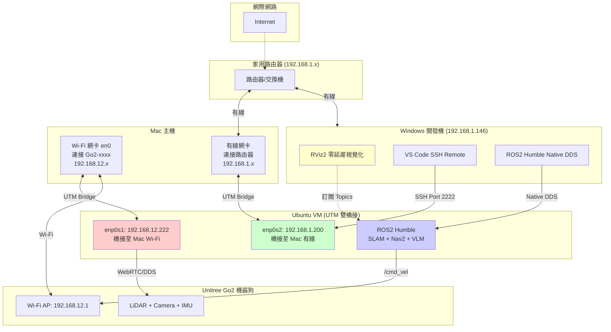
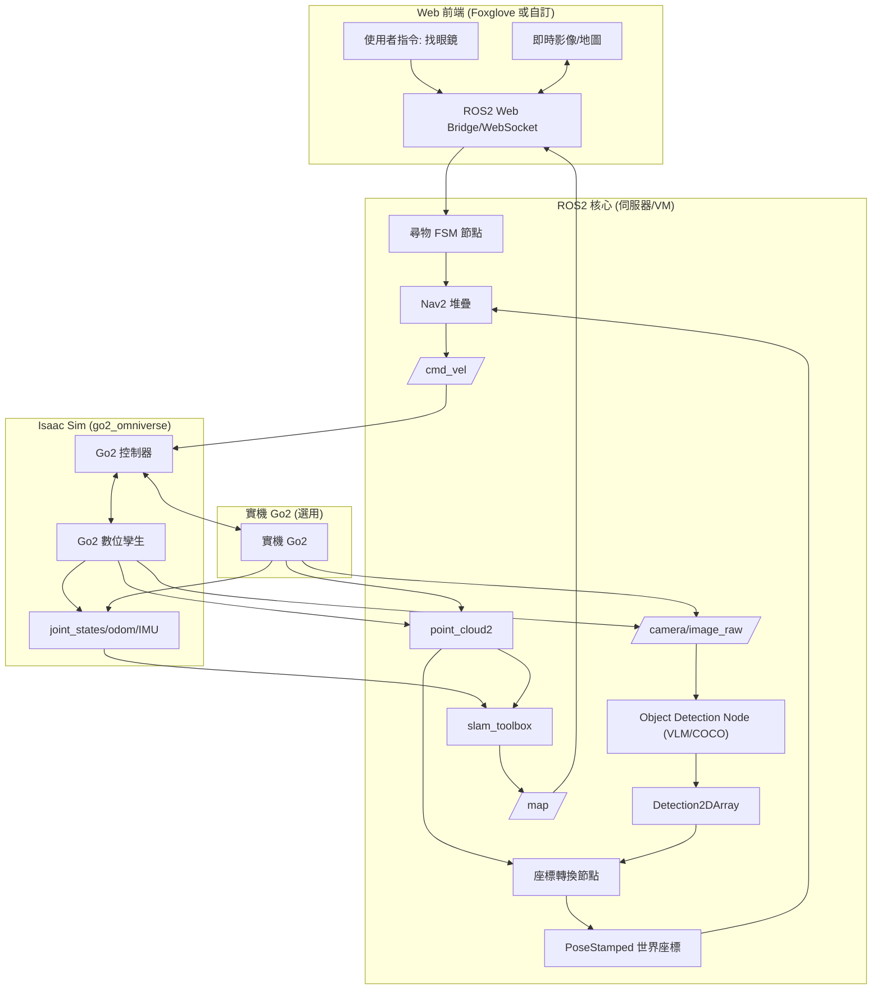

# Go2 智慧尋物系統開發計畫

**報告日期：** 2025/11/20（依 2025/11/19 會議決議同步）  
**分析基礎：** [Goal.md](./Goal.md)（目標計畫） vs [claude_plan.md](./claude_plan.md)（現況報告） vs go2_omniverse/README.md（模擬器專案） vs 2025/11/19 會議記錄

## 1. 計畫符合度評估
| 項目 | [Goal.md](./Goal.md) 目標 | 現況（2025/11/19 會議） | 符合度 | 修正方向 |
|------|------------------------|---------------------------|--------|------------|
| **基礎建設 (ROS2 + SDK)** | Ubuntu 22.04 + ROS2 Humble + Clean Arch | 95%（程式齊備，但 WSL2 pip/網路仍需固定化流程） | ✅ 高 | 依會議結論，優先完成虛擬機 + ROS2 部署 SOP，確保全員能在 11/26 前複製環境 |
| **SLAM + Nav2** | slam_toolbox + Nav2 完整整合 | 100%（robot.launch.py 已穩定，Nav2 巡邏腳本可用） | ✅ 完備 | 依決議將結果納入 12/17 Demo 的最低保證（實機/模擬任一） |
| **感測器整合** | LiDAR/Camera/IMU 可輸出到 VLM/SLAM | 95%（topic 鏈路完整，TF 補償就緒） | ✅ 高 | 需補上 camera remap + 訂閱手冊（寫入 01-guides） |
| **模擬器** | Isaac Sim (Orbit) 作為主要測試場域 | 進度 20%：go2_omniverse 方案確認，但 Isaac Sim 尚未部署到遠端 GPU | ⚠️ 中 | 依 11/19 會議：柏翊 11/26 前完成 VM→GPU→Isaac Sim 串接，文件同步到 remote GPU setup |
| **VLM 視覺** | Plan A：COCO 本地推論；Plan B：Gemini API | 30%：COCO 研究進行中、Gemini 仍在候補 | ⚠️ 中 | 依決議：W6-W7 完成 COCO 本地推論節點，Gemini 留作 Demo 備案 |
| **座標轉換** | 2D 像素 → 3D 世界 (LiDAR 深度 + tf2) | 僅有 camera_info/TF 基礎 | ❌ 低 | 11/19 決議列為核心技術，W7-W8 需完成 LiDAR 投影與 tf2 結合 Nav2 目標 |
| **尋物邏輯** | FSM (巡邏→掃描→導航) | 0%，僅有簡易巡邏節點 | ❌ 低 | 依會議：W9 建立完整 FSM，納入 12/17 技術展示 |
| **Web / App 介面** | 最少提供 Web 端視覺化與指令 | 30%（Foxglove Bridge） | ⚠️ 中 | 會議決議：優先做桌面 Web 版，12/10 前完成初版畫面（結果 + 指令） |
| **資料記錄 / 分析** | 搜尋紀錄 + 統計 | 0% | ⚠️ 低 | 當前放入第二階段，只需在文件標注延伸規劃 |
| **總體** | 12/17 第一階段 Demo、12/12 文件繳交 | 約 55% | 🟡 中等 | 會議結論：以技術展示為主，立即補齊 VLM/轉換/FSM/模擬四缺口 |

**結論：** 現況高度符合 [Goal.md](./Goal.md) 的基礎與導航範疇，但 11/19 會議已明確將「虛擬機 + 遠端 GPU + Isaac Sim」、「COCO VLM」、「座標轉換」、「尋物 FSM」列為接下來四週必達項目；必須在文件、節點與 Demo 整體同步落地，才能滿足 12/17 技術展示。

## 2. 修正後系統架構圖 (整合 go2_omniverse)

### 2.1 開發環境網路拓樸（雙橋接架構 - 2025/12/01 更新）

**設計目標：**
- **Windows 開發主力機**：透過 SSH 遠端開發，分擔運算負擔
- **Mac VM 運算中樞**：執行 ROS2 SLAM/Nav2/VLM，未來帶去學校 Demo
- **低延遲 Native DDS**：Windows ↔ VM 走有線連接（< 1ms）
- **實機連線**：VM 透過 Mac Wi-Fi 連接 Go2 機器狗



**網路配置關鍵點：**

1. **Mac 主機**：
   - **Wi-Fi (en0)**：連接 `Go2-xxxx`，取得 192.168.12.x IP
   - **有線網卡**：連接家用路由器，取得 192.168.1.x IP

2. **UTM 虛擬機（雙網卡雙橋接）**：
   - **Network 0 (enp0s1)**：橋接至 Mac Wi-Fi (en0)，靜態 IP `192.168.12.222`
   - **Network 1 (enp0s2)**：橋接至 Mac 有線網卡，DHCP 取得 `192.168.1.200`

3. **資料流向**：
   ```
   Go2 感測器 → VM (12.222) → Windows RViz2 (1.146)
   Windows SSH → VM (1.200) → 開發/編譯/測試
   ```

4. **延遲分析**：
   - Windows ↔ VM (ROS2 DDS)：< 1ms（有線直連）
   - VM ↔ Go2 (WebRTC)：~5-10ms（Wi-Fi，瓶頸在 Go2）
   - **總延遲**：~10ms（符合即時控制需求）

**設定步驟**（詳見 [Phase 1 執行指南](../01-guides/slam_nav/phase1_execution_guide.md)）：

```bash
# Mac 主機：連接 Go2 Wi-Fi 並確認 IP
ifconfig en0 | grep "inet "  # 應顯示 192.168.12.x

# UTM 設定（需關機修改）：
# 1. 網路 0 → 橋接模式 → 選擇 Wi-Fi (en0)
# 2. 網路 1 → 橋接模式 → 選擇有線網卡

# VM 內部配置（啟動後）：
sudo ip addr flush dev enp0s1
sudo ip addr add 192.168.12.222/24 dev enp0s1
sudo ip link set enp0s1 up

# 驗證連線
ping 192.168.12.1        # 測試連接 Go2
ping 192.168.1.146       # 測試連接 Windows
```

**Demo 攜帶性**：
- **在家開發**：Windows + Mac 都連家用網路，VM 雙橋接
- **帶去學校**：只需 Mac + Go2，Windows 連上 Go2 Wi-Fi 即可（或不帶 Windows，直接在 Mac 上操作）

---

### 2.1.1 雙橋接架構快速啟動指南（每次開機必做）

**更新日期：** 2025/12/01（Phase 1 架構驗證完成後）

#### 📋 開機檢查清單

**物理連線：**
- [ ] Mac 主機 Wi-Fi 連接 `Go2-xxxx`
- [ ] Mac 主機有線網卡連接家用路由器
- [ ] Windows 有線網卡連接家用路由器

**Windows 清場（⚠️ 重要！）：**
```cmd
# 1. 檢查虛擬網卡干擾
ipconfig

# 2. 確認「沒有」以下 IP 段：
#    - 25.x.x.x (Hamachi)
#    - 26.x.x.x (Radmin VPN)
#    - 172.x.x.x (WSL)

# 3. 若有干擾網卡，執行：
ncpa.cpl
# 手動停用相關虛擬網卡
```

**VM 網卡配置（每次開機）：**
```bash
# SSH 進入 VM 後執行
sudo ip addr flush dev enp0s1
sudo ip addr add 192.168.12.222/24 dev enp0s1
sudo ip link set enp0s1 up

# 驗證雙通
ping -c 1 192.168.12.1      # Go2 機器狗（必須通）
ping -c 1 192.168.1.146     # Windows（必須通）
```

**或使用自動化腳本：**
```bash
cd ~/ros2_ws/src/elder_and_dog
zsh phase1_test.sh env
```

---

#### 🔧 CycloneDDS 配置檔案（黃金設定）

**Windows 端（`C:\dev\cyclonedds.xml`）：**
```xml
<?xml version="1.0" encoding="UTF-8" ?>
<CycloneDDS xmlns="https://cdds.io/config">
    <Domain>
        <General>
            <!-- ⚠️ 填 Windows 自己的 IP -->
            <NetworkInterfaceAddress>192.168.1.146</NetworkInterfaceAddress>
            <AllowMulticast>false</AllowMulticast>
        </General>
        <Discovery>
            <ParticipantIndex>auto</ParticipantIndex>
            <MaxAutoParticipantIndex>120</MaxAutoParticipantIndex>
            <Peers>
                <!-- ⚠️ 填 VM (enp0s2) 的 IP -->
                <Peer address="192.168.1.200"/>
            </Peers>
        </Discovery>
    </Domain>
</CycloneDDS>
```

**Windows 環境變數（每次開啟 CMD）：**
```cmd
cd C:\dev\ros2_humble
call local_setup.bat
set CYCLONEDDS_URI=file:///C:/dev/cyclonedds.xml
set RMW_IMPLEMENTATION=rmw_cyclonedds_cpp
set ROS_DOMAIN_ID=0
```

**Mac VM 端（`~/cyclonedds.xml`）：**
```xml
<?xml version="1.0" encoding="UTF-8" ?>
<CycloneDDS xmlns="https://cdds.io/config">
    <Domain>
        <General>
            <!-- ⚠️ 填 VM (enp0s2) 的 IP -->
            <NetworkInterfaceAddress>192.168.1.200</NetworkInterfaceAddress>
            <AllowMulticast>false</AllowMulticast>
        </General>
        <Discovery>
            <ParticipantIndex>auto</ParticipantIndex>
            <MaxAutoParticipantIndex>120</MaxAutoParticipantIndex>
            <Peers>
                <!-- ⚠️ 填 Windows 的 IP -->
                <Peer address="192.168.1.146"/>
            </Peers>
        </Discovery>
    </Domain>
</CycloneDDS>
```

**VM 環境變數（已加入 `~/.zshrc`）：**
```bash
export RMW_IMPLEMENTATION=rmw_cyclonedds_cpp
export CYCLONEDDS_URI=file:///home/roy422/cyclonedds.xml
```

---

#### 🚀 Phase 1 測試啟動流程

**Step 1: VM 環境檢查**
```bash
cd ~/ros2_ws/src/elder_and_dog
zsh phase1_test.sh env
```

**Step 2: VM 啟動機器狗驅動（Terminal 1）**
```bash
zsh phase1_test.sh t1
# 等待看到 "Video frame received"
```

**Step 3: Windows 啟動 RViz2**
```cmd
cd C:\dev\ros2_humble
call local_setup.bat
set CYCLONEDDS_URI=file:///C:/dev/cyclonedds.xml
ros2 run rviz2 rviz2
```

**Step 4: RViz2 設定**
- Fixed Frame: `odom`
- Add → By Topic → `/scan` → LaserScan
- Add → By Topic → `/tf` → TF

**驗證成功標準：**
- ✅ RViz2 3D 視圖顯示紅色雷射點
- ✅ TF 座標軸顯示（RGB 箭頭）
- ✅ Global Status: OK

---

#### ⚠️ 常見問題排查

| 問題 | 症狀 | 解決方案 |
|------|------|----------|
| Windows 看不到 Topics | `ros2 topic list` 只顯示本機 topics | 1. 確認 `CYCLONEDDS_URI` 已設定<br/>2. 檢查防火牆 UDP 7400-7500<br/>3. 執行 `ipconfig` 清除 VPN 網卡 |
| VM ping 不到 Go2 | `ping 192.168.12.1` 失敗 | 1. Mac 主機確認已連接 `Go2-xxxx` Wi-Fi<br/>2. 執行 `connect_dog` 或 `phase1_test.sh env`<br/>3. 檢查 UTM 網路設定（Network 0 需橋接 Wi-Fi） |
| DDS 報錯 `ddsi_udp_conn_write failed` | Talker 嘗試連線到 26.x.x.x | 停用 Radmin/Hamachi VPN 網卡 |
| RViz2 Global Status 紅色 | "No tf data" 或 "Fixed Frame does not exist" | 1. 確認 VM Terminal 1 已啟動驅動<br/>2. Fixed Frame 設為 `odom` 或 `base_link` |

---

### 2.2 ROS2 系統架構圖



## 3. 更新時程規劃（依 2025/11/19 會議決議）

| 日期區間 | 決議重點 | Must-have 交付 | Owner / 備註 |
|----------|----------|----------------|---------------|
| **11/19 - 11/26** | 完成虛擬機 + 遠端 GPU + Isaac Sim 部署，並整理 SOP | ✅ Windows VM ↔ GPU 連線、✅ ROS2 + go2_robot_sdk 在 VM 編譯、✅ Isaac Sim/go2_omniverse 可啟動並與 ROS2 溝通 | 柏翊負責環境建置；同步更新 [remote_gpu_setup.md](../01-guides/remote_gpu_setup.md) |
| **11/21 - 12/03** | COCO VLM Plan A 雛形 | ✅ 本地 GPU 推論腳本、✅ vision_vlm COCO 節點輸出 Detection2DArray、✅ 影像 topic remap 指南 | 如薇、旭；Gemini API 僅維持候補 |
| **11/28 - 12/05** | 座標轉換基礎 | ✅ LiDAR 投影 + tf2 往 `base_link` → `map` 的轉換、✅ PoseStamped → Nav2 目標範例 | 依會議納入核心技術，與柏翊導航任務共同開發 |
| **12/02 - 12/09** | 尋物 FSM 端到端 | ✅ 巡邏/掃描/鎖定/導航四狀態、✅ 透過 COCO + 轉換產生 Nav2 目標的閉環測試（模擬優先） | 全組共筆，FSM 詳細行為寫入 `docs/02-design/search_fsm_design.md` |
| **12/10 (二)** | 文件完成 | ✅ `docs/` 全面更新（尤其 Goal/README/設計文件 + Ch2 User Story + Ch3 DB Schema） | 11/19 會議決議 |
| **12/11 (三)** | 文件修正日 | ✅ 依指導老師/內部審查修訂 |  |
| **12/12 (四)** | 正式繳交 | ✅ 提交完整文件與 Demo 計畫 |  |
| **12/13 - 12/17** | 第一階段發表準備 | ✅ Demo 腳本、✅ 架構圖（Mermaid/draw.io 動態流向）、✅ 模擬或實機影片 | 發表時間暫定 12/17 中午/五六節 |

## 4. 模擬器整合具體步驟 (go2_omniverse)
1. 安裝 Ubuntu 22.04 + NVIDIA Driver 545+ + Isaac Sim 2023.1.1 (Omniverse Launcher 或 Docker)。
2. 安裝 ROS2 Humble + Orbit 0.3.0 (`./orbit.sh --install --extra rsl_rl`)。
3. `git clone https://github.com/abizovnuralem/go2_omniverse --recurse-submodules` 到專案外目錄。
4. 複製 Unitree_L1.json & material_files 到 Orbit 路徑。
5. `./run_sim.sh` (Go2) 或 `./run_sim_g1.sh`，WASD 控制，驗證 ROS2 topic (camera/lidar/imu/cmd_vel)。
6. 串接：go2_omniverse ROS2 ws src 加 go2_interfaces，colcon build，launch robot.launch.py + sim bridge。
7. 驗證：SLAM/Nav2 在 Sim 環境建圖導航。

## 5. 資源確認清單
| 項目 | 需求 | 狀態（11/19 會議） | 行動 |
|------|------|------------------|------|
| GPU 伺服器 | ✅ **Quadro RTX 8000 48GB（遠端 SSH）** | ✅ 已確認、可供多人使用 | 柏翊維護帳號，提供 VM/SSH 配置文件 |
| 虛擬機 / 網路 | WSL2 + Windows VM + Ubuntu | ⚠️ 代理/pip 網路不穩 | 依決議建立 `setup_ros.sh`、`start_go2_navigation.sh`，並在 docs/01-guides 記錄 proxy/Python 安裝順序 |
| Isaac Sim / go2_omniverse | 2023.1.1 + Orbit 0.3.0 | ❌ 待部署 | 11/26 前完成部署，並可與 ROS2 bridge 驗證（含 SOP） |
| Gemini API | 開發額度 10K/月 | Waiting List | 維持申請，必要時以 COCO Demo 取代 |
| Web / App 服務 | 最低 Web 版（顯示影像/地圖/狀態） | ⚠️ 初版未完成 | 12/10 文件凍結前產出頁面範例，若使用 Foxglove 需寫明操作 |
| 實機降噪 | 腳套/泡棉 測試噪音 | ❌ 未驗證 | 11/26 前購買椅腳套/泡棉試驗，減輕 Demo 場地噪音（柏翊/全組） |

## 6. 風險管理 (Plan A/B/C)
| 風險 | 等級 | 緩解 | Plan B (Demo) | Plan C (最低) |
|------|------|------|---------------|---------------|
| 座標誤差 | 🔴 高 | LiDAR 投影 + 多點平均 | 導大致區域 + Web 標 VLM BBox | COCO + 手動導航 |
| Isaac Sim 阻 | 🔴 高 | 跟 README 步驟，Docker 備援 | 實機 SLAM/Nav2 + 預錄 VLM | 純實機無 VLM |
| VLM 延遲 | 🟡 中 | 快取 + 降頻 (1Hz) | 預錄結果 + 實機導航 | COCO 80類 |
| ROS2/pip | 🟡 中 | proxy/Docker | Docker compose up | 手動依賴 |

**總結：** 依 11/19 會議決議，短期內必須先解決環境與模擬器部署，再在 12/10 文件凍結前依序交付 COCO VLM、座標轉換與尋物 FSM。只要每週依表完成交付，12/17 技術展示便能以「模擬器 + 技術火力」為主軸，並可視實機狀態補上加分項。
