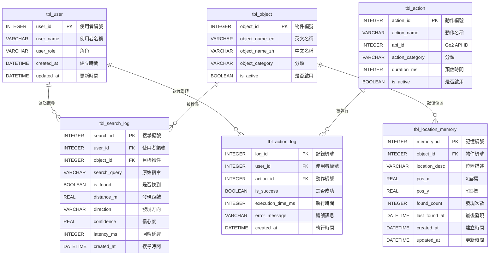

# 資料庫設計文件

> **專案名稱：** 老人與狗 (Elder and Dog) - Go2 智慧尋物系統  
> **資料庫系統：** SQLite  
> **選型理由：** 輕量、無需安裝、單檔案、Python 內建支援  
> **文件版本：** v1.0 | 2026-01-01

---

## 一、實體關係圖 (ERD)



---

## 二、資料表關連一覽

| 編號 | 資料表名稱 | 說明 | 關聯 |
|:----:|:-----------|:-----|:-----|
| T01 | `tbl_user` | 使用者資料 | → T03, T05 |
| T02 | `tbl_object` | 物件類別定義 | → T03, T06 |
| T03 | `tbl_search_log` | 尋物搜尋記錄 | ← T01, T02 |
| T04 | `tbl_action` | Go2 動作定義 | → T05 |
| T05 | `tbl_action_log` | 動作執行記錄 | ← T01, T04 |
| T06 | `tbl_location_memory` | 物品位置記憶 | ← T02 |

> **命名規則：** `tbl_` 前綴 + 小寫英文 + 底線分隔

---

## 三、資料表結構詳述

### T01. tbl_user - 使用者資料

| # | 欄位名稱 | 型態 | 說明 | 約束 |
|:-:|:---------|:-----|:-----|:-----|
| 1 | `user_id` | INTEGER | 使用者編號 | PK, AI, NN |
| 2 | `user_name` | VARCHAR(50) | 使用者名稱 | NN |
| 3 | `user_role` | VARCHAR(20) | 角色（elder/admin） | NN |
| 4 | `created_at` | DATETIME | 建立時間 | NN |
| 5 | `updated_at` | DATETIME | 更新時間 | NN |

**說明：**
- `elder`：一般使用者（長輩）
- `admin`：管理員，可設定系統參數

---

### T02. tbl_object - 物件類別定義

| # | 欄位名稱 | 型態 | 說明 | 約束 |
|:-:|:---------|:-----|:-----|:-----|
| 1 | `object_id` | INTEGER | 物件編號 | PK, AI, NN |
| 2 | `object_name_en` | VARCHAR(50) | 英文名稱（YOLO 類別） | NN |
| 3 | `object_name_zh` | VARCHAR(50) | 中文名稱 | NN |
| 4 | `object_category` | VARCHAR(30) | 分類 | - |
| 5 | `is_active` | BOOLEAN | 是否啟用 | - |

**物件分類範例：**
- `furniture`：家具類（桌子、椅子）
- `daily`：日常用品（水杯、遙控器）
- `medicine`：醫療用品（藥盒、血壓計）

---

### T03. tbl_search_log - 尋物搜尋記錄

| # | 欄位名稱 | 型態 | 說明 | 約束 |
|:-:|:---------|:-----|:-----|:-----|
| 1 | `search_id` | INTEGER | 搜尋編號 | PK, AI, NN |
| 2 | `user_id` | INTEGER | 使用者編號 | FK→T01, NN |
| 3 | `object_id` | INTEGER | 目標物件編號 | FK→T02 |
| 4 | `search_query` | VARCHAR(200) | 原始指令（如「幫我找水」） | NN |
| 5 | `is_found` | BOOLEAN | 是否找到 | - |
| 6 | `distance_m` | REAL | 發現距離（公尺） | - |
| 7 | `direction` | VARCHAR(20) | 發現方向（左側/正前方/右側） | - |
| 8 | `confidence` | REAL | YOLO 信心度 | - |
| 9 | `latency_ms` | INTEGER | 回應延遲（毫秒） | - |
| 10 | `created_at` | DATETIME | 搜尋時間 | NN |

**說明：**
- 此表記錄每一次尋物請求，無論成功與否
- `confidence` 儲存 YOLO 模型的偵測信心度 (0.0 ~ 1.0)

---

### T04. tbl_action - Go2 動作定義

| # | 欄位名稱 | 型態 | 說明 | 約束 |
|:-:|:---------|:-----|:-----|:-----|
| 1 | `action_id` | INTEGER | 動作編號 | PK, AI, NN |
| 2 | `action_name` | VARCHAR(30) | 動作名稱（如 Hello） | NN |
| 3 | `api_id` | INTEGER | Go2 API ID（如 1016） | NN |
| 4 | `action_category` | VARCHAR(20) | 分類 | - |
| 5 | `duration_ms` | INTEGER | 預估執行時間（毫秒） | - |
| 6 | `is_active` | BOOLEAN | 是否啟用 | - |

**動作分類：**
- `safe`：安全動作（坐下、站立）
- `basic`：基礎動作（Hello、招手）
- `dangerous`：危險動作（跳躍、後空翻）- 需管理員權限

---

### T05. tbl_action_log - 動作執行記錄

| # | 欄位名稱 | 型態 | 說明 | 約束 |
|:-:|:---------|:-----|:-----|:-----|
| 1 | `log_id` | INTEGER | 記錄編號 | PK, AI, NN |
| 2 | `user_id` | INTEGER | 使用者編號 | FK→T01, NN |
| 3 | `action_id` | INTEGER | 動作編號 | FK→T04, NN |
| 4 | `is_success` | BOOLEAN | 是否成功 | - |
| 5 | `execution_time_ms` | INTEGER | 實際執行時間（毫秒） | - |
| 6 | `error_message` | VARCHAR(200) | 錯誤訊息（失敗時） | - |
| 7 | `created_at` | DATETIME | 執行時間 | NN |

**說明：**
- 記錄每次動作指令的執行結果
- 用於分析動作成功率和效能

---

### T06. tbl_location_memory - 物品位置記憶

| # | 欄位名稱 | 型態 | 說明 | 約束 |
|:-:|:---------|:-----|:-----|:-----|
| 1 | `memory_id` | INTEGER | 記憶編號 | PK, AI, NN |
| 2 | `object_id` | INTEGER | 物件編號 | FK→T02, NN |
| 3 | `location_desc` | VARCHAR(100) | 位置描述（如「客廳桌上」） | - |
| 4 | `pos_x` | REAL | X 座標（公尺） | - |
| 5 | `pos_y` | REAL | Y 座標（公尺） | - |
| 6 | `found_count` | INTEGER | 在此位置發現次數 | - |
| 7 | `last_found_at` | DATETIME | 最後發現時間 | - |
| 8 | `created_at` | DATETIME | 建立時間 | NN |
| 9 | `updated_at` | DATETIME | 更新時間 | NN |

**說明：**
- 儲存物品曾經被發現的位置
- `found_count` 用於判斷物品的「常見位置」
- 可用於優先搜尋策略

---

## 四、約束說明

| 縮寫 | 全稱 | 說明 |
|:----:|:-----|:-----|
| PK | Primary Key | 主鍵 |
| FK | Foreign Key | 外鍵 |
| AI | Auto Increment | 自動遞增 |
| NN | Not Null | 不可為空 |

---

## 五、外鍵關係圖解

```
┌─────────────┐         ┌─────────────────┐         ┌─────────────┐
│  tbl_user   │ 1     * │  tbl_search_log │ *     1 │ tbl_object  │
│  (使用者)    │─────────│   (搜尋記錄)     │─────────│  (物件)      │
└─────────────┘         └─────────────────┘         └─────────────┘
       │                                                   │
       │ 1                                                 │ 1
       │ *                                                 │ *
┌─────────────────┐         ┌─────────────┐     ┌───────────────────┐
│  tbl_action_log │ *     1 │ tbl_action  │     │ tbl_location_memory│
│   (動作記錄)     │─────────│  (動作)      │     │    (位置記憶)       │
└─────────────────┘         └─────────────┘     └───────────────────┘
```

---

## 六、資料流說明

1. **尋物流程**
   - 使用者 (`tbl_user`) 發出搜尋指令
   - 系統記錄至 `tbl_search_log`
   - 若找到，更新 `tbl_location_memory`

2. **動作流程**
   - 使用者 (`tbl_user`) 發出動作指令
   - 系統查詢 `tbl_action` 取得動作資訊
   - 執行後記錄至 `tbl_action_log`

3. **位置記憶機制**
   - 每次成功找到物品，更新該物品在 `tbl_location_memory` 的記錄
   - `found_count` 累加，下次搜尋時優先檢查高頻位置
