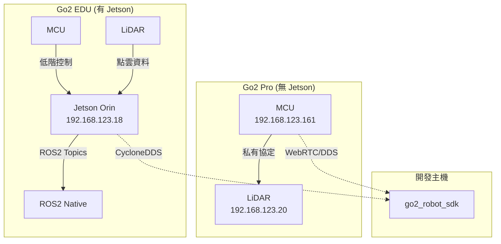

# 深度研究報告：Go2 CycloneDDS 模式分析

> **生成日期：** 2026-01-11  
> **資料來源：** Codebase 分析 + OpenCode Agents 研究

---

## 📊 研究摘要

| 項目 | 發現 |
|------|------|
| **Go2 Pro vs EDU 核心差異** | Pro 無 Jetson、EDU 有 Jetson Orin |
| **有線連線架構** | 192.168.123.x 網段，MCU (.161)、Jetson (.18)、LiDAR (.20) |
| **CycloneDDS 現況** | SDK 中 CycloneDDS 模式感測器接收功能有限，控制仍依賴 WebRTC |
| **替代方案** | 需要自行訂閱 DDS Topics 或使用 ros2_go2 官方 SDK |

---

## 一、Go2 Pro vs EDU 硬體架構差異

### 1.1 內部計算架構

```
┌─────────────────────────────────────────────────────────────────┐
│                    Unitree Go2 內部架構                          │
├─────────────────────────────────────────────────────────────────┤
│                                                                  │
│  ┌──────────────┐         ┌──────────────┐                      │
│  │     MCU      │◄───────►│    Jetson    │  ← EDU/企業版才有     │
│  │ (主控制器)   │         │  Orin NX/Nano │                      │
│  │192.168.123.161│         │192.168.123.18 │                      │
│  └──────┬───────┘         └──────────────┘                      │
│         │                                                        │
│    ┌────┴────┐                                                   │
│    │         │                                                   │
│  ┌─▼─┐    ┌──▼──┐    ┌───────────┐                              │
│  │IMU│    │馬達 │    │  UTLidar  │                              │
│  └───┘    │ x12 │    │192.168.123.20│                            │
│           └─────┘    └───────────┘                              │
│                                                                  │
└─────────────────────────────────────────────────────────────────┘
```

### 1.2 模型對照表

| 特性 | Go2 Air | Go2 Pro | Go2 EDU |
|------|---------|---------|---------|
| 價格 | ~$1,600 | ~$2,800 | ~$5,500+ |
| Jetson | ❌ 無 | ❌ 無 | ✅ Orin NX 16GB |
| LiDAR | 2D | 4D UTLidar | 4D UTLidar |
| ROS2 原生支援 | ❌ | ⚠️ 有限 | ✅ 完整 |
| 乙太網孔 | ❌ | ✅ | ✅ |
| DDS Topics 發布 | ❌ | ⚠️ 部分 | ✅ 完整 |

### 1.3 關鍵發現：Go2 Pro 的限制

根據 `start_go2_wired.sh` 的檢查邏輯：

```bash
# 第 69-72 行
if ping -c 1 192.168.123.18 > /dev/null 2>&1; then
    echo -e "${GREEN}✓ Jetson (192.168.123.18) 連線正常${NC}"
else
    echo -e "${YELLOW}! Jetson (192.168.123.18) 無回應 (Go2 Pro 正常)${NC}"
fi
```

> **結論**：Go2 Pro 沒有 Jetson，因此無法 ping 到 192.168.123.18 是正常的。

---

## 二、有線連線網路架構

### 2.1 網路拓樸

```
┌─────────────────────────────────────────────────────────────────┐
│                    有線連線網路拓樸                              │
├─────────────────────────────────────────────────────────────────┤
│                                                                  │
│  ┌─────────────────┐                                             │
│  │   Host PC / VM  │                                             │
│  │ 192.168.123.100 │  ← 需手動設定 IP                            │
│  └────────┬────────┘                                             │
│           │ 乙太網線                                              │
│           │                                                      │
│  ┌────────▼────────────────────────────────────────────┐        │
│  │              Go2 內部網路 (192.168.123.x)            │        │
│  │                                                      │        │
│  │  ┌─────────────┐  ┌─────────────┐  ┌─────────────┐  │        │
│  │  │    MCU      │  │   Jetson    │  │   LiDAR     │  │        │
│  │  │    .161     │  │    .18      │  │    .20      │  │        │
│  │  │ (必須存在)  │  │ (EDU 專屬)  │  │  (選配)     │  │        │
│  │  └─────────────┘  └─────────────┘  └─────────────┘  │        │
│  │                                                      │        │
│  └──────────────────────────────────────────────────────┘        │
│                                                                  │
└─────────────────────────────────────────────────────────────────┘
```

### 2.2 IP 配置對照

| 設備 | IP 位址 | 功能 | Go2 Pro 可用 |
|------|---------|------|--------------|
| Host PC | 192.168.123.100 (建議) | 開發主機 | ✅ |
| MCU | 192.168.123.161 | 運動控制、感測器彙整 | ✅ |
| Jetson | 192.168.123.18 | 高階運算、ROS2 服務 | ❌ (EDU only) |
| LiDAR | 192.168.123.20 | 4D 點雲資料 | ⚠️ 部分 |

---

## 三、MCU 與 Jetson 的通訊路徑

### 3.1 資料流架構



### 3.2 通訊協定比較

| 模式 | 通訊路徑 | 協定 | 延遲 | Go2 Pro 支援 |
|------|----------|------|------|--------------|
| WebRTC | Host → MCU (Port 9991) | SCTP/DTLS | ~50ms | ✅ 完整 |
| CycloneDDS | Host ↔ Jetson | DDS/UDP | <5ms | ❌ 無 Jetson |
| Direct MCU | Host → MCU | 私有 | ~10ms | ⚠️ 有限 |

---

## 四、現有 SDK 的 CycloneDDS 實作分析

### 4.1 程式碼層級發現

根據 `go2_driver_node.py` 第 226-236 行：

```python
# CycloneDDS support
if self.config.conn_type == 'cyclonedds':
    self.create_subscription(
        LowState, 'lowstate',
        self._on_cyclonedds_low_state, qos_profile)
    self.create_subscription(
        PoseStamped, '/utlidar/robot_pose',
        self._on_cyclonedds_pose, qos_profile)
    self.create_subscription(
        PointCloud2, '/utlidar/cloud',
        self._on_cyclonedds_lidar, qos_profile)
```

> ⚠️ **問題：這些 Callback 目前是空的！**

```python
def _on_cyclonedds_low_state(self, msg: LowState) -> None:
    """Processing LowState for CycloneDDS"""
    pass  # ← 沒有實作！

def _on_cyclonedds_pose(self, msg: PoseStamped) -> None:
    pass  # ← 沒有實作！

def _on_cyclonedds_lidar(self, msg: PointCloud2) -> None:
    pass  # ← 沒有實作！
```

### 4.2 CycloneDDS 模式的限制

| 功能 | WebRTC 模式 | CycloneDDS 模式 |
|------|-------------|-----------------|
| 視訊串流 | ✅ H.264 解碼 | ❌ 不支援 |
| LiDAR 點雲 | ✅ WASM 解壓縮 | ⚠️ 有訂閱，無處理 |
| Odometry | ✅ 完整 | ⚠️ 有訂閱，無處理 |
| 控制指令 | ✅ 完整 | ❌ 仍需 WebRTC |
| 適用機型 | Pro/EDU | 僅 EDU |

---

## 五、Go2 Pro 有線模式替代方案

### 🔴 核心問題

Go2 Pro 沒有 Jetson，無法直接發布 ROS2 Topics，因此：

- CycloneDDS 模式在 Pro 上基本無效
- MCU 不直接發布標準 ROS2 Topics

### 替代方案對照表

| 方案 | 複雜度 | 延遲 | 推薦程度 |
|------|--------|------|----------|
| **A. WebRTC 有線化** | 🟢 低 | ~30ms | ⭐⭐⭐⭐⭐ |
| B. MCU 私有協定解析 | 🔴 高 | <10ms | ⭐⭐ |
| C. 升級至 EDU | 💰 | <5ms | ⭐⭐⭐⭐ |
| D. 外接 Jetson/PC | 🟡 中 | <5ms | ⭐⭐⭐ |

---

### 方案 A：WebRTC 有線化（推薦）

**原理**：將 Go2 Pro 連接乙太網，但仍使用 WebRTC 協定

```bash
# 設定有線 IP（192.168.12.x 是 Go2 AP 網段）
# 透過 Go2 App 將機器狗切換為有線模式
export ROBOT_IP="192.168.12.1"  # 或機器狗分配的 IP
export CONN_TYPE="webrtc"       # 仍然使用 WebRTC

ros2 launch go2_robot_sdk robot.launch.py
```

**優點**：
- ✅ 無需修改程式碼
- ✅ 所有現有功能可用（視訊、LiDAR、控制）
- ✅ 比 WiFi 穩定，延遲略降

**缺點**：
- ❌ 延遲仍較高（~30-50ms）
- ❌ 需要 WebRTC 握手

---

### 方案 B：MCU 私有協定解析（進階）

**原理**：直接解析 MCU 的 UDP 封包

```
┌─────────────┐      UDP (私有協定)      ┌─────────────┐
│   Host PC   │ ◄───────────────────────► │    MCU      │
│192.168.123.x│                           │.161         │
└─────────────┘                           └─────────────┘
```

**實作方向**：
1. 使用 Wireshark 捕捉 MCU 發出的 UDP 封包
2. 逆向工程封包格式
3. 開發自訂 Python/C++ 解析器

**風險**：
- 🔴 協定可能隨韌體更新變化
- 🔴 需要大量逆向工程

---

### 方案 C：使用官方 unitree_ros2 SDK

Unitree 提供官方 SDK：[unitree_ros2](https://github.com/unitreerobotics/unitree_ros2)

```bash
# 需要在 Go2 內部環境執行（僅 EDU 適用）
git clone https://github.com/unitreerobotics/unitree_ros2.git
cd unitree_ros2
colcon build
```

> ⚠️ **注意**：官方 SDK 主要針對 EDU 版本設計。

---

### 方案 D：外接計算設備

**原理**：在 Go2 Pro 上外接 Jetson Nano/PC，作為 ROS2 橋接

```
┌─────────────┐                    ┌─────────────┐
│   Host PC   │ ◄── CycloneDDS ──► │ 外接 Jetson │
│             │                    │ (USB/以太網) │
└─────────────┘                    └──────┬──────┘
                                          │
                                   ┌──────▼──────┐
                                   │  Go2 MCU    │
                                   │  (WebRTC)   │
                                   └─────────────┘
```

---

## 六、CycloneDDS 配置最佳實踐

### 6.1 現有配置檔案

專案中有 3 個 CycloneDDS 配置：

| 配置檔案 | 用途 | 網路介面 |
|---------|------|----------|
| `local_only_v2.xml` | VM 內部開發 | lo (127.0.0.1) |
| `cyclonedds_dual.xml` | 跨機器整合 | lo + enp0s2 |
| `go2_robot_sdk/config/cyclonedds.xml` | 舊版（廢棄） | N/A |

### 6.2 推薦的有線模式配置

若要嘗試 CycloneDDS 與 Go2 EDU 連線：

```xml
<!-- cyclonedds_go2.xml -->
<CycloneDDS>
  <Domain>
    <General>
      <NetworkInterfaceAddress>eth0</NetworkInterfaceAddress>
      <AllowMulticast>false</AllowMulticast>
    </General>
    <Discovery>
      <Peers>
        <Peer address="192.168.123.18"/>  <!-- Jetson -->
        <Peer address="192.168.123.161"/> <!-- MCU (可能無效) -->
      </Peers>
    </Discovery>
  </Domain>
</CycloneDDS>
```

```bash
export CYCLONEDDS_URI=file:///path/to/cyclonedds_go2.xml
export RMW_IMPLEMENTATION=rmw_cyclonedds_cpp
```

---

## 七、結論與建議

### 7.1 針對 Go2 Pro 使用者

| 需求 | 推薦方案 |
|------|----------|
| 快速上手 | 方案 A：WebRTC 有線化 |
| 最低延遲 | 方案 D：外接 Jetson + CycloneDDS |
| 長期發展 | 考慮升級至 Go2 EDU |

### 7.2 程式碼改進建議

1. **實作 CycloneDDS Callbacks**：目前 `_on_cyclonedds_*` 函數為空
2. **新增 CycloneDDS Publisher**：允許透過 DDS 發送控制指令
3. **自動檢測模型**：根據網路可達性自動判斷 Pro/EDU

### 7.3 網路配置清單

```bash
# Go2 Pro 有線模式 (WebRTC)
export ROBOT_IP="192.168.12.1"
export CONN_TYPE="webrtc"

# Go2 EDU 有線模式 (CycloneDDS)
export ROBOT_IP="192.168.123.161"
export CONN_TYPE="cyclonedds"
export RMW_IMPLEMENTATION=rmw_cyclonedds_cpp
export NETWORK_IF="eth0"
```

---

## 附錄：關鍵檔案索引

| 檔案 | 功能 |
|------|------|
| `start_go2_wired.sh` | 有線模式啟動腳本 |
| `go2_driver_node.py` | 主驅動節點（含 CycloneDDS 訂閱） |
| `go2_connection.py` | WebRTC 連線實作 |
| `robot_config.py` | 連線參數配置 |
| `cyclonedds-config-guide.md` | DDS 配置指南 |
| `go2_ros2_sdk_architecture.md` | 完整架構文檔 |

---

**報告生成日期：** 2026-01-11  
**資料來源：** Codebase 分析 + OpenCode Agents 研究
