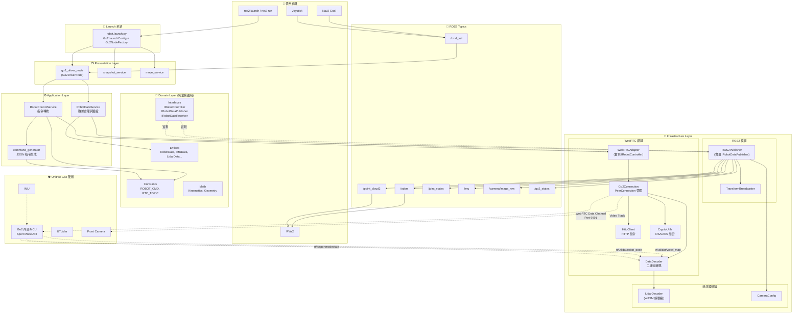
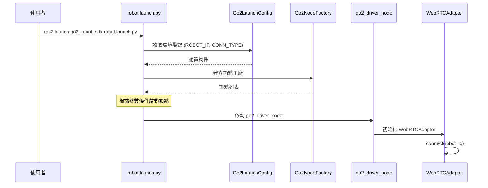
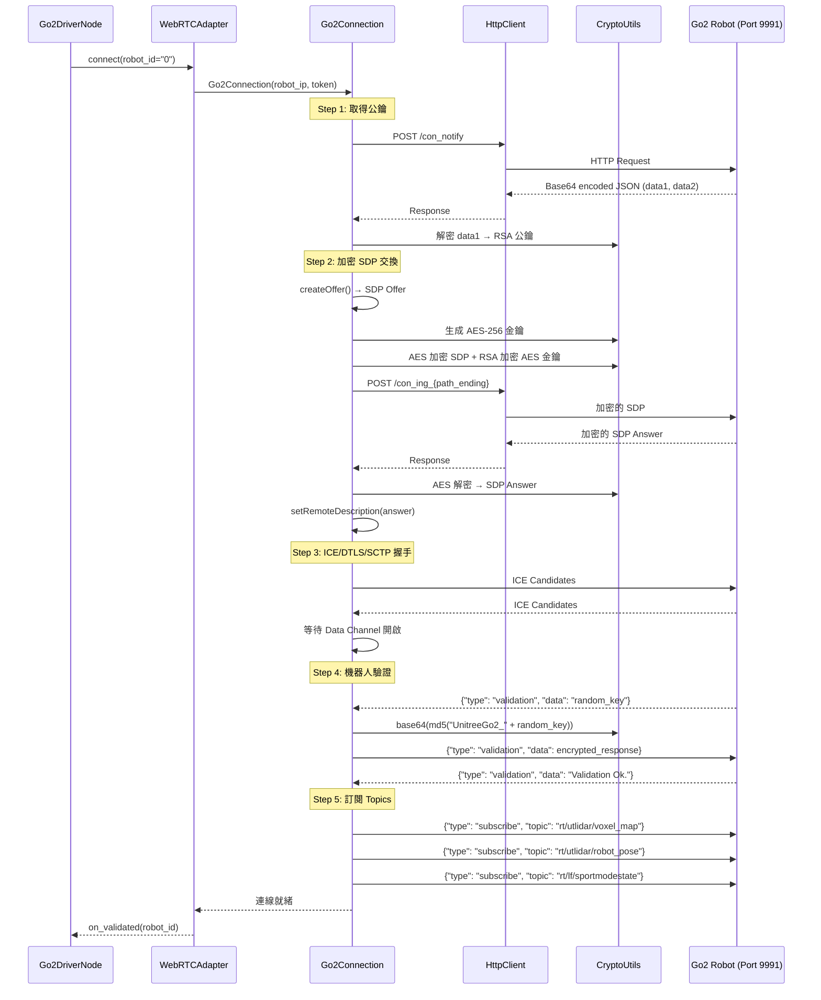
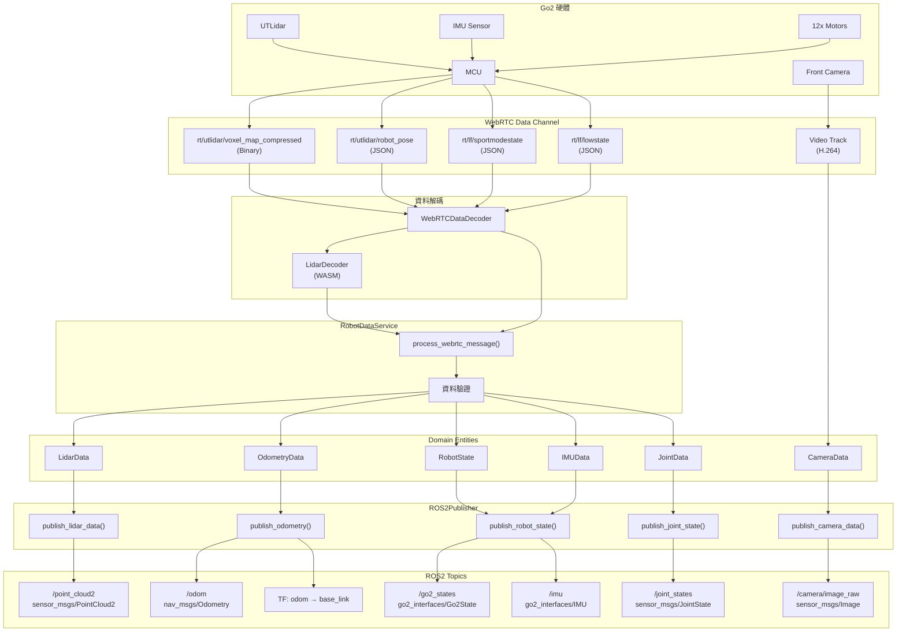
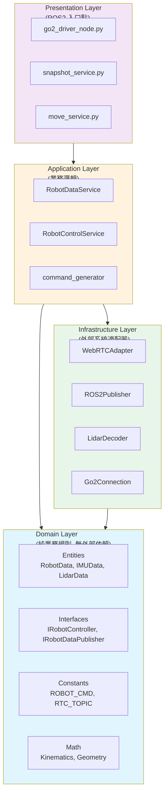
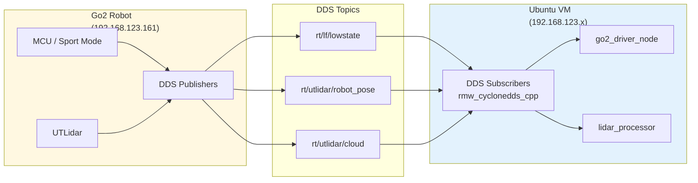

# go2_robot_sdk 完整逆向工程架構文檔

> **版本**: v1.1  
> **更新日期**: 2026-01-11  
> **作者**: Sisyphus Agent (逆向工程分析)  
> **審查**: Oracle Agent (技術驗證通過 ✅)

---

## 一、系統總覽

`go2_robot_sdk` 是一個基於 **Clean Architecture (整潔架構)** 設計的 ROS2 驅動套件，用於控制 Unitree Go2 四足機器狗。系統支援兩種連線模式：

| 連線模式 | 適用場景 | 特點 |
|---------|---------|------|
| **WebRTC** | 遠端控制、影像串流 | 支援 H.264 視訊、加密通訊、低延遲 |
| **CycloneDDS** | 區域網路、低階控制 | 標準 DDS、高頻率控制迴路 |

---

## 二、整體架構圖



---

## 三、啟動流程詳解

### 3.1 Launch 入口點



### 3.2 Launch 參數與條件邏輯

| 參數 | 預設值 | 說明 |
|------|--------|------|
| `slam` | `true` | 啟動 slam_toolbox |
| `nav2` | `true` | 啟動 Nav2 導航堆疊 |
| `rviz2` | `true` | 啟動 RViz2 視覺化 |
| `foxglove` | `true` | 啟動 Foxglove Bridge |
| `mcp_mode` | `false` | **MCP 模式**: 啟用時停用 SLAM/Nav2，啟動 snapshot_service |

**條件邏輯**:
```python
slam_enabled = AndSubstitution(with_slam, NotSubstitution(with_mcp_mode))
nav2_enabled = AndSubstitution(with_nav2, NotSubstitution(with_mcp_mode))
```

---

## 四、WebRTC 連線建立流程



---

## 五、cmd_vel 完整資料流

```mermaid
flowchart LR
    subgraph Input["輸入來源"]
        NAV2["Nav2<br/>/cmd_vel<br/>Priority: 5"]
        JOY["Joystick<br/>/cmd_vel_joy<br/>Priority: 10"]
    end

    subgraph Mux["twist_mux"]
        MUX_NODE["twist_mux<br/>優先級仲裁"]
    end

    subgraph Driver["go2_driver_node"]
        SUB["Subscriber<br/>/cmd_vel"]
        CALLBACK["_on_cmd_vel()"]
    end

    subgraph Control["RobotControlService"]
        HANDLE["handle_cmd_vel()<br/>四捨五入 + 零值過濾"]
    end

    subgraph Generator["command_generator"]
        GEN["gen_mov_command()"]
        JSON["JSON 指令"]
    end

    subgraph Adapter["WebRTCAdapter"]
        SEND["send_movement_command()"]
        QUEUE["asyncio.Queue"]
    end

    subgraph Connection["Go2Connection"]
        DC["data_channel.send()"]
    end

    subgraph Go2["Go2 MCU"]
        SPORT["Sport Mode API<br/>api_id: 1008"]
        MOTOR["電機控制器"]
    end

    NAV2 --> MUX_NODE
    JOY --> MUX_NODE
    MUX_NODE -->|"最高優先級"| SUB
    SUB --> CALLBACK
    CALLBACK -->|"x, y, z"| HANDLE
    HANDLE -->|"round(x, 2)"| GEN
    GEN --> JSON
    JSON --> SEND
    SEND --> QUEUE
    QUEUE -->|"asyncio"| DC
    DC -->|"WebRTC Data Channel"| SPORT
    SPORT --> MOTOR
```



### 5.1 指令格式

**標準移動指令 (Sport Mode)**:
```json
{
  "type": "msg",
  "topic": "rt/api/sport/request",
  "data": {
    "header": {
      "identity": {
        "id": 1704931234567,
        "api_id": 1008
      }
    },
    "parameter": "{\"x\": 0.3, \"y\": 0, \"z\": 0.5}"
  }
}
```

**障礙物規避模式**:
```json
{
  "type": "msg",
  "topic": "rt/api/obstacles_avoid/request",
  "data": {
    "header": {
      "identity": {
        "id": 1704931234567,
        "api_id": 1003
      }
    },
    "parameter": "{\"x\": 0.3, \"y\": 0, \"yaw\": 0.5, \"mode\": 0}"
  }
}
```

---

## 六、感測器資料流



---

## 七、WebRTC 二進位封包格式

```
┌─────────────────────────────────────────────────────────────┐
│                    WebRTC Binary Message                     │
├──────────┬──────────┬─────────────────┬─────────────────────┤
│  Offset  │   Size   │      Field      │     Description     │
├──────────┼──────────┼─────────────────┼─────────────────────┤
│   0x00   │  2 bytes │  JSON Length    │ Little-endian u16   │
│   0x02   │  2 bytes │  Padding        │ Reserved (0x0000)   │
│   0x04   │  N bytes │  JSON Metadata  │ UTF-8 encoded JSON  │
│   0x04+N │  M bytes │  Compressed     │ Voxel Map Data      │
│          │          │  Payload        │ (需 WASM 解壓縮)    │
└──────────┴──────────┴─────────────────┴─────────────────────┘
```

### JSON Metadata 範例:
```json
{
  "topic": "rt/utlidar/voxel_map_compressed",
  "data": {
    "stamp": 1704931234.567,
    "resolution": 0.05,
    "origin": [0.0, 0.0, 0.0],
    "width": [128, 128, 64],
    "src_size": 65536
  }
}
```

---

## 八、Clean Architecture 層次結構



### 依賴規則:
1. **Domain Layer**: 完全獨立，無外部依賴
2. **Application Layer**: 只依賴 Domain
3. **Infrastructure Layer**: 實現 Domain 定義的介面
4. **Presentation Layer**: 協調 Application 與 Infrastructure

---

## 九、ROBOT_CMD 指令對照表

| 指令名稱 | API ID | 說明 |
|---------|--------|------|
| `StandUp` | 1004 | 站立 |
| `StandDown` | 1005 | 趴下 |
| `Move` | 1008 | 移動 (x, y, z) |
| `Hello` | 1016 | 打招呼動作 |
| `Dance1` | 1022 | 跳舞動作 1 |
| `Dance2` | 1023 | 跳舞動作 2 |
| `FingerHeart` | 1036 | 比愛心 |
| `FrontFlip` | 1030 | 前空翻 |
| `WiggleHips` | 1033 | 扭屁股 |
| `Handstand` | 1301 | 倒立 |
| `MoonWalk` | 1305 | 月球漫步 |

---

## 十、RTC_TOPIC 主題對照表

| 主題名稱 | Topic 路徑 | 用途 |
|---------|-----------|------|
| `SPORT_MOD` | `rt/api/sport/request` | 運動控制指令 |
| `OBSTACLES_AVOID` | `rt/api/obstacles_avoid/request` | 障礙物規避指令 |
| `ULIDAR_ARRAY` | `rt/utlidar/voxel_map_compressed` | 壓縮點雲數據 |
| `ROBOTODOM` | `rt/utlidar/robot_pose` | 里程計位姿 |
| `LF_SPORT_MOD_STATE` | `rt/lf/sportmodestate` | 機器人狀態 |
| `LOW_STATE` | `rt/lf/lowstate` | 低階馬達狀態 |

---

## 十一、CycloneDDS 連線模式 (有線低延遲)

當 `CONN_TYPE=cyclonedds` 時，系統使用 DDS 協議直接與 Go2 通訊，適用於有線低延遲場景。

### 11.1 連線架構



### 11.2 環境配置

```bash
# 設定 RMW 實作
export RMW_IMPLEMENTATION=rmw_cyclonedds_cpp

# 指定網卡 (依實際環境調整)
export NETWORK_IF="enp0s2"

# CycloneDDS 配置 (動態生成)
export CYCLONEDDS_URI="<CycloneDDS><Domain><General><NetworkInterfaceAddress>$NETWORK_IF</NetworkInterfaceAddress></General></Domain></CycloneDDS>"

# 啟動有線模式
zsh start_go2_wired.sh
```

### 11.3 DDS Topics 對照表

| 功能 | ROS2 Topic | 原生 DDS Topic | 訊息類型 | QoS |
|-----|-----------|---------------|---------|-----|
| 底層狀態 | `/lowstate` | `rt/lf/lowstate` | `go2_interfaces/LowState` | BEST_EFFORT |
| 機器人位姿 | `/utlidar/robot_pose` | `rt/utlidar/robot_pose` | `geometry_msgs/PoseStamped` | BEST_EFFORT |
| LiDAR 點雲 | `/utlidar/cloud` | `rt/utlidar/cloud` | `sensor_msgs/PointCloud2` | BEST_EFFORT |

### 11.4 WebRTC vs CycloneDDS 比較

| 特性 | WebRTC | CycloneDDS |
|-----|--------|------------|
| **連線方式** | WiFi (無線) | 乙太網 (有線) |
| **延遲** | 中等 (~50ms) | 極低 (~5ms) |
| **視訊串流** | ✅ 支援 H.264 | ❌ 不支援 |
| **加密** | ✅ RSA/AES | ❌ 無加密 |
| **控制指令** | ✅ 完整支援 | ⚠️ 感測器為主 |
| **適用場景** | 遠端控制、開發 | 競賽、低延遲需求 |

### 11.5 配置檔案

| 配置 | 檔案路徑 | 用途 |
|-----|---------|------|
| 開發模式 | `config/local_only_v2.xml` | 限制在 loopback |
| 整合模式 | `config/cyclonedds_dual.xml` | 支援雙網卡 |
| 啟動腳本 | `start_go2_wired.sh` | 自動配置環境 |

> ⚠️ **注意**: CycloneDDS 模式下，控制指令目前仍主要透過 WebRTC 發送。DDS 主要用於高頻率感測器數據接收。

---

## 十二、總結

`go2_robot_sdk` 是一個設計精良的 ROS2 驅動套件，其核心特點：

1. **Clean Architecture**: 嚴格分層，Domain 層無外部依賴
2. **雙連線模式**: WebRTC (遠端) / CycloneDDS (區域網路)
3. **加密通訊**: RSA/AES 混合加密的 WebRTC 信令
4. **高效點雲處理**: WASM 加速的 Voxel Map 解壓縮
5. **安全控制**: twist_mux 優先級仲裁 + 指令參數驗證

---

## 十三、Oracle 技術審查報告

### 審查結論: ✅ 通過

| 項目 | 狀態 | 說明 |
|-----|------|------|
| Clean Architecture 分層 | ✅ | 完全符合整潔架構設計模式 |
| WebRTC 連線流程 | ✅ | 涵蓋所有步驟：公鑰取得、SDP 交換、驗證協議 |
| cmd_vel 轉換鏈 | ✅ | 完整且正確 |
| 二進位封包格式 | ✅ | 正確描述 Header + JSON + Payload 結構 |
| CycloneDDS 模式 | ✅ | 已更新完整配置說明 |

### 技術建議

1. **WASM 效能**: `wasmtime` 提供良好的可攜性，但有輕微 CPU 開銷。對於 Python 驅動而言是可接受的權衡。

2. **DDS 發現機制**: 建議添加 DDS Topic 發現檢查，避免因固件版本變更導致靜默失敗。

3. **安全性**: WebRTC 模式具備完整加密，CycloneDDS 模式無加密，建議在安全敏感場景使用 WebRTC。

---

*文檔由 Sisyphus Agent 自動生成，Oracle Agent 技術審查通過*
