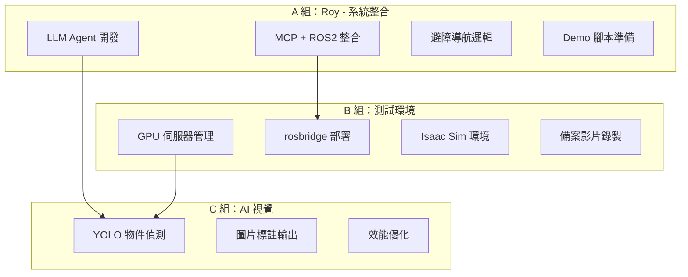
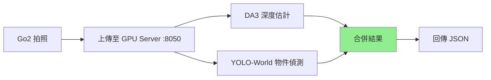
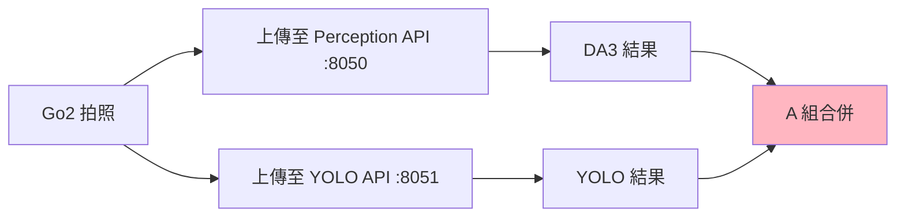
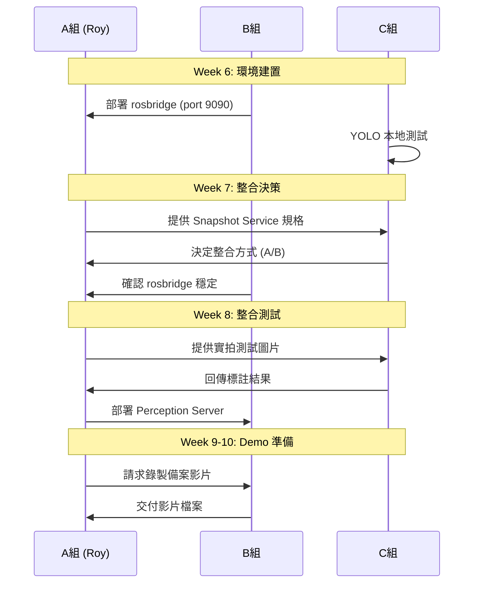
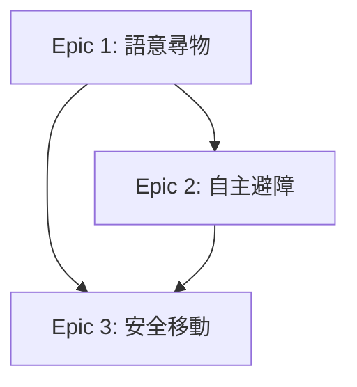

# 專題文件撰寫大綱

**專題名稱：** 老人與狗 (Elder and Dog)  
**文件版本：** v1.1  
**建立日期：** 2025/12/15  
**最後更新：** 2025/12/15  
**目的：** 提供專題報告書各章節撰寫方向與內容建議

---

## 團隊架構與分工

### 團隊組成

本專題採用 **三組分工架構**，各組職責明確，透過 MCP 架構整合：



### 成員職責一覽表

| 組別 | 成員 | 角色定位 | 核心任務 |
|------|------|---------|---------|
| **A 組** | Roy | 系統架構師 / 專題負責人 | MCP + LLM Agent 整合、ROS2 控制、避障導航、Demo 準備 |
| **B 組** | - | 測試環境提供者 / 運算資源管理 | GPU 伺服器管理、rosbridge 部署、Isaac Sim 環境、備案影片 |
| **C 組** | 鄔 + 黃 | AI 視覺演算法工程師 | YOLO 物件偵測、圖片標註、效能優化 |

### 各組詳細職責

#### A 組（Roy）：系統整合與 MCP 架構

**核心資源：** Mac UTM VM + Go2 實機 + Kilo Code

**主要任務：**

| 週次 | 任務 | 產出 |
|------|------|------|
| W6 | MCP 基礎串接 | rosbridge 連線 + MCP 工具驗證 |
| W7 | 視覺閉環 + 移動控制 | `/capture_snapshot` + `/move_for_duration` 服務 |
| W8 | 感知系統整合 | DA3 深度估計 + 避障邏輯 |
| W9-10 | Demo 準備 | 穩定性測試 + 備案影片 + 簡報 |

**技術決策權：**
- MCP vs FSM 架構選擇
- LLM 模型選擇（Claude / Mistral / Nova）
- 整合方式決策（C 組 YOLO 如何接入）

---

#### B 組：測試環境與運算資源

**核心資源：** 學校 GPU 伺服器 (RTX 8000) + 學校 VM

**主要任務：**

| 週次 | 任務 | 產出 |
|------|------|------|
| W6 | rosbridge 部署 | Port 9090 WebSocket 服務 |
| W7 | 環境穩定性維護 | 連續運行 1 小時無斷線 |
| W8 | 本地 LLM 備案（選用） | Ollama + Llama 3.1 部署 |
| W9-10 | 監控與備案 | 系統監控 + 備案影片錄製 |

**成功標準：**

| 等級 | 條件 | 判定 |
|------|------|------|
| 🟢 優秀 | Isaac Sim 可用 + rosbridge 穩定 | 完美測試環境 |
| 🟡 及格 | 協助實機測試 + rosbridge 穩定 | 足夠使用 |
| 🔴 失敗 | 無法提供任何測試環境 | Roy 需單獨作業 |

---

#### C 組（鄔 + 黃）：AI 視覺模組

**核心任務：** 輸入圖片 → 輸出標註後圖片（Bounding Box + 物件名稱）

#### C 組 YOLO 整合方案

**方案 A: 整合至 Perception API（推薦 ✅）**



**優點：**
- A 組只需呼叫一次 API
- GPU Server 統一管理 YOLO + DA3
- 資料格式統一

**方案 B: 獨立 API（備案）**



**缺點：**
- A 組需呼叫兩次 API
- 網路延遲增加
- 需額外開發合併邏輯

**決策時程：** W7 (12/15) 決定使用 **方案 A**

---

**主要任務：**

| 週次 | 任務 | 產出 |
|------|------|------|
| W6 | YOLO 本地測試 | 標註圖片產生 |
| W7 | 整合方式決策 | 方案 A（整合 Snapshot）或 方案 B（獨立 API） |
| W8 | 整合測試 | 準確度 > 80%，速度 < 0.5s |
| W9-10 | 效能報告 | 檢測統計 + 推論時間記錄 |

**MCP 架構簡化效益：**
- ❌ 不需要：像素座標計算 (u, v)
- ❌ 不需要：世界座標轉換 (x, y, z)
- ✅ 只需要：標註 Bounding Box + 物件名稱的圖片

> **簡化原因：** LLM Vision 可直接從標註圖片判斷「往左 2 公尺」，不需精確座標

---

### 跨組協作流程



---

### 關鍵里程碑（團隊版）

| 日期 | A 組 (Roy) | B 組 | C 組 |
|------|-----------|------|------|
| 12/8 | MCP 基礎串接完成 | rosbridge 運行穩定 | YOLO 本地測試成功 |
| 12/15 | 視覺閉環完成 | 連續運行 1 小時 | 整合方式決策完成 |
| 12/22 | 感知系統整合完成 | 本地 LLM 備案（選用） | 整合測試完成 (>80%) |
| 1/6 | Demo 準備完成 | 備案影片交付 | 效能報告完成 |
| **1/7** | **專題發表** | **現場支援** | **現場支援** |

---

### 專題文件撰寫分工

#### 分工原則

1. **誰開發，誰寫文件**：負責實作的人最了解技術細節
2. **Roy 總審**：所有文件由 Roy 統整與審核一致性
3. **交叉驗收**：User Story 驗收條件需跨組確認

---

#### 第一章 系統描述（主筆：Roy）

| 章節 | 負責人 | 說明 |
|------|--------|------|
| 1.1 發展背景與動機 | **Roy** | 專題整體方向，需統一定調 |
| 1.2 系統發展目的 | **Roy** | 問題與解決方案對應，需全局視野 |
| 1.3 系統範圍 | **Roy** | 功能列表彙整 |
| 1.4 背景知識 | **Roy + C 組** | Roy 寫 MCP/ROS2，C 組寫 YOLO |
| 1.5 系統限制 | **Roy** | 技術決策說明 |

---

#### 第二章 軟體需求規格（分組撰寫）

| 章節 | 內容 | 負責人 | 說明 |
|------|------|--------|------|
| 2.1 使用者角色說明 | 長者 / 管理者 | **Roy** | 統一定義角色 |
| 2.2 使用者故事對應 | Epic 結構圖 | **Roy** | 統籌 Epic 架構 |
| 2.3 使用者故事卡 | | | **依功能模組分工** |
| ├─ Epic 1: 語意尋物 | US 1.1-1.3 | **Roy** | 主要使用者流程 |
| ├─ Epic 2: 自主避障 | US 2.1-2.3 | **Roy + C 組** | Roy 寫流程，C 組補 YOLO 細節 |
| ├─ Epic 3: 安全移動 | US 3.1-3.3 | **Roy** | 移動服務規格 |
| └─ Epic 4: 系統管理 | US 4.1-4.3 | **B 組** | 環境啟動與監控 |

**驗收條件撰寫分工：**

| User Story | Given-When-Then 撰寫者 | 說明 |
|------------|----------------------|------|
| US 1.1-1.3 | Roy | 尋物主流程 |
| US 2.1 拍照分析 | Roy | Snapshot + Perception API |
| US 2.2 偵測障礙物 | **C 組** | YOLO 偵測邏輯，需說明信心度門檻 |
| US 2.3 自動繞行 | Roy | 避障決策邏輯 |
| US 3.1-3.3 | Roy | 移動服務規格 |
| US 4.1-4.3 | **B 組** | 系統啟動/監控流程 |

---

#### 第三章 軟體設計規格（分組撰寫）

| 章節 | 內容 | 負責人 | 說明 |
|------|------|--------|------|
| 3.1 資料庫設計 | | | |
| ├─ 感知結果暫存 | JSON 結構 | **Roy** | Perception API 回傳格式 |
| └─ 物件偵測結果 | JSON 結構 | **C 組** | YOLO 偵測結果格式 |
| 3.2 介面設計 | | | |
| ├─ UI-01, 02 Kilo Code | 畫面說明 | **Roy** | LLM 對話介面 |
| ├─ UI-03 Foxglove | 畫面說明 | **B 組** | 監控介面截圖 |
| └─ UI-04 API 回應 | JSON 範例 | **Roy** | Perception API 格式 |
| 3.3 資源需求 | | | |
| ├─ A 組人力 | 工時計算 | **Roy** | 自行估算 |
| ├─ B 組人力 | 工時計算 | **B 組** | 自行估算 |
| └─ C 組人力 | 工時計算 | **C 組** | 自行估算 |

---

#### 文件撰寫時程

| 日期 | 任務 | 負責人 | 交付物 |
|------|------|--------|--------|
| 12/20 | 第一章初稿 | Roy | 1.1-1.5 完整內容 |
| 12/22 | 第二章初稿 | 全員 | Epic 1-4 User Story |
| 12/25 | 第二章驗收條件 | 全員 | Given-When-Then 完成 |
| 12/28 | 第三章初稿 | 全員 | 資料庫 + 介面 + 資源 |
| 1/2 | 全文審閱 | Roy | 一致性檢查 |
| 1/5 | 定稿 | Roy | 繳交版本 |

---

#### 文件交接 SOP

```
1. B 組 / C 組完成分配章節
   ↓
2. 上傳至 docs/archive/2026-02-11-restructure/reports/drafts/
   ↓
3. Roy 審閱並回饋修改意見
   ↓
4. 修改後整合至最終版本
   ↓
5. 全員確認無誤後定稿
```

---

## 第一章 系統描述

### 1.1 發展背景與動機

#### 發展背景

**目標使用者：** 居家獨居長者（爺爺/奶奶）

**市場背景與統計數據：**
- 台灣 65 歲以上人口佔比 18.8%（2024 內政部資料）
- 獨居長者超過 50 萬人,且逐年增加
- 根據衛福部調查,67% 長者表示「忘記物品位置」為日常困擾之一
- 失智症患者中,「找不到東西」是引發焦慮的主要原因

**現有相關系統/競品分析：**

| 系統類型 | 代表產品 | 優點 | 缺點 |
|---------|---------|------|------|
| 智慧音箱 | Amazon Alexa、Google Home | 語音互動方便 | 無法移動、無法幫忙找東西 |
| 掃地機器人 | iRobot Roomba、小米掃地機 | 自主導航成熟 | 無互動功能、無視覺辨識 |
| 服務機器人 | Pepper、Loomo | 可移動、有語音 | 價格昂貴（>10萬）、設定複雜 |
| 四足機器人 | Unitree Go2 SDK 範例 | 地形適應力強 | 需程式控制、無自然語言介面 |

#### 發展動機（現有問題）

| 問題編號 | 目標使用者面臨的問題 | 現有解決方案的缺點 |
|---------|-------------------|------------------|
| P1 | 長者容易忘記物品位置（眼鏡、藥盒等） | 傳統 APP 需手機操作，對長者不友善 |
| P2 | 獨居長者缺乏情感陪伴 | 掃地機器人無互動功能 |
| P3 | 長者行動不便，難以自行尋找物品 | 需等待家人協助，降低生活自主性 |
| P4 | 現有機器人操作門檻高 | 需複雜設定，長者無法自行使用 |
| P5 | 機器人移動時可能碰撞家具造成危險 | 傳統避障需精確座標，無法處理動態障礙 |

---

### 1.2 系統發展目的

#### 功能性需求

根據發展動機所提的問題，系統將提供以下解決方案：

| 問題編號 | 問題描述 | 解決方案 |
|---------|---------|---------|
| P1 | 忘記物品位置 | **語意尋物功能**：接受「幫我找眼鏡」等自然語言指令，機器狗自主巡視並引導長者 |
| P2 | 缺乏互動 | **自然語言對話**：建立溫暖的「小狗」AI 角色，可語音/文字互動 |
| P3 | 行動不便 | **主動巡視**：機器狗可自主移動至各區域搜尋目標物品 |
| P4 | 操作困難 | **零設定介面**：透過 MCP 協定讓 LLM 直接控制 ROS2，使用者只需說話 |
| P5 | 碰撞風險 | **視覺避障系統**：透過深度估計自動偵測障礙物並繞行 |

#### 非功能性需求

| 需求類型 | 目標值 | 說明 |
|---------|--------|------|
| 反應速度 | < 5 秒 | LLM 接收指令到開始行動 |
| 避障成功率 | > 80% | 正確偵測並繞過障礙物 |
| 穩定性 | 連續運行 10 分鐘 | Demo 期間無故障 |
| 延遲容忍 | < 500ms | 深度估計推論時間 |

#### 問題與解決方案對應表

| 問題 | 解決方案 | 對應功能模組 |
|------|---------|-------------|
| P1 忘記物品 | 語意尋物 | LLM Agent + 視覺感知 |
| P2 缺乏陪伴 | 自然語言對話 | LLM + TTS（第二階段） |
| P3 行動不便 | 主動巡視 | Nav2 / MCP 移動控制 |
| P4 操作困難 | 零設定 | MCP 協定 + ros-mcp-server |
| P5 碰撞風險 | 視覺避障 | Depth Anything V2 + 避障邏輯 |

---

### 1.3 系統範圍

#### 本次開發範圍（1/7 Demo）

根據系統目的，以下功能將納入本次開發範圍：

**核心功能：**

1. **自然語言指令接收**
   - 接受文字指令（如「往前走」、「幫我找水」）
   - 透過 Kilo Code 介面操作

2. **視覺環境感知**
   - 透過 Go2 相機截圖（Snapshot）
   - 呼叫 Depth Anything V2 深度估計

3. **自主避障導航**
   - 根據深度資訊判斷障礙物距離
   - 自動選擇繞行方向（左/右）
   - 繞行後繼續執行任務

4. **尋物回報機制**
   - 偵測到目標物品後停止
   - 透過文字告知使用者物品位置

**基礎功能（支援核心功能運作）：**

5. **ROS2 通訊橋接**
   - rosbridge WebSocket 連線
   - MCP 協定轉譯

6. **安全移動服務**
   - `/move_for_duration` 定時移動
   - `/stop_movement` 緊急停止
   - 速度限制（max 0.3 m/s）

7. **系統監控（管理者）**
   - Foxglove 視覺化介面
   - 感測器狀態顯示

#### 不在本次範圍（見系統限制）

- 語音輸入/輸出（STT/TTS）
- 物品位置記憶庫
- Nav2 精確導航
- 多代理人架構

---

### 1.4 背景知識

#### 1.4.1 MCP (Model Context Protocol)

**說明：** Anthropic 於 2024 年提出的 LLM 與外部工具通訊標準協定。

**與本系統關聯：**
- LLM（如 Claude）透過 MCP 協定呼叫 ROS2 服務
- 使得 AI 可直接控制機器狗，無需額外程式開發
- 本系統使用開源的 `ros-mcp-server` 實作

**技術架構：**
```
LLM (Claude) → MCP Protocol → ros-mcp-server → rosbridge → ROS2
```

#### 1.4.2 ros-mcp-server

**說明：** 開源的 MCP Server 實作，支援 ROS1 和 ROS2。

**選擇原因：**
- 提供 Topic Publish/Subscribe 功能
- 提供 Service Call 功能
- 提供 Action Goal 功能（可控制 Nav2）
- 有 Unitree Go2 範例程式碼

#### 1.4.3 Depth Anything V2

**說明：** 2024 年發表的單目深度估計 SOTA 模型。

**與本系統關聯：**
- 透過單張 RGB 圖片估算場景深度
- 提供障礙物距離資訊給避障決策
- 本系統使用 `DA3METRIC-LARGE` 版本（輸出公尺單位）

**性能指標：**
- 推論時間：~300ms（640x480）
- VRAM 使用：~1.5 GB
- 誤差：校正後 < 20%（15cm-1m 範圍）

#### 1.4.4 ROS2 與 Nav2

**說明：** Robot Operating System 2 是機器人開發的標準框架。

**本系統使用的 ROS2 功能：**
- Topic 發布/訂閱（`/cmd_vel`, `/camera/image_raw`）
- Service 呼叫（`/capture_snapshot`, `/move_for_duration`）
- TF2 座標轉換

**Nav2 現況：**
- 已驗證可運行，但因 Wi-Fi 延遲（/scan ~1Hz）暫不使用
- 保留為未來升級選項

#### 1.4.5 Unitree Go2

**說明：** 宇樹科技的消費級四足機器人。

**本系統使用版本：**
- 一般版（非 EDU）
- 連線方式：Wi-Fi + WebRTC
- 感測器：LiDAR、RGB 相機、IMU

**相關競品對比：**

| 機器人 | 價格 | 導航能力 | 語意理解 |
|--------|------|---------|---------|
| Unitree Go2 (本系統加值) | ~$1,600 + 軟體 | ✅ SLAM + 視覺 | ✅ LLM |
| Boston Dynamics Spot | ~$75,000 | ✅ | ❌ 需開發 |
| 傳統服務機器人 | $10,000+ | ✅ | ❌ 程式指令 |

---

### 1.5 系統限制（可行性分析）

以下功能對使用者有價值，但因技術或時程限制，未納入本次開發範圍：

| 限制項目 | 對使用者的重要性 | 未納入原因 | 未來規劃 |
|---------|----------------|----------|---------|
| **語音輸入（STT）** | 🔴 高 - 長者更習慣說話 | 時程限制（需整合 Whisper） | 第二階段 |
| **語音輸出（TTS）** | 🔴 高 - 聽覺回饋更直覺 | 時程限制 | 第二階段 |
| **物品位置記憶** | 🟡 中 - 可加速尋物 | 需資料庫整合 | 第二階段 |
| **Nav2 精確導航** | 🟡 中 - 可規劃最佳路徑 | Wi-Fi 延遲導致 /scan 頻率不足 | 需 Ethernet 連線 |
| **深度估計 2m+ 精度** | 🟢 低 - 避障主要在近距離 | Go2 廣角鏡頭特性 | 持續校正優化 |
| **戶外使用** | 🟢 低 - 本系統定位為居家 | 環境複雜度過高 | 不在規劃內 |

---

### 1.6 風險管理與應對方案

本專題開發期間可能遇到的風險與對應的緩解措施：

| 風險 | 等級 | 影響 | 緩解措施 (Plan A) | 備案 (Plan B) |
|------|------|------|------------------|---------------|
| **現場網路不穩** | 🔴 高 | Demo 無法連線 | 手機熱點 + 本地 VM | 預錄「一鏡到底」影片 ✅ |
| **LLM 產生幻覺** | 🟡 中 | 機器狗暴衝 | Safety Filter（限速 0.3 m/s） | 使用 `autonomous_nav.py` 確定性腳本 ✅ |
| **C 組 YOLO 未就緒** | 🟡 中 | 無法識別物品 | W8 整合測試提前確認 | 使用純 DA3 避障（已驗證可行 80%+）✅ |
| **Demo 實機故障** | 🟡 中 | 無法展示 | 事前檢查電池與硬體 | 備案影片 + Isaac Sim 模擬器展示 |
| **深度估計誤差** | 🟢 低 | 避障成功率降低 | Go2 校正係數 0.60 | 增加安全距離門檻（1m → 1.5m）|
| **Perception API 延遲** | 🟢 低 | 反應速度慢 | GPU 優化推論 < 500ms | 降低圖片解析度 640x480 → 320x240 |

**風險應對原則：**
1. ✅ **所有 P0 風險都有 Plan B**（現場網路、YOLO 未就緒、實機故障）
2. ⏰ **提前驗證**：W8 必須完成 YOLO 整合測試,不能拖到 W9
3. 📹 **備案影片必拍**：12/28 前由 B 組錄製完成（一鏡到底,包含 LLM 對話截圖）

---

## 第二章 軟體需求規格

### 2.1 使用者角色說明

| 角色 | 說明 | 主要使用情境 |
|------|------|-------------|
| **長者（主要使用者）** | 居家獨居長者，可能行動不便或記憶力衰退 | 在客廳對 Go2 說「幫我找眼鏡」，由機器狗協助尋物 |
| **管理者（家屬/看護）** | 協助長者安裝設定系統，監控運行狀況 | 透過 Foxglove 觀看地圖與機器狗狀態，確認系統正常 |

### 2.2 使用者故事對應

#### Epic 與 User Story 結構

```
Epic 1: 語意尋物（長者）
├── US 1.1: 下達尋物指令
├── US 1.2: 接收尋物進度回報
├── US 1.2.5: 辨識目標物品（新增！整合 YOLO）
└── US 1.3: 接收尋物結果

Epic 2: 自主避障（系統內部，支援 Epic 1）
├── US 2.1: 拍照分析環境
├── US 2.2: 偵測前方障礙物
└── US 2.3: 自動繞行障礙物

Epic 3: 安全移動（系統內部，支援 Epic 1, 2）
├── US 3.1: 執行定時移動
├── US 3.2: 執行緊急停止
└── US 3.3: 限制最高速度

Epic 4: 系統管理（管理者）
├── US 4.1: 啟動機器狗系統
├── US 4.2: 查看機器狗狀態
└── US 4.3: 關閉機器狗系統
```

**使用者故事依賴關係：**



- Epic 1 依賴 Epic 2（尋物過程需避障）
- Epic 1 依賴 Epic 3（尋物過程需移動）
- Epic 2 依賴 Epic 3（繞行需移動指令）

---

### 2.3 使用者故事卡

#### Epic 1: 語意尋物

**Epic 1 驗收條件（列點式）：**

- 使用者可透過文字輸入尋物指令（如「幫我找水」）
- 機器狗收到指令後開始自主巡視環境
- 巡視過程中若遇到障礙物，自動繞行（依賴 Epic 2）
- 找到目標物後，機器狗停止並以文字告知使用者位置
- **US 1.1 → US 1.2 → US 1.3 為順序關係**

---

##### US 1.1: 下達尋物指令

| 項目 | 內容 |
|------|------|
| **I am** | 長者 |
| **I want** | 透過文字告訴機器狗我想找什麼東西 |
| **So that** | 不需要自己四處走動尋找，減輕身體負擔 |

**驗收條件：**

```gherkin
Scenario: 下達有效尋物指令
  Given 機器狗系統已啟動且處於待機狀態
  When 使用者輸入「幫我找水」
  Then 機器狗回應「收到！我來幫您找水」並開始移動
  
Scenario: 下達無效指令
  Given 機器狗系統已啟動且處於待機狀態
  When 使用者輸入「今天天氣如何」
  Then 機器狗回應「抱歉，我目前只能幫您找東西喔」
```

---

##### US 1.2: 接收尋物進度回報

| 項目 | 內容 |
|------|------|
| **I am** | 長者 |
| **I want** | 在機器狗搜尋過程中知道牠在做什麼 |
| **So that** | 了解進度，不會擔心機器狗是否卡住 |

**驗收條件：**

```gherkin
Scenario: 巡視中回報
  Given 機器狗已收到尋物指令（US 1.1）且正在巡視
  When 機器狗移動至新區域
  Then 機器狗回報「我正在客廳找找看...」

Scenario: 避障中回報
  Given 機器狗正在巡視（US 1.2）
  When 機器狗偵測到障礙物並繞行（US 2.3）
  Then 機器狗回報「前面有東西擋住了，我繞一下」
```

---

##### US 1.2.5: 辨識目標物品

| 項目 | 內容 |
|------|------|
| **I am** | 機器狗系統 |
| **I want** | 在拍攝的照片中識別目標物品（如水瓶、眼鏡、藥盒等） |
| **So that** | 確認是否找到使用者要找的東西,避免誤報 |

**驗收條件：**

```gherkin
Scenario: 成功識別目標物品
  Given 機器狗已拍攝環境照片（US 2.1）
  And 使用者要找的物品為「水瓶」
  When 照片上傳至 Perception API
  And YOLO-World 偵測到「水瓶」（信心度 > 0.7）
  And DA3 計算該物品距離為 1.2m
  Then 系統判定「找到目標物」
  And 記錄物品位置資訊
  And 觸發 US 1.3 回報結果

Scenario: 畫面中無目標物品
  Given 機器狗已拍攝環境照片（US 2.1）
  And 使用者要找的物品為「眼鏡」
  When YOLO-World 未偵測到「眼鏡」類別
  Then 系統判定「未找到目標物」
  And 繼續移動到下一個位置搜尋（US 1.2）

Scenario: 低信心度偵測
  Given 機器狗已拍攝環境照片（US 2.1）
  And 使用者要找的物品為「水瓶」
  When YOLO-World 偵測到「水瓶」但信心度僅 0.65（< 0.7 門檻）
  Then 系統標記為「疑似水瓶」
  And 回報「我看到疑似水瓶的東西,但不太確定...」
  And 詢問使用者是否需要靠近確認
```

**C 組職責：**
- 提供 YOLO-World 物件偵測模型
- 確保偵測準確率 > 80%
- 輸出格式包含：物件類別、信心度、Bounding Box 座標

---

##### US 1.3: 接收尋物結果

| 項目 | 內容 |
|------|------|
| **I am** | 長者 |
| **I want** | 機器狗找到東西後告訴我在哪裡 |
| **So that** | 我可以知道物品位置，前往取用 |

**驗收條件：**

```gherkin
Scenario: 成功找到目標物
  Given 機器狗已巡視環境（US 1.2）
  When 機器狗偵測到目標物品（如水瓶）
  Then 機器狗停止移動並回報「爺爺，水在前面桌上喔！」

Scenario: 未找到目標物
  Given 機器狗已巡視完所有區域（US 1.2）
  When 未偵測到目標物品
  Then 機器狗回報「抱歉，我找不到水瓶，您要我再找一次嗎？」
```

---

#### Epic 2: 自主避障

**Epic 2 驗收條件（列點式）：**

- 機器狗可自動拍照並分析環境深度
- 正確偵測前方 1 公尺內的障礙物
- 自動選擇較空曠的方向繞行
- 避障成功率達 80% 以上
- **US 2.1 → US 2.2 → US 2.3 為順序關係，形成迴圈**

---

##### US 2.1: 拍照分析環境

| 項目 | 內容 |
|------|------|
| **I am** | 機器狗系統 |
| **I want** | 定期拍攝前方環境照片並分析深度 |
| **So that** | 獲得障礙物距離資訊，供避障決策使用 |

**驗收條件：**

```gherkin
Scenario: 成功拍照並分析
  Given 機器狗相機正常運作
  When 系統呼叫 /capture_snapshot 服務
  Then 回傳 640x480 JPEG 圖片
  And 呼叫 Perception API 取得深度分析結果
  And 取得三區域距離（左/中/右）
```

---

##### US 2.2: 偵測前方障礙物

| 項目 | 內容 |
|------|------|
| **I am** | 長者（間接受益） |
| **I want** | 機器狗能自動偵測前方障礙物 |
| **So that** | 避免機器狗撞到家具或物品，造成損壞或跌倒風險 |

**驗收條件：**

```gherkin
Scenario: 偵測到前方障礙物
  Given 機器狗已完成環境分析（US 2.1）
  When 分析結果顯示 front_obstacle_m < 1.0
  Then 系統判定「前方有障礙物」

Scenario: 前方無障礙物
  Given 機器狗已完成環境分析（US 2.1）
  When 分析結果顯示 front_obstacle_m >= 1.0
  Then 系統判定「前方暢通」
```

---

##### US 2.3: 自動繞行障礙物

| 項目 | 內容 |
|------|------|
| **I am** | 長者（間接受益） |
| **I want** | 機器狗遇到障礙物時能自動繞開 |
| **So that** | 不需要人工介入，機器狗能順利完成任務 |

**驗收條件：**

```gherkin
Scenario: 向右繞行
  Given 偵測到前方障礙物（US 2.2）
  And 右側距離 > 左側距離
  When 系統執行繞行
  Then 機器狗向右旋轉約 45-90 度
  And 重新執行 US 2.1 確認路徑

Scenario: 向左繞行
  Given 偵測到前方障礙物（US 2.2）
  And 左側距離 > 右側距離
  When 系統執行繞行
  Then 機器狗向左旋轉約 45-90 度
  And 重新執行 US 2.1 確認路徑

Scenario: 三面受阻
  Given 偵測到前方障礙物（US 2.2）
  And 左側距離 < 0.5m 且右側距離 < 0.5m
  When 系統判斷無法繞行
  Then 機器狗停止並回報「這邊走不過去，我換條路」
```

---

#### Epic 3: 安全移動

**Epic 3 驗收條件（列點式）：**

- 所有移動指令都有時間限制（最長 10 秒）
- 速度限制在安全範圍（0.3 m/s）
- 提供緊急停止功能
- **US 3.1, 3.2, 3.3 為獨立功能，可個別驗收**

---

##### US 3.1: 執行定時移動

| 項目 | 內容 |
|------|------|
| **I am** | 機器狗系統 |
| **I want** | 以指定速度移動指定秒數後自動停止 |
| **So that** | 確保移動有限制，不會無止境移動 |

**驗收條件：**

```gherkin
Scenario: 正常定時移動
  Given 機器狗處於可移動狀態
  When 呼叫 /move_for_duration {linear_x: 0.3, duration: 2.0}
  Then 機器狗前進約 2 秒後自動停止
  And 實際移動距離約 0.6 公尺（誤差 < 15%）

Scenario: 超過時間上限
  Given 機器狗處於可移動狀態
  When 呼叫 /move_for_duration {duration: 15.0}
  Then 系統拒絕執行並回報「時間不能超過 10 秒」
```

---

##### US 3.2: 執行緊急停止

| 項目 | 內容 |
|------|------|
| **I am** | 長者 / 管理者 |
| **I want** | 可隨時讓機器狗立即停止 |
| **So that** | 遇到危險時能即時阻止 |

**驗收條件：**

```gherkin
Scenario: 緊急停止
  Given 機器狗正在移動中
  When 呼叫 /stop_movement 服務
  Then 機器狗在 0.5 秒內完全停止
```

---

#### Epic 4: 系統管理（管理者）

**Epic 4 驗收條件（列點式）：**

- 管理者可透過指令啟動/關閉系統
- 管理者可監控機器狗即時狀態
- **US 4.1, 4.2, 4.3 為獨立功能**

---

##### US 4.1: 啟動機器狗系統

| 項目 | 內容 |
|------|------|
| **I am** | 管理者 |
| **I want** | 一鍵啟動所有必要的 ROS2 節點 |
| **So that** | 快速完成系統準備，減少設定時間 |

**驗收條件：**

```gherkin
Scenario: 正常啟動
  Given 管理者已 SSH 連線至 VM
  When 執行 `zsh start_mcp.sh`
  Then 所有節點在 30 秒內啟動完成
  And rosbridge 服務可連線（Port 9090）
  And 機器狗驅動正常（/cmd_vel 可發布）
```

---

##### US 4.2: 查看機器狗狀態

| 項目 | 內容 |
|------|------|
| **I am** | 管理者 |
| **I want** | 透過視覺化介面查看機器狗位置與感測器狀態 |
| **So that** | 確認系統運作正常，便於除錯 |

**驗收條件：**

```gherkin
Scenario: Foxglove 監控
  Given 系統已啟動（US 4.1）
  When 管理者開啟 Foxglove Studio 連線 ws://192.168.1.200:8765
  Then 顯示機器狗即時影像
  And 顯示 LiDAR 點雲
  And 顯示 TF 座標樹
```

---

## 第三章 軟體設計規格

### 3.1 資料庫設計

#### 3.1.1 說明

本系統目前版本（v1.0）以 Session 暫存為主，不使用持久化資料庫。

**使用 No SQL (JSON) 結構儲存：**

#### 3.1.2 資料結構

##### 感知結果暫存（DA3 + YOLO 整合）

```json
{
    "timestamp": "2025-12-15T15:00:00Z",
    "image_path": "/tmp/snapshot_latest.jpg",
    "perception_result": {
        "depth_estimation": {
            "left_m": 1.31,
            "center_m": 0.73,
            "right_m": 1.21,
            "front_obstacle_m": 0.54,
            "suggestion": "⚠️ 正前方 0.5m 有障礙，建議向左繞行"
        },
        "object_detection": {
            "detected_objects": [
                {
                    "class": "水瓶",
                    "confidence": 0.85,
                    "bbox": [120, 200, 180, 320],
                    "distance_m": 1.2
                }
            ],
            "target_found": true
        },
        "inference_ms": 326.4
    }
}
```

**資料結構說明：**
- `depth_estimation`: DA3 深度估計結果（A 組開發）
- `object_detection`: YOLO-World 物件偵測結果（**C 組負責**）
- `target_found`: 是否找到目標物品（觸發 US 1.2.5）

##### 移動指令紀錄

```json
{
    "timestamp": "2025-12-15T15:00:05Z",
    "action": "move_for_duration",
    "parameters": {
        "linear_x": 0.3,
        "angular_z": 0.0,
        "duration": 2.0
    },
    "result": {
        "success": true,
        "actual_duration": 2.08
    }
}
```

#### 3.1.3 未來擴充（第二階段）

| 資料表 | 用途 | 資料庫類型 |
|-------|------|----------|
| `object_memory` | 物品位置記憶 | SQLite |
| `patrol_history` | 巡視路徑記錄 | JSON Log |
| `user_preferences` | 使用者偏好設定 | SQLite |

---

### 3.2 介面設計

#### 3.2.1 介面藍圖一覽表

| 編號 | 畫面名稱 | 對應 User Story |
|------|---------|-----------------|
| UI-01 | Kilo Code 對話介面（待機） | US 4.1 啟動後 |
| UI-02 | Kilo Code 對話介面（執行中） | US 1.1, 1.2, 1.3, 2.3 |
| UI-03 | Foxglove 監控畫面 | US 4.2 |
| UI-04 | Perception API 回應（JSON） | US 2.1 |

#### 3.2.2 介面藍圖說明

##### UI-01: Kilo Code 對話介面（待機）

**畫面說明：**
- 初始畫面，顯示系統就緒
- 使用者可在此輸入指令

**元件與動作：**

| 元件 | 動作 | 跳轉畫面 |
|------|------|---------|
| 輸入框 | 輸入尋物指令 | → UI-02 |
| 系統狀態顯示 | 顯示「待機中」 | - |

**畫面流程：**
- 從 UI-02（任務完成）返回此畫面
- 從 US 4.1（啟動系統）進入此畫面

---

##### UI-02: Kilo Code 對話介面（執行中）

**畫面說明：**
- 顯示 LLM 思考過程與機器狗動作
- 即時更新任務進度

**畫面示意圖：**

```
┌────────────────────────────────────┐
│  Kilo Code - 執行中               │
├────────────────────────────────────┤
│ 使用者: 幫我找水                    │
│                                    │
│ Go2: 收到！我來幫您找水             │
│ Go2: 正在拍照分析環境...            │
│ Go2: [圖片] 前方有障礙物            │
│ Go2: 向右繞行中...                  │
│ Go2: [圖片] 發現疑似水瓶！          │
│ Go2: 爺爺，水在前面桌上喔！         │
│                                    │
│ ┌──────────────────────────────┐   │
│ │ 輸入新指令...                 │   │
│ └──────────────────────────────┘   │
│                                    │
│ [停止]                             │
└────────────────────────────────────┘
```

**元件與動作：**

| 元件 | 動作 | 跳轉畫面 |
|------|------|---------|
| 對話紀錄 | 顯示 LLM 回應 | - |
| 進度指示 | 顯示「正在拍照...」「正在繞行...」 | - |
| 停止按鈕 | 緊急停止（US 3.2） | → UI-01 |
| 任務完成訊息 | 顯示「爺爺，水在桌上喔！」 | → UI-01 |

**畫面流程：**
- 從 UI-01（輸入指令）進入此畫面
- 任務完成或中止後返回 UI-01

---

##### UI-03: Foxglove 監控畫面

**畫面說明：**
- 管理者用的視覺化監控介面
- 顯示感測器資料與機器狗狀態

**元件與動作：**

| 元件 | 動作 | 說明 |
|------|------|------|
| 3D 視圖 | 顯示機器狗 URDF 模型 | 即時更新姿態 |
| 影像面板 | 顯示 /camera/image_raw | 640x480 |
| 點雲面板 | 顯示 /point_cloud2 | LiDAR 資料 |
| TF 樹面板 | 顯示座標關係 | map → base_link |

---

##### UI-04: Perception API 回應

**畫面說明：**
- API 回傳的 JSON 格式（內部使用）
- 提供給 LLM 解析

**範例：**

```json
{
    "left_m": 1.31,
    "center_m": 0.73,
    "right_m": 1.21,
    "front_obstacle_m": 0.54,
    "suggestion": "⚠️ 正前方 0.5m 有障礙，建議向左繞行"
}
```

---

### 3.3 資源需求

#### 3.3.1 開發期間資源

##### 人力（三組分工）

| 組別 | 成員 | 角色 | 工時 | 時薪 | 小計 |
|------|------|------|------|------|------|
| **A 組** | Roy | 系統架構師 / 專題負責人 | 100 小時 | $200 | $20,000 |
| **B 組** | - | 測試環境管理 / GPU 伺服器 | 30 小時 | $200 | $6,000 |
| **C 組** | 鄔 + 黃 | AI 視覺演算法（2人） | 40 小時 × 2 | $200 | $16,000 |
| **合計** | **4 人** | | **210 小時** | | **$42,000** |

**工時說明：**

| 組別 | 工時分配 |
|------|---------|
| A 組 (Roy) | MCP 整合 30h + 避障開發 25h + 感知整合 20h + Demo 準備 15h + 文件撰寫 10h |
| B 組 | 環境建置 10h + 穩定性維護 10h + 備案錄製 5h + 現場支援 5h |
| C 組 (每人) | YOLO 測試 15h + 整合開發 15h + 效能優化 5h + 報告撰寫 5h |

##### 軟體

| 項目 | 版本/規格 | 費用 |
|------|----------|------|
| Ubuntu 22.04 | 開源 | $0 |
| ROS2 Humble | 開源 | $0 |
| Python 3.10 | 開源 | $0 |
| ros-mcp-server | 開源 | $0 |
| OpenRouter API | $10 儲值 | $10 |
| **合計** | | **$10** |

##### 硬體

| 項目 | 規格 | 費用 |
|------|------|------|
| Unitree Go2 | 已有 | $0 |
| Mac (UTM VM) | 8GB RAM, 已有 | $0 |
| Windows PC | 開發用, 已有 | $0 |
| GPU Server | 學校資源 | $0 |
| **合計** | | **$0** |

**開發期間總成本：$42,010**

---

#### 3.3.2 營運期間資源（三年預估）

##### 人力

| 項目 | 年度工時 | 時薪 | 年費用 | 三年費用 |
|------|---------|------|--------|---------|
| 系統維護 | 60 小時/年 | $200 | $12,000 | $36,000 |
| 客服支援 | 40 小時/年 | $150 | $6,000 | $18,000 |
| **合計** | | | **$18,000** | **$54,000** |

##### 軟體

| 項目 | 年費用 | 三年費用 | 說明 |
|------|--------|---------|------|
| LLM API (OpenRouter) | $600 | $1,800 | 預估 $50/月 |
| 雲端運算 (預估) | $0 | $0 | 目前使用學校資源 |
| **合計** | **$600** | **$1,800** | |

##### 硬體

| 項目 | 年費用 | 三年費用 | 說明 |
|------|--------|---------|------|
| Go2 維修/耗材 | $500 | $1,500 | 預估 |
| 伺服器租用（若需） | $3,000 | $9,000 | AWS g4dn.xlarge 預估 |
| **合計** | **$3,500** | **$10,500** | |

**營運期間三年總成本：$66,300**

---

## 撰寫檢查清單

在交稿前，請確認以下項目：

### 第一章

- [ ] 發展背景有描述「目標使用者」或「目標組織」
- [ ] 發展背景有簡述「現有相關系統/競品」
- [ ] 發展動機有描述「使用者面臨的問題」
- [ ] 發展動機有描述「現有解決方案的缺點」
- [ ] 系統目的的每個解決方案都對應到一個動機問題
- [ ] 系統目的沒有出現新的問題（沒在動機提過的）
- [ ] 系統範圍只包含功能性需求（非功能性移到目的）
- [ ] 系統範圍涵蓋所有目的中的解決方案
- [ ] 背景知識與發展背景一致（提到的系統都解釋）
- [ ] 系統限制有解釋「對使用者的重要性」
- [ ] 系統限制有解釋「未納入原因」

### 第二章

- [ ] 使用者角色與 User Story 的角色一致
- [ ] Epic 有分解為多個 User Story（不是只有 1-2 個）
- [ ] User Story 有明確的 I am / I want / So that
- [ ] I want 和 So that 不是重複的內容
- [ ] Epic 驗收條件有說明 User Story 之間的關係
- [ ] User Story 驗收條件使用 Given-When-Then 格式
- [ ] Given 是前置條件（不是動作）
- [ ] When 是使用者或系統的動作
- [ ] Then 是結果或回饋（不是後續動作）
- [ ] 驗收條件有列出所需的輸入/輸出資料

### 第三章

- [ ] 資料庫設計有說明使用的技術（如 NoSQL/SQLite）
- [ ] 資料結構有用範例說明（如 JSON 範例）
- [ ] 介面藍圖一覽表有列出所有介面
- [ ] 每個介面一個獨立編號
- [ ] 介面說明有標註元件對應的動作
- [ ] 介面說明有標註跳轉的畫面編號
- [ ] 資源需求有分開發期間和營運期間
- [ ] 人力成本有說明工時計算方式
- [ ] 軟硬體成本有考慮上線後的費用（不是只列現有）

---

## 相關文件

- [專題目標](../00-overview/專題目標.md)
- [開發計畫](../00-overview/開發計畫.md)
- [MCP System Prompt](../02-design/mcp_system_prompt.md)
- [12/13 開發筆記](../04-notes/dev_notes/2025-12-13-dev.md)
- [12/14 開發筆記](../04-notes/dev_notes/2025-12-14-dev.md)
- [12/15 開發筆記](../04-notes/dev_notes/2025-12-15-dev.md)

---

**版本紀錄：**

| 版本 | 日期 | 修改內容 |
|------|------|---------|
| v1.0 | 2025/12/15 | 初版建立 |
| v1.1 | 2025/12/15 | 補充市場統計數據、新增 US 1.2.5 物件識別、補充 C 組 YOLO 整合方案、新增 1.6 風險管理、補充介面示意圖 |
