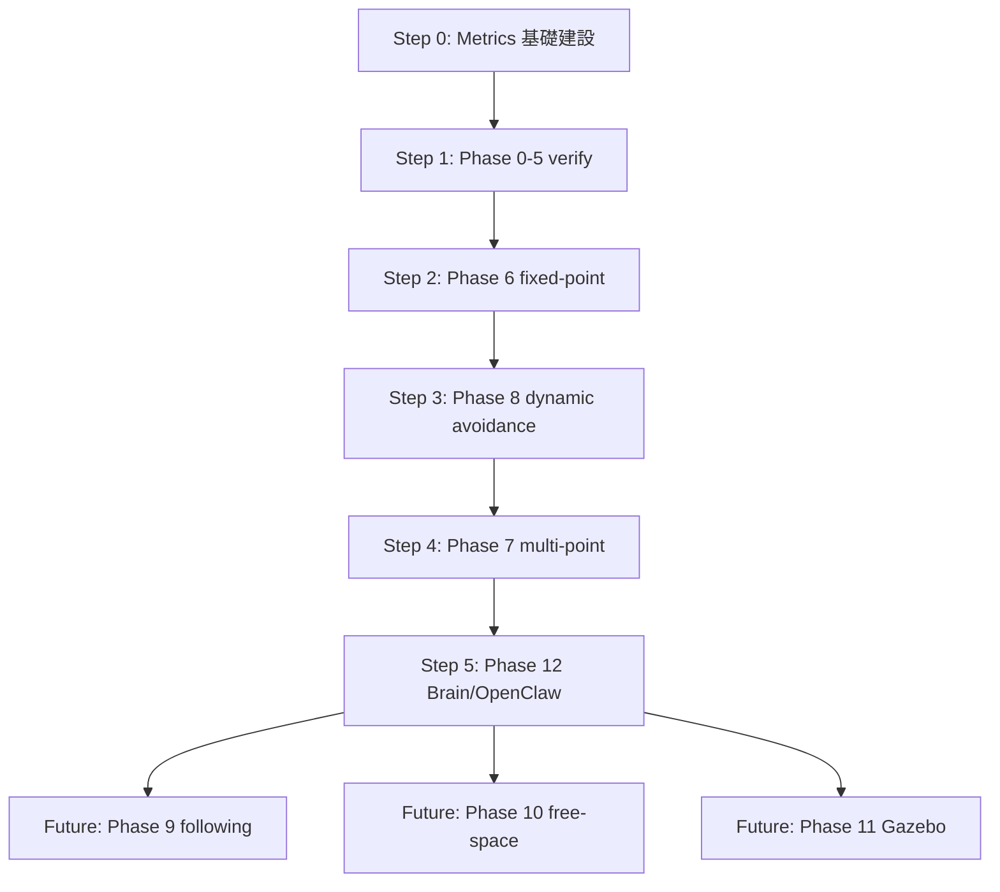

# PawAI 導航避障 — Capability Ladder

> **文件類型**：能力地圖（不是每日 backlog、不是 implementation plan）
> **日期**：2026-05-24
> **狀態**：first draft（Q1–Q8 grill session 收斂結果）
> **配套**：[`metrics/nav-kpi-matrix.md`](metrics/nav-kpi-matrix.md)、[`metrics/schema.md`](metrics/schema.md)、[`metrics/baselines/`](metrics/baselines/)

---

## 0. 核心原則

> **先做有數據的證人，再做有權力的裁判。**

任何新感測器、新 capability、新融合策略，先讓它「能被量化」，再讓它「能影響控制」。
D435 走這條路：先發 `/state/depth_safety/status` JSON（證人）→ 累積 baseline → 再決定是否進 Nav2 costmap（裁判）。

兩條配套紀律：

1. **量化先於功能**：沒有 KPI 不開發新 Phase；沒有 baseline 不調參。
2. **WARN ≠ REGRESSED**：WARN 是絕對門檻（PASS/WARN/FAIL）；REGRESSED 是相對 `accepted.md` baseline 的 delta。同時可看，分開判。

---

## 1. 能力狀態機

每個 Phase 在任一時刻處於下列狀態之一：

```text
LOCKED                  尚無 runtime source；分兩種：
                          SPEC_ONLY            只有 spec / 文件，無 code
                          LOCKED_BY_PHASE_X    code 有但前置 Phase 未 UNLOCKED
IMPLEMENTED_UNMEASURED  有實作、以前場測跑過，但無 metrics baseline
INSUFFICIENT_DATA       開始量測但 manual session 樣本 < 3
IN_PROGRESS             至少 1 個核心 KPI FAIL，或有明確 blocker
WARN                    所有核心 KPI ≥ WARN，但任一在 WARN 區間
UNLOCKED                連續 3 個 manual session 所有核心 KPI PASS
REGRESSED               曾達 UNLOCKED，後續 session 相對 accepted baseline 任一 KPI 退化
```

**重要**：

- **`UNLOCKED` 這字保留給「有 KPI、連續 3 次 PASS」的狀態，不借用**。沒 baseline 就用 `IMPLEMENTED_UNMEASURED`。
- WARN 和 REGRESSED **可以同時**：表面門檻 WARN，相對 baseline 也退化 → markdown 兩個欄位都標。
- 樣本不足 → 直接 `INSUFFICIENT_DATA`，不判 REGRESSED（防止單次測試吵翻整個 ladder）。
- `session_source: auto` 的數據**不計入** UNLOCKED 樣本，只能進 `latest.md`，不能 promote 到 `accepted.md`。
- `LOCKED_BY_PHASE_X` 是 ladder 自我解釋的子狀態 — 看到「Phase 7 LOCKED_BY_PHASE_6_AND_8」就知道為什麼進不去，不必查文件。

---

## 2. Phase 全景

| # | 能力 | 對外能力名稱 | 當前狀態 | 為什麼 |
|---|---|---|---|---|
| **0** | 感測器 bring-up | RPLIDAR + D435 + TF + Go2 odom 同時上線 | **🟡 IMPLEMENTED_UNMEASURED** | 場測能跑，但無 metrics 驗證 |
| **1** | RViz/Foxglove/TF 調試 | 觀測儀表板 | **🟡 IMPLEMENTED_UNMEASURED** | Foxglove bridge 已在每個 demo tmux 內 |
| **2** | SLAM 即時建圖 | 室內 2D LiDAR 建圖 | **🟡 IMPLEMENTED_UNMEASURED** | `home_living_room_v8.pbstream + .yaml` 已存 |
| **3** | AMCL 定位 | 地圖定位 + 信心分級 | **🟡 IMPLEMENTED_UNMEASURED** | `/capability/nav_ready` 已 publish；covariance 三段門檻已對齊 |
| **4** | 基礎安全避障 | LiDAR 停障 + D435 fail-closed safety gate | **🟡 IMPLEMENTED_UNMEASURED** | 4-mode reactive_stop 主動停車 + depth_safety 拒絕新 action + twist_mux 四層；D435 不停 active Nav2 goal（E1 主線）；no_auto_resume 安全屬性未量測 |
| **5** | Nav2 路徑規劃 | 短距 goal navigation | **🔴 IN_PROGRESS** | **F7 blocker**：goal accepted 但 `/cmd_vel_nav` 不出 |
| **6** | 固定點導航 | named waypoint navigation | **🔴 IN_PROGRESS** | code 有，但 Executive NAV executor 仍 `nav_unimplemented_phase_a`；named_poses/ 空；F7 未解前實際 = `LOCKED_BY_PHASE_5` |
| **7** | 多點導航 | patrol / waypoint mission | **⚫ LOCKED_BY_PHASE_6_AND_8** | `route_runner` 有 code，但 fixed-point + 安全停車未解前不該排 |
| **8** | 動態避障 | 遇障停車 + 不暴衝 | **🔴 IN_PROGRESS** | reactive_stop 4-mode 已修 5/11 撞牆事件，但 **no_auto_resume 紅線從未量測** |
| **9** | 目標跟隨 | person following | **⚫ LOCKED / SPEC_ONLY** | 無 code，無 runtime source |
| **10** | 巡線 / 視覺輔助路面 | free-space / semantic obstacle | **⚫ LOCKED / SPEC_ONLY** | 無 code |
| **11** | Gazebo / 模擬驗證 | sim-to-real | **⚫ LOCKED / SPEC_ONLY** | 無整合 |
| **12** | Brain / OpenClaw 全局任務 | 自然語言觸發導航 | **⚫ LOCKED_BY_PHASE_6** | Brain 接 NAV executor 缺口（5/20 spec Line B）；fixed-point 沒穩前 Brain 接也沒用 |

> 🟡 **IMPLEMENTED_UNMEASURED** = 場測能跑，但**無 KPI 證據**。Metrics 系統上線後第一週要做的事就是把這些升級成 UNLOCKED、或降級成 IN_PROGRESS / REGRESSED。
> ⚫ **LOCKED_BY_PHASE_X** = code 已寫，但前置 Phase 未 UNLOCKED 之前不開始量測 — 避免「上游壞掉污染下游 baseline」。

---

## 3. 開發順序（**不是 0→12 從頭蓋**）

```text
Step 0  Metrics 基礎建設                    ← 本週要做
        nav_metrics_recorder_node
        /state/depth_safety/status JSON
        SQLite raw data
        latest.md / accepted.md baseline 流程
        pawai nav metrics CLI wrapper

Step 1  快速驗證 Phase 0–5（不是重做）
        把場測能跑的 Phase 0–4 從 IMPLEMENTED_UNMEASURED 升級成 UNLOCKED
        把 Phase 5 F7 root cause 找出來（或加 watchdog）

Step 2  Phase 6 unlock                      ← 第一個必達 demo 能力
        goto_relative 0.3m / 0.5m baseline
        goto_named ≥ 2 個 named places
        F7 不復現

Step 3  Phase 8 unlock（優先於 Phase 7）    ← 安全紅線
        no_auto_resume 100% 通過
        TTS / stop_margin / brake_false_positive_ratio 三項 baseline

Step 4  Phase 7 unlock
        route patrol 多點
        per-waypoint SR

Step 5  Phase 12 unlock                     ← demo 包裝
        Brain → Executive NAV executor 接通
        TTS 回報為什麼停 / 是否完成

Step 6–8  Phase 9 / 10 / 11                ← 6/18 後 future
```

**兩條關鍵調整**：

- **Phase 8 排在 Phase 7 前面**：多點導航沒有安全停車會很危險。
- **Phase 12 排在 Phase 9/10/11 前面**：Brain 接 fixed-point + route 就能展示「自然語言觸發導航」這個故事，不需要等跟隨/巡線/sim。

---

## 4. 依賴關係（mermaid）



---

## 5. UNLOCKED 條件總表

每個 Phase「UNLOCKED」的條件 = 對應 [`metrics/nav-kpi-matrix.md`](metrics/nav-kpi-matrix.md) 中**全部核心 KPI 連續 3 個 manual session PASS**。

| Phase | 核心 KPI（卡 UNLOCKED）| 詳細定義 |
|---|---|---|
| 6 | SR / final_position_error / time_to_goal / no_progress_timeout | nav-kpi-matrix.md §Phase 6 |
| 7 | route_completion / waypoint_completed_ratio / per_waypoint_abort | nav-kpi-matrix.md §Phase 7 |
| 8 | TTS / stop_margin / no_auto_resume / brake_false_positive_ratio | nav-kpi-matrix.md §Phase 8 |
| 12 | nav_skill_invoke_success / executive_block_reason_clarity | TBD |

**Supplementary KPI**（給 baseline diff 看趨勢、不卡 UNLOCKED）：SPL、SCT、recovery_count、AMCL covariance 改善幅度、cmd_vel_nav active ratio — 細節見 nav-kpi-matrix.md §Supplementary。

---

## 6. 對外話術分級（給教授 / 評審 / Demo 講話用）

「能不能對外講」不是一個 binary，是分四層，跟 ladder 狀態一對一對應。誇大會在現場被打臉，過度保守會讓教授覺得沒進度。

| Ladder 狀態 | 可以說 | 不可以說 |
|---|---|---|
| **UNLOCKED** | 「已具備 X 能力，可穩定展示」、「我們量化了 SR / SPL / TTS，目前 baseline 在 …」 | 「100% 完美」、不引用 baseline 數字就講穩定性 |
| **IMPLEMENTED_UNMEASURED** | 「已完成基本接線，正在建立量化 baseline」、「下週將產出第一份 KPI 報告」 | **「穩定」**、「已驗證」、把它列為 demo promise |
| **IN_PROGRESS** | 「正在調試 / 已知 blocker（例如 F7）」、「root cause 在 …」 | 列為 demo promise、用「應該可以」這種語意 |
| **LOCKED / SPEC_ONLY / LOCKED_BY_PHASE_X** | 「後續 roadmap」、「等 Phase X 穩定後啟動」 | 暗示「現在就能跑」、把它列進 demo flow |

### 各 Phase 對應的「UNLOCKED 後可以講」一句話

> 這些是 UNLOCKED 之後**才**能說的版本。當前狀態不是 UNLOCKED 時，套上面表格降一級講。

| Phase | UNLOCKED 後可以講 |
|---|---|
| 2 | PawAI 已具備基於 LiDAR 的室內 SLAM 建圖能力 |
| 3 | PawAI 已具備地圖定位與定位可信度評估能力 |
| 4 | PawAI 已具備 LiDAR 主動停障 + D435 fail-closed safety gate 的雙層安全機制 |
| 5 | PawAI 已具備基於地圖的路徑規劃與短距導航能力 |
| 6 | PawAI 已具備室內固定點導航能力 |
| 7 | PawAI 已具備多點任務導航與巡邏能力 |
| 8 | PawAI 已具備基於 LiDAR 與深度相機的動態避障能力 |
| 12 | PawAI 已具備自然語言任務拆解與導航能力 |

### 範例：目前能怎麼講（2026-05-24）

- ✅「Phase 4 安全避障已完成基本接線（reactive_stop 4-mode + depth_safety fail-closed），正在建立量化 baseline」— 對應 IMPLEMENTED_UNMEASURED
- ✅「Phase 5 已知 blocker：F7 — goal accepted 但 controller 沒發 cmd_vel，本週優先排查」— 對應 IN_PROGRESS
- ❌「Phase 8 動態避障已穩定」— 違反 IN_PROGRESS 紀律（no_auto_resume 紅線未驗證）
- ❌「Phase 9 跟隨人預計下週展示」— 違反 SPEC_ONLY 紀律（沒 code）

---

## 7. 不做（明文 non-goals，跟 5/20 spec 對齊）

- **不照搬 BARN 學術門檻**（輪式 sim benchmark，對 Go2 sport mode MIN_X=0.5m/s 不公平）
- **不直接把 D435 塞進 Nav2 control loop 當主線**（先做證人；A/B 對照後才考慮裁判）
- **不在 6/18 demo 前承諾 Phase 9 / 10 / 11**
- **不換** Nav2 / AMCL / Cartographer 主棧
- **不**為了 metrics 完整性，去蓋 Phase 9-11 假 schema 欄位（schema 留位但不填）

---

## 8. 紅線（任何 phase UNLOCKED 都不能違反）

- **no_auto_resume** = 障礙移開後 Go2 **絕不自動暴衝**。這條任何時候 FAIL → 整個 Phase 8 直接 REGRESSED，且 demo 不準上場。
- **collision 為零容忍**：stop_margin < 0.10m 或實際碰撞 → 同上。
- **metrics_integrity FAIL → baseline 作廢**：recorder 自己壞掉污染的數據不算數，需重跑。

---

## 變更紀錄

- 2026-05-24 first draft（Q1–Q8 grill session 收斂）
