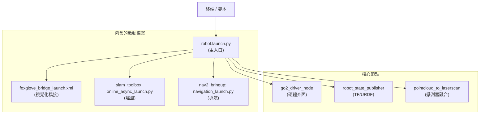

# 📚 Go2 ROS2 SDK：SLAM + Nav2 完整操作手冊

## 「從零到自主導航」指南

> **適用版本：** ROS2 Humble + slam_toolbox + Nav2  
> **專案：** PawAI (老人與狗) - Unitree Go2 機器狗  
> **最後更新：** 2026/01/11

---

## 📋 目錄

1. [系統架構總覽](#1-系統架構總覽)
2. [檔案結構說明](#2-檔案結構說明)
3. [TF 座標系樹狀圖](#3-tf-座標系樹狀圖)
4. [啟動參數參考](#4-啟動參數參考)
5. [從零開始操作流程](#5-從零開始操作流程)
6. [SLAM 配置詳解](#6-slam-配置詳解)
7. [Nav2 配置詳解](#7-nav2-配置詳解)
8. [常見錯誤排除](#8-常見錯誤排除)
9. [進階調校指南](#9-進階調校指南)

---

## 1. 系統架構總覽

### 1.1 資料流圖

```
┌─────────────────────────────────────────────────────────────────────────┐
│                         Go2 機器狗 (192.168.12.1)                        │
│                              WebRTC 連線                                 │
└───────────────────────────────────┬─────────────────────────────────────┘
                                    │
                                    ▼
┌─────────────────────────────────────────────────────────────────────────┐
│                      go2_driver_node (Python)                           │
│  • 接收 IMU、關節狀態、LiDAR 原始數據                                    │
│  • 發布 odom → base_link TF                                             │
│  • 發布 /joint_states                                                   │
└───────────────────────────────────┬─────────────────────────────────────┘
                                    │
            ┌───────────────────────┼───────────────────────┐
            ▼                       ▼                       ▼
┌──────────────────┐    ┌──────────────────┐    ┌──────────────────┐
│ lidar_to_        │    │ robot_state_     │    │ pointcloud_      │
│ pointcloud       │    │ publisher        │    │ aggregator       │
│ (PointCloud2)    │    │ (URDF → TF)      │    │ (過濾+聚合)       │
└────────┬─────────┘    └──────────────────┘    └────────┬─────────┘
         │                                               │
         └───────────────────┬───────────────────────────┘
                             ▼
                ┌──────────────────────────┐
                │ pointcloud_to_laserscan  │
                │ (3D → 2D /scan)          │
                └────────────┬─────────────┘
                             │
         ┌───────────────────┴───────────────────┐
         ▼                                       ▼
┌──────────────────┐                  ┌──────────────────────┐
│   slam_toolbox   │                  │        Nav2          │
│ (建圖 + map→odom │                  │ • controller_server  │
│  TF 發布)        │                  │ • planner_server     │
└────────┬─────────┘                  │ • bt_navigator       │
         │                            │ • costmap 2d         │
         ▼                            └──────────┬───────────┘
    /map topic                                   │
                                                 ▼
                                          /cmd_vel → 機器狗
```

### 1.2 啟動層級架構



---

## 2. 檔案結構說明

### 2.1 核心檔案清單

| 類別 | 檔案路徑 | 說明 |
|------|----------|------|
| 啟動檔 | `go2_robot_sdk/launch/robot.launch.py` | 主系統啟動入口 |
| SLAM 參數 | `go2_robot_sdk/config/mapper_params_online_async.yaml` | slam_toolbox 配置 |
| Nav2 參數 | `go2_robot_sdk/config/nav2_params.yaml` | 導航堆疊配置 |
| 速度控制 | `go2_robot_sdk/config/twist_mux.yaml` | 速度指令多路複用 |
| URDF | `go2_robot_sdk/urdf/go2.urdf` | 機器人模型定義 |
| 測試腳本 | `phase1_test.sh` | 自動化測試腳本 |
| Debug 指南 | `nav2_debug_checklist.md` | 故障排除清單 |

### 2.2 配置檔案關係圖

```
go2_robot_sdk/
├── config/
│   ├── mapper_params_online_async.yaml  ← SLAM 使用
│   ├── nav2_params.yaml                 ← Nav2 使用
│   ├── twist_mux.yaml                   ← 遙控/導航優先權
│   └── joystick.yaml                    ← 手把設定
├── urdf/
│   ├── go2.urdf                         ← 單機模式
│   ├── multi_go2.urdf                   ← 多機模式
│   └── go2_with_realsense.urdf          ← RealSense 版本
└── launch/
    ├── robot.launch.py                  ← 主啟動 (Python 版)
    └── robot_cpp.launch.py              ← 高效能版本
```

---

## 3. TF 座標系樹狀圖

### 3.1 完整 TF 樹

```
map                          ← SLAM Toolbox 發布 (全域座標)
 └── odom                    ← go2_driver_node 發布 (里程計座標)
      └── base_link          ← 機器人本體中心
           ├── base_footprint
           ├── imu
           ├── radar (lidar_link)
           ├── Head_upper
           │    ├── front_camera   ← ⚠️ AI 感知使用此框架！
           │    └── Head_lower
           ├── FL_hip → FL_thigh → FL_calf → FL_foot
           ├── FR_hip → FR_thigh → FR_calf → FR_foot
           ├── RL_hip → RL_thigh → RL_calf → RL_foot
           └── RR_hip → RR_thigh → RR_calf → RR_foot
```

### 3.2 各框架發布來源

| Transform | 發布節點 | 說明 |
|-----------|----------|------|
| map → odom | slam_toolbox | SLAM 校正 |
| odom → base_link | go2_driver_node | 里程計 (WebRTC) |
| 關節 TF | robot_state_publisher | 從 URDF 解析 |
| 靜態 TF | robot_state_publisher | 相機、IMU 等 |

### 3.3 ⚠️ 重要注意事項

| 框架 | 注意 |
|------|------|
| `front_camera` | AI 感知 (YOLO/DA3) 使用此框架，不是 camera_link！ |
| `odom` | LiDAR 點雲的 frame_id 使用 odom，因為 WebRTC 已轉換 |
| Z 軸補償 | ros2_publisher.py 加入 +0.07m 高度補償 |

---

## 4. 啟動參數參考

### 4.1 環境變數 (必須)

```bash
export ROBOT_IP="192.168.12.1"      # 機器狗 IP (必填)
export CONN_TYPE="webrtc"           # 連線方式: webrtc 或 cyclonedds
export ROBOT_TOKEN=""               # WebRTC Token (選填)
export MAP_NAME="my_map"            # 地圖名稱 (選填)
export ELEVENLABS_API_KEY=""        # TTS API Key (選填)
```

### 4.2 啟動參數

| 參數 | 預設值 | 說明 |
|------|--------|------|
| `slam` | true | 啟動 SLAM Toolbox |
| `nav2` | true | 啟動 Nav2 導航堆疊 |
| `rviz2` | true | 啟動 RViz2 視覺化 |
| `foxglove` | true | 啟動 Foxglove Bridge (Port 8765) |
| `joystick` | true | 啟動手把控制 |
| `teleop` | true | 啟動 twist_mux |
| `mcp_mode` | false | MCP 模式：停用 SLAM/Nav2，啟用 AI 服務 |

### 4.3 啟動範例

```bash
# 完整系統 (SLAM + Nav2 + 視覺化)
ros2 launch go2_robot_sdk robot.launch.py

# 只啟動驅動 (不含導航)
ros2 launch go2_robot_sdk robot.launch.py slam:=false nav2:=false

# MCP 模式 (AI 控制)
ros2 launch go2_robot_sdk robot.launch.py mcp_mode:=true

# 無視覺化 (節省資源)
ros2 launch go2_robot_sdk robot.launch.py rviz2:=false foxglove:=false
```

---

## 5. 從零開始操作流程

### 5.1 環境準備

```bash
# 1. Source ROS2 環境
source /opt/ros/humble/setup.bash
cd ~/ros2_ws/src/elder_and_dog
source install/setup.bash

# 2. 設定環境變數
export ROBOT_IP="192.168.12.1"
export CONN_TYPE="webrtc"
```

### 5.2 使用自動化腳本 (推薦)

```bash
# 步驟零：環境檢查
zsh phase1_test.sh env

# Terminal 1：啟動驅動
zsh phase1_test.sh t1
# 等待看到 "Video frame received"

# Terminal 2：監控 /scan 頻率
zsh phase1_test.sh t2
# 確認頻率 > 5 Hz

# Terminal 3：啟動 SLAM + Nav2
zsh phase1_test.sh t3
# 等待看到 "Server listening on port 8765"

# Terminal 4：控制移動
zsh phase1_test.sh t4
# 輸入 auto 自動巡房建圖
```

### 5.3 手動操作流程

```bash
# Terminal 1：啟動驅動 (簡化版)
zsh start_go2_simple.sh

# Terminal 2：啟動完整系統
ros2 launch go2_robot_sdk robot.launch.py slam:=true nav2:=true

# Terminal 3：驗證系統
ros2 node list        # 確認節點運行
ros2 topic hz /scan   # 確認 > 5 Hz
ros2 topic echo /tf   # 確認 TF 發布
```

### 5.4 儲存地圖

```bash
# 建立地圖目錄
mkdir -p src/go2_robot_sdk/maps

# 儲存地圖
ros2 run nav2_map_server map_saver_cli -f src/go2_robot_sdk/maps/my_map

# 驗證
ls -lh src/go2_robot_sdk/maps/my_map.*
# 應該看到 my_map.yaml 和 my_map.pgm
```

### 5.5 發送導航目標

```bash
# 方法 1：使用 RViz2 / Foxglove 的 "2D Goal Pose" 工具

# 方法 2：命令列
ros2 topic pub -1 /goal_pose geometry_msgs/msg/PoseStamped "{
  header: {frame_id: 'map'},
  pose: {
    position: {x: 2.0, y: 0.0, z: 0.0},
    orientation: {x: 0.0, y: 0.0, z: 0.0, w: 1.0}
  }
}"

# 方法 3：使用測試腳本
python3 scripts/nav2_goal_autotest.py --distance 1.0
```

---

## 6. SLAM 配置詳解

### 6.1 關鍵參數 (mapper_params_online_async.yaml)

```yaml
slam_toolbox:
  ros__parameters:
    # === 座標框架 ===
    odom_frame: odom           # 里程計框架
    map_frame: map             # 地圖框架
    base_frame: base_link      # 機器人基座框架
    scan_topic: /scan          # LiDAR 輸入 topic
    
    # === 運行模式 ===
    mode: mapping              # mapping 或 localization
    
    # === 地圖品質 ===
    resolution: 0.05           # 地圖解析度 (5cm/格)
    max_laser_range: 20.0      # LiDAR 最大有效範圍
    
    # === 更新頻率 ===
    map_update_interval: 5.0   # 地圖更新間隔 (秒)
    transform_publish_period: 0.02  # TF 發布週期
    
    # === 迴圈閉合 ===
    do_loop_closing: true      # 啟用迴圈閉合
    loop_search_maximum_distance: 3.0  # 搜索範圍
```

### 6.2 模式說明

| 模式 | 使用場景 | 說明 |
|------|----------|------|
| online_async | 預設，即時建圖 | 非同步處理，不阻塞主循環 |
| online_sync | 需要精確同步 | 同步處理，較慢但更穩定 |
| localization | 已有地圖，只定位 | 載入現有地圖進行 AMCL 定位 |

---

## 7. Nav2 配置詳解

### 7.1 控制器參數 (nav2_params.yaml)

```yaml
controller_server:
  ros__parameters:
    controller_frequency: 10.0      # 控制頻率
    FollowPath:
      plugin: "dwb_core::DWBLocalPlanner"
      
      # === Go2 專用調校 ===
      min_vel_x: 0.1         # ⚠️ 必須 > 0，否則無法起步
      max_vel_x: 0.5         # 安全最大速度
      max_vel_theta: 1.0     # ⚠️ 降低以避免原地打轉
      min_speed_xy: 0.1      # 最小線速度
      
      # === 路徑跟隨 ===
      xy_goal_tolerance: 0.3 # 到達容差
      
      # === 評分權重 ===
      RotateToGoal.scale: 10.0  # ⚠️ 降低以減少原地旋轉
```

### 7.2 代價地圖參數

```yaml
local_costmap:
  local_costmap:
    ros__parameters:
      global_frame: odom         # 本地地圖使用 odom
      robot_base_frame: base_link
      footprint: "[ [0.3, 0.15], [0.3, -0.15], [-0.3, -0.15], [-0.3, 0.15] ]"
      
      voxel_layer:
        min_obstacle_height: 0.1   # ⚠️ 過濾地板雜訊
        max_obstacle_height: 2.0
        
      inflation_layer:
        inflation_radius: 0.15     # ⚠️ 縮小以適應窄空間

global_costmap:
  global_costmap:
    ros__parameters:
      global_frame: map          # ⚠️ 必須是 map，不是 odom！
```

### 7.3 規劃器參數

```yaml
planner_server:
  ros__parameters:
    GridBased:
      plugin: "nav2_smac_planner/SmacPlannerHybrid"
      motion_model_for_search: "REEDS_SHEPP"  # 適合四足機器人
      minimum_turning_radius: 0.30             # 最小轉彎半徑
```

---

## 8. 常見錯誤排除

### 8.1 問題：機器狗原地打轉

**症狀：** 發送導航目標後，機器狗只在原地旋轉

**檢查與修復：**

```bash
# 1. 檢查 cmd_vel 輸出
ros2 topic echo /cmd_vel
# 預期：linear.x 應該 > 0.1

# 2. 如果 linear.x = 0，檢查參數
ros2 param get /controller_server FollowPath.min_vel_x
# 應該返回 0.1

# 3. 手動修正 (臨時)
ros2 param set /controller_server FollowPath.min_vel_x 0.1
ros2 param set /controller_server FollowPath.max_vel_theta 1.0
```

### 8.2 問題：TF 錯誤 (No transform)

**症狀：** 出現 `Could not transform... No transform available`

**檢查：**

```bash
# 1. 檢查 TF 樹完整性
ros2 run tf2_ros tf2_echo map base_link

# 2. 視覺化 TF 樹
ros2 run tf2_tools view_frames
# 產生 frames.pdf

# 3. 確認 SLAM 正在運行
ros2 node list | grep slam
```

### 8.3 問題：/scan 頻率過低

**症狀：** `/scan` 頻率 < 5 Hz

**檢查：**

```bash
# 1. 檢查驅動是否正常
ros2 node info /go2_driver_node

# 2. 檢查 pointcloud 處理
ros2 topic hz /point_cloud2

# 3. 確認網路連線
ping 192.168.12.1
```

### 8.4 問題：SLAM 地圖不更新

**症狀：** `/map` topic 沒有新數據

**檢查：**

```bash
# 1. 確認 SLAM 節點運行
ros2 node list | grep slam_toolbox

# 2. 確認 /scan 有數據
ros2 topic echo /scan --once

# 3. 檢查 SLAM 參數
ros2 param get /slam_toolbox scan_topic
```

### 8.5 問題：Nav2 Recovery Loop

**症狀：** 導航反覆重試，出現 "Goal canceled"

**原因與修復：**

| 可能原因 | 修復方法 |
|----------|----------|
| 目標點在障礙物上 | 在 RViz2 確認目標在白色(自由)區域 |
| 路徑規劃失敗 | 檢查 `/plan` topic 是否有路徑 |
| Costmap 過度膨脹 | 縮小 `inflation_radius` |

---

## 9. 進階調校指南

### 9.1 提升導航速度

```yaml
# nav2_params.yaml
FollowPath:
  max_vel_x: 0.7          # 提高最大速度 (0.5 → 0.7)
  acc_lim_x: 1.5          # 降低加速度，更平滑
```

### 9.2 優化窄空間通過

```yaml
# nav2_params.yaml
inflation_layer:
  inflation_radius: 0.12   # 進一步縮小 (0.15 → 0.12)
  cost_scaling_factor: 2.0 # 降低代價衰減
```

### 9.3 改善 SLAM 精度

```yaml
# mapper_params_online_async.yaml
resolution: 0.03           # 提高解析度 (0.05 → 0.03)
minimum_travel_distance: 0.3  # 更頻繁更新
```

### 9.4 關鍵 Topics 監控

| Topic | 預期頻率 | 監控指令 |
|-------|----------|----------|
| `/scan` | > 5 Hz | `ros2 topic hz /scan` |
| `/map` | ~ 0.2 Hz | `ros2 topic hz /map` |
| `/cmd_vel` | ~ 10 Hz | `ros2 topic echo /cmd_vel` |
| `/tf` | 持續 | `ros2 topic echo /tf` |
| `/local_costmap/costmap` | ~ 1 Hz | 在 RViz2 觀察 |

### 9.5 Debug 模式啟動

```bash
# 啟動時加上 debug log
ros2 launch go2_robot_sdk robot.launch.py --log-level debug

# 錄製 ROS2 bag (全部 topics)
ros2 bag record -a -o nav2_debug_$(date +%Y%m%d_%H%M%S)
```

---

## 📎 快速參考卡

### 常用指令

```bash
# 啟動完整系統
ros2 launch go2_robot_sdk robot.launch.py

# 檢查系統狀態
zsh phase1_test.sh check

# 儲存地圖
ros2 run nav2_map_server map_saver_cli -f ~/maps/my_map

# 發送導航目標 (前進 2m)
python3 scripts/nav2_goal_autotest.py --distance 2.0

# 檢查 TF 樹
ros2 run tf2_tools view_frames
```

### 重要座標框架

- `map` → Nav2 目標使用
- `odom` → 本地運動使用
- `base_link` → cmd_vel 參考
- `front_camera` → AI 感知使用 ⚠️

### 關鍵參數速查

| 參數 | 位置 | Go2 建議值 |
|------|------|-----------|
| `min_vel_x` | nav2_params.yaml | 0.1 |
| `max_vel_theta` | nav2_params.yaml | 1.0 |
| `inflation_radius` | nav2_params.yaml | 0.15 |
| `global_frame` (global_costmap) | nav2_params.yaml | map |
| `min_obstacle_height` | nav2_params.yaml | 0.1 |

---

**祝導航順利！🐕**
